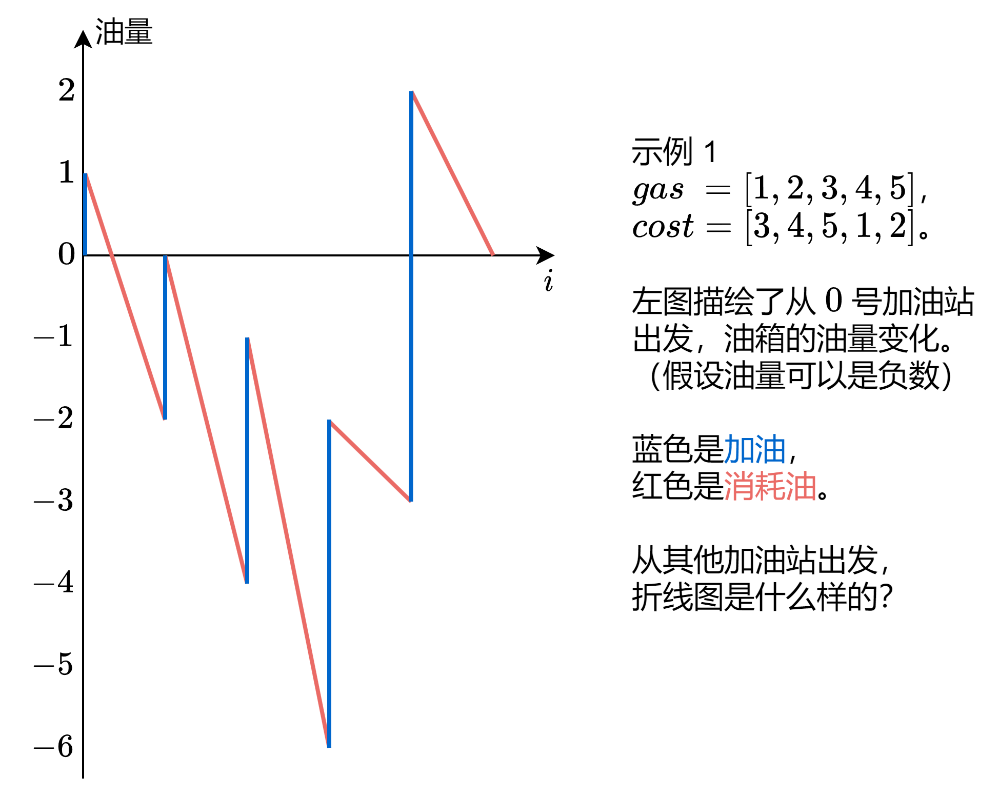
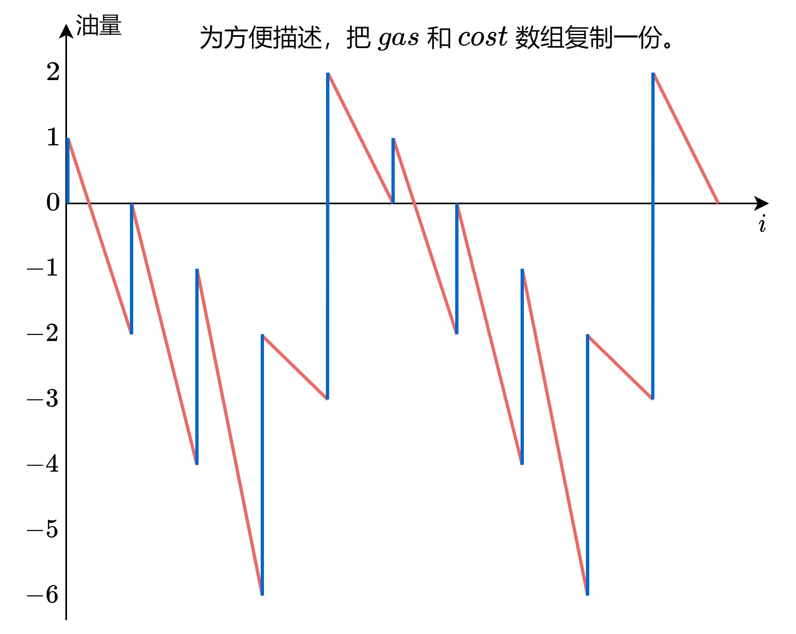
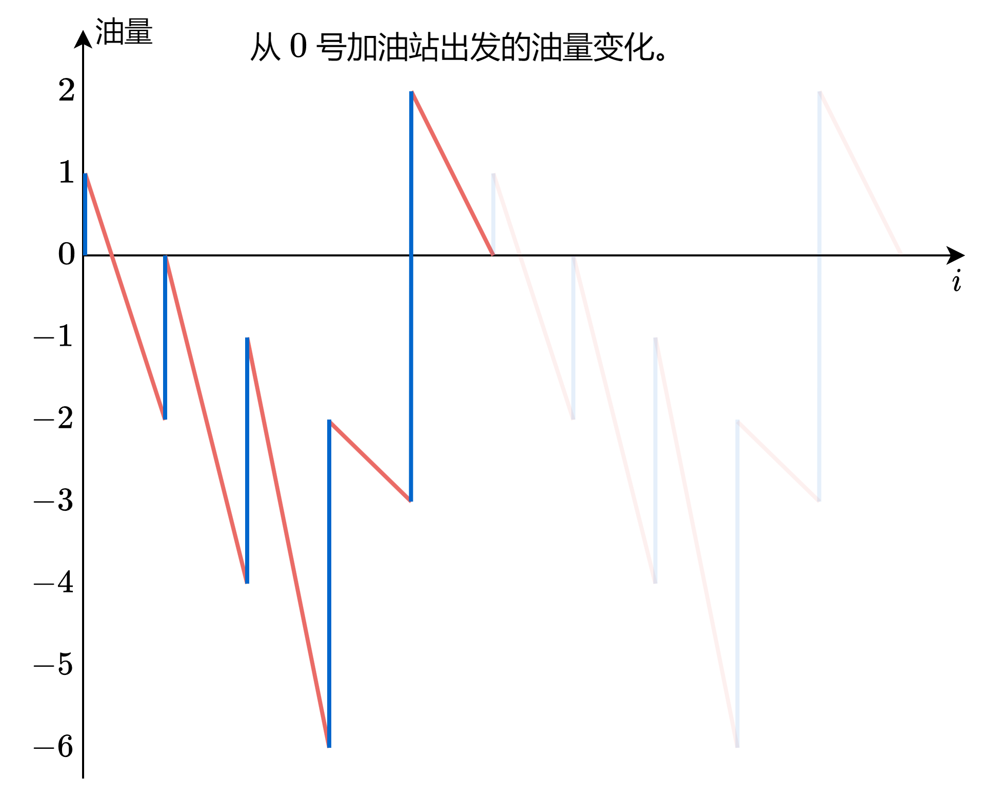
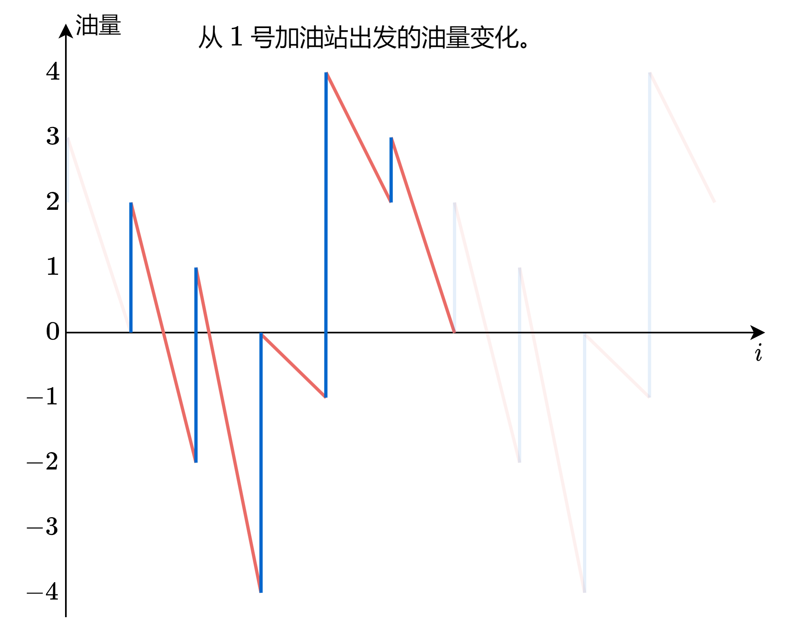
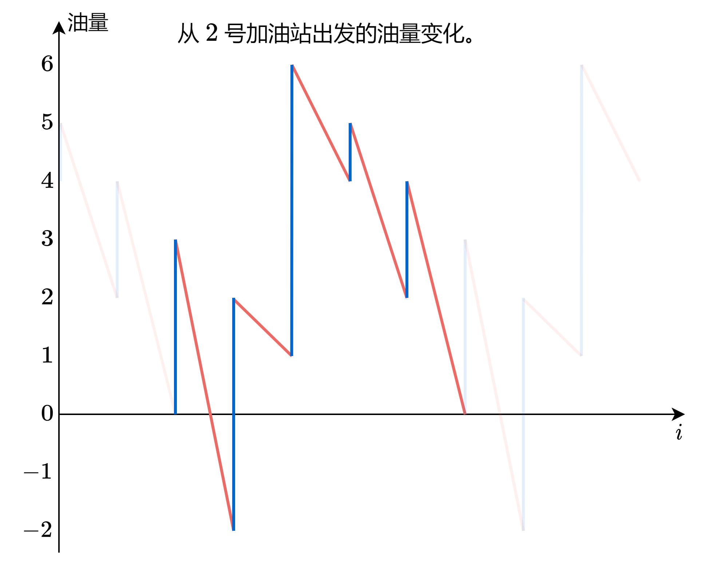
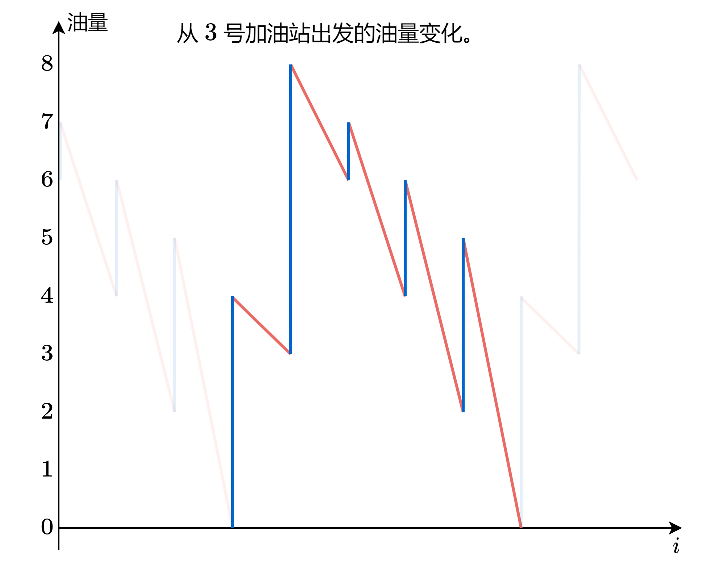
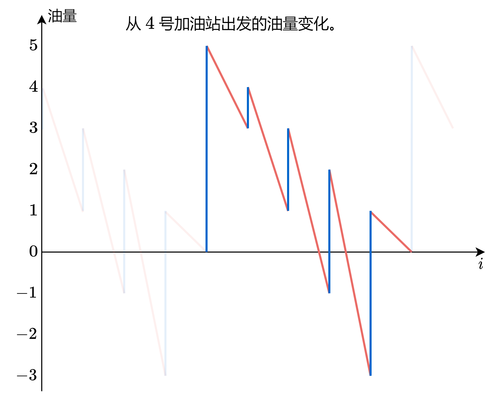
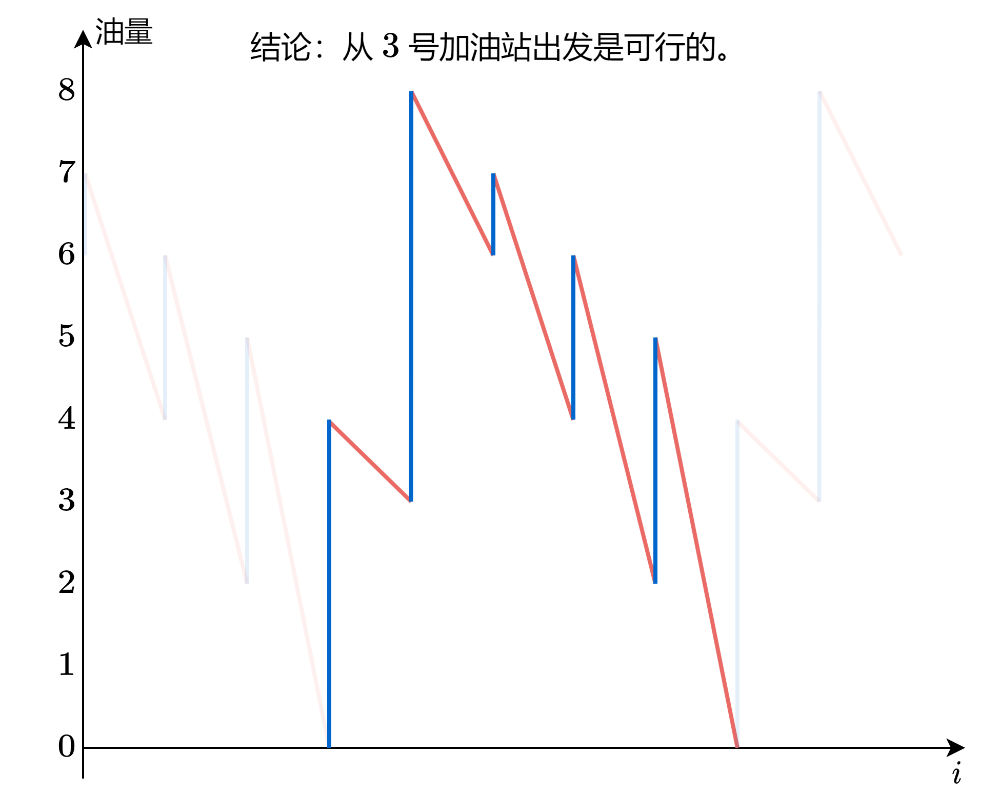

---
tags:
    - Array
    - Greedy
    - Top Interview 150
---

# [134. Gas Station](https://leetcode.com/problems/gas-station/)

There are `n` gas stations along a circular route, where the amount of gas at the `ith` station is `gas[i]`.

You have a car with an unlimited gas tank and it costs `cost[i]` of gas to travel from the `ith` station to its next `(i + 1)th` station. You begin the journey with an empty tank at one of the gas stations.

Given two integer arrays `gas` and `cost`, return *the starting gas station's index if you can travel around the circuit once in the clockwise direction, otherwise return* `-1`. If there exists a solution, it is **guaranteed** to be **unique**

 

**Example 1:**

```
Input: gas = [1,2,3,4,5], cost = [3,4,5,1,2]
Output: 3
Explanation:
Start at station 3 (index 3) and fill up with 4 unit of gas. Your tank = 0 + 4 = 4
Travel to station 4. Your tank = 4 - 1 + 5 = 8
Travel to station 0. Your tank = 8 - 2 + 1 = 7
Travel to station 1. Your tank = 7 - 3 + 2 = 6
Travel to station 2. Your tank = 6 - 4 + 3 = 5
Travel to station 3. The cost is 5. Your gas is just enough to travel back to station 3.
Therefore, return 3 as the starting index.
```

**Example 2:**

```
Input: gas = [2,3,4], cost = [3,4,3]
Output: -1
Explanation:
You can't start at station 0 or 1, as there is not enough gas to travel to the next station.
Let's start at station 2 and fill up with 4 unit of gas. Your tank = 0 + 4 = 4
Travel to station 0. Your tank = 4 - 3 + 2 = 3
Travel to station 1. Your tank = 3 - 3 + 3 = 3
You cannot travel back to station 2, as it requires 4 unit of gas but you only have 3.
Therefore, you can't travel around the circuit once no matter where you start.
```

 

**Constraints:**

- `n == gas.length == cost.length`
- `1 <= n <= 105`
- `0 <= gas[i], cost[i] <= 104`


**Solution**:

核心思路：“已经在谷底了，怎么走都是向上。”

来看看示例 1 是怎么算的（点击下面播放按钮）：

















注：把数组复制一份，意思是 gas=gas+gas=[1,2,3,4,5,1,2,3,4,5]。

对于示例 2，由于 gas 元素和小于 cost 元素和，油量不够我们跑一圈，答案一定是 −1。

如果 gas 元素和大于等于 cost 元素和，答案是否一定存在？如何找到答案？

从示例 1 的计算过程可以发现，我们可以先计算从 0 号加油站出发的油量变化，然后从中找到油量最低时所处的加油站（3 号加油站），即为答案。

有没有可能从 3 号加油站出发，某个时刻油量变成负数呢？

这是不会的，请看下图：


⚠注意：gas 之和减去 cost 之和，对应图中复制的折线图的初始油量。如果不是负数，那么复制后的折线图的最小值，不会比第一段的最小值还小。如果是负数，那么复制后的折线图的最小值，比第一段的最小值还小，这会导致从第一段的最小值出发，行驶过程中油量会变成负数。

答疑
问：下面的代码，是否有可能算出 ans=n？

答：不会，如果最后一轮循环 s<minS，那么 s 必然小于 0，这会导致最终返回 −1。

```java
class Solution {
    public int canCompleteCircuit(int[] gas, int[] cost) {
        int result = 0;
        int total = 0;
        int cur = 0;

        for (int i = 0; i < gas.length; i++){
            total = total + gas[i] - cost[i];

            cur = cur + gas[i] - cost[i];

            if (cur < 0){
                result = i + 1;
                cur = 0;
            }
        }

        if (total < 0){
            return -1; 
        }else{
            return result;
        }
    }
}


// TC: O(n)
// SC: O(1)
```

```java
class Solution {
    public int canCompleteCircuit(int[] gas, int[] cost) {
        int result = 0;
        int minS = 0;
        int s = 0;
        for (int i = 0; i < gas.length; i++){
            s = s + gas[i] - cost[i]; // 在i处加油, 然后从i到i+1
            if (s < minS){
                minS = s; // 更新最小油量
                result = i + 1; // 注意s减去cost[i]之后, 汽车在i+1而不是i
            }
        }


        // 循环结束后, s即为gas之和减去cost之和
        if (s < 0){
            return -1;
        }else{
            return result;
        }
    }
}
// TC: O(n)
// SC: O(1)
```

