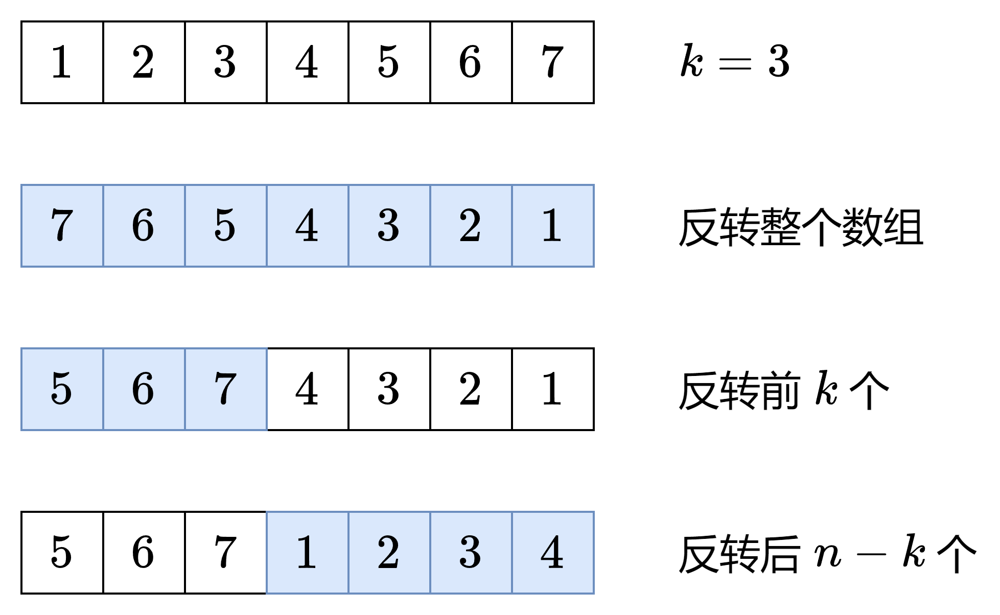

---
tags:
    - Array
    - Math
    - Two Pointers
    - Top Interview 150
---

# [189. Rotate Array](https://leetcode.com/problems/rotate-array/)

Given an integer array `nums`, rotate the array to the right by `k` steps, where `k` is non-negative.

 

**Example 1:**

```
Input: nums = [1,2,3,4,5,6,7], k = 3
Output: [5,6,7,1,2,3,4]
Explanation:
rotate 1 steps to the right: [7,1,2,3,4,5,6]
rotate 2 steps to the right: [6,7,1,2,3,4,5]
rotate 3 steps to the right: [5,6,7,1,2,3,4]
```

**Example 2:**

```
Input: nums = [-1,-100,3,99], k = 2
Output: [3,99,-1,-100]
Explanation: 
rotate 1 steps to the right: [99,-1,-100,3]
rotate 2 steps to the right: [3,99,-1,-100]
```

 

**Constraints:**

- `1 <= nums.length <= 105`
- `-231 <= nums[i] <= 231 - 1`
- `0 <= k <= 105`

 

**Follow up:**

- Try to come up with as many solutions as you can. There are at least **three** different ways to solve this problem.
- Could you do it in-place with `O(1)` extra space?

**Solution:**

```java
class Solution {
    public void rotate(int[] nums, int k) {
        int n = nums.length;
        k = n % k;
        reverse(nums, 0, n - 1);
        reverse(nums, 0, k - 1);
        reverse(nums, k, n - 1);
    }

    private void reverse(int[] nums, int i, int j){
        while(i < j){
            int temp = nums[i];
            nums[i++] = nums[j];
            nums[j--] = temp;
        }
    }
}
```

#### 复杂度分析

- 时间复杂度：O(*n*)，其中 *n* 是 *nums* 的长度。
- 空间复杂度：O(1)。

例子
把 [1,2,3,4,5,6,7] 变成 [5,6,7,1,2,3,4]，首先要保证 5,6,7 在 1,2,3,4 前面，这可以通过反转整个数组做到。

反转后数组变成 [7,6,5,4,3,2,1]，对比最终目标可以发现，前三个数需要反转，后四个数需要反转，这样就得到了 [5,6,7,1,2,3,4]。



一般化
这里假设 0≤k<n，对于 k≥n 的情况，可以转换成 0≤k<n 的情况（证明见后文）。

设 nums=A+B，其中 A 是 nums 的前 n−k 个数，B 是后 k 个数。在上例中，A=[1,2,3,4]，B=[5,6,7]。

题目要求把 A+B 变成 B+A，这可以用三次反转实现：

把 nums=A+B 反转，我们得到了 rev(B)+rev(A)，其中 rev(A) 表示数组 A 反转后的结果。在上例中，rev(B)+rev(A)=[7,6,5]+[4,3,2,1]。
单独反转 rev(B)，因为一个数组反转两次是不变的，所以 rev(rev(B))=B，我们得到了 B。
单独反转 rev(A)，得到 rev(rev(A))=A。
现在数组变成 B+A。在上例中，B+A=[5,6,7]+[1,2,3,4]，这正是我们想要的结果。

正确性证明
向右轮转 k 个位置后，下标 i 的元素移动到下标 (i+k)modn 上，其中 n 是 nums 的长度。

下面证明上述方法（三次反转）的正确性。

假设 0≤k<n，也就是 0≤k≤n−1，分类讨论：

如果 n−k≤i≤n−1，那么第一次反转（整个数组的反转）会把下标 i 的元素交换到下标 n−1−i 上（注意 0≤n−1−i≤k−1，在第二次反转的范围中），第二次反转会把下标 n−1−i 的元素交换到下标 k−1−(n−1−i)=i+k−n 上。根据 n−k≤i≤n−1 可得 0≤i+k−n≤k−1，所以 i+k−n=(i+k)modn，符合题目要求。
如果 0≤i≤n−k−1，那么第一次反转（整个数组的反转）会把下标 i 的元素交换到下标 n−1−i 上（注意 k≤n−1−i≤n−1，在第三次反转的范围中），第三次反转会把下标 n−1−i 的元素交换到下标 k+n−1−(n−1−i)=i+k 上（注*）。根据 0≤i≤n−k−1 可得 k≤i+k≤n−1，所以 i+k=(i+k)modn，符合题目要求。

对于 k≥n 的情况，由于轮转 n 次等同于没有轮转，轮转 n+1 等同于轮转 1 次……依此类推，轮转 k 次等同于轮转 kmodn 次。由于 0≤kmodn≤n−1，所以 k≥n 的情况也是正确的。

综上所述，对于任意非负整数 k，按照图中三次反转的方法，可以把下标 i 的元素移动到下标 (i+k)modn 上。

注：对于下标区间 [L,R] 的反转，由于 i=L 会反转到 R，i=L+1 会反转到 R−1，i=L+2 会反转到 R−2，依此类推，下标 i 和反转后的位置 j 满足 i+j=L+R，所以 i 会反转到 L+R−i。

