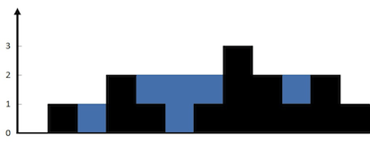
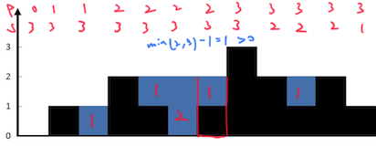
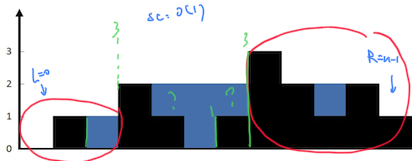

---
tags:
    - Array
    - Two Pointers
    - Dynamic Programming
    - Stack
    - Monotonic Stack
    - Goldman Sachs
    - Google
    - Top Interviews
---

# [42. Trapping Rain Water](https://leetcode.com/problems/trapping-rain-water/)

Given `n` non-negative integers representing an elevation map where the width of each bar is `1`, compute how much water it can trap after raining.

 

**Example 1:**



```
Input: height = [0,1,0,2,1,0,1,3,2,1,2,1]
Output: 6
Explanation: The above elevation map (black section) is represented by array [0,1,0,2,1,0,1,3,2,1,2,1]. In this case, 6 units of rain water (blue section) are being trapped.
```

**Example 2:**

```
Input: height = [4,2,0,3,2,5]
Output: 9
```


## **Solution:**

### Method 1 Prefix–suffix decomposition:




```java
class Solution {
    public int trap(int[] height) {
        int[] pre = new int[height.length];
        int[] last = new int[height.length];
        int preH = height[0];
        for (int i = 0; i < height.length; i++){
            int curHeight = height[i];
            pre[i] = Math.max(height[i], preH);
            preH = Math.max(height[i], preH);
        }

        int lastH = height[height.length - 1];
        for (int i = height.length-1; i >= 0; i--){
            int curHeight = height[i];
            last[i] = Math.max(height[i], lastH);
            lastH = Math.max(height[i], lastH);
        }

        int result = 0;

        for (int i = 0; i < height.length; i++){
            int curPre = pre[i];
            int curLast = last[i];
            int curHeight = height[i];
            int curSum = Math.min(curPre, curLast) - curHeight;
            if (curSum > 0){ // 可以不用写, curSum >0 左右最高值已经更新过了
                result = result + curSum;
            }
        }

        return result;

    }
}

// TC: O(n)
// SC: O(n)
```

```java
class Solution {
    public int trap(int[] height) {
        int n = height.length;
        int[] pre = new int[n];
        int[] last = new int[n];

        int preH = height[0];
        pre[0] = height[0];
        for (int i = 1; i < n; i++){
            int curHeight = height[i];
            pre[i] = Math.max(curHeight, preH);
            preH = Math.max(preH, curHeight);
        }

        int lastH = height[n-1];
        last[n - 1] = height[n - 1];
        for (int i = n - 2; i >= 0; i--){
            int curHeight = height[i];
            last[i] = Math.max(curHeight, lastH);
            lastH = Math.max(curHeight, lastH);
        }

        int result = 0;

        for (int i = 0; i < n; i++){
            int curPre = pre[i];
            int curLast = last[i];
            int curHeight = height[i];
            int curSum = Math.min(curPre,  curLast) - curHeight;
            if (curSum > 0){
                result = result + curSum;
            }
        }

        return result;
    }
}
// TC: O(n)
// SC: O(n)
```


### Method 2: Two pointers moving toward each other

**Note:** The `while` loop does not need to include the equality condition. Under the rule of “move the pointer with the smaller height,” the meeting position will always be at the tallest bar, which cannot trap any water.




==木桶理论: 盯住最短板, 谁小移动谁==

```java
class Solution {
    public int trap(int[] height) {
        int result = 0;

        int left = 0;
        int right = n - 1;

        int preMax = 0;
        int sufMax = 0;

        while(left <= right){
            preMax = Math.max(preMax, height[left]);
            sufMax = Math.max(sufMax, height[right]);

            if (preMax < sufMax){
                result = result + (preMax - height[left]);
                left++;
            }else{
                result = result + (sufMax - height[right]);
                right--;
            }
        }

        return result;
    }
}

// TC: O(n)
// SC: O(1)
```


Solution1: 中心开花, 对于每个点, 往左往右找到左右的最大边界, 最大边界里面较小的哪个就是我这个一个点的水位线, 我的水量 = 我的水位线 - 我的高度

TC: O(n^2)

```java
class Solution {
    public int trap(int[] height) {
        int result = 0;
        int size = height.length;
        for (int i = 1; i < size - 1; i++){
            int left_max = 0;
            int right_max = 0;
            for (int j = i; j >= 0; j--){ // search the left part for max bar size
                left_max = Math.max(left_max, height[j]);
            }

            for (int j = i; j < size; j++){
                // search the right part for max bar size
                right_max = Math.max(right_max, height[j]);
            }
            result = result + Math.min(left_max, right_max) - height[i];
        }
        return result;
        
    }
}
// TC: O(n^2)
// SC: O(1)
```


### Method 3: Stack

找上一个更大元素, 在找的过程中填坑

```java
class Solution {
    public int trap(int[] height) {
        int result = 0;
        Deque<Integer> stack = new ArrayDeque<Integer>();
        int n = height.length;
        for (int i = 0; i < n; i++){
            int cur = height[i];
            while (!stack.isEmpty() && cur >= height[stack.peekLast()]){
                int bottom_h = height[stack.pollLast()];
                if (stack.isEmpty()){
                    break;
                }

                int left = stack.peekLast();
                int dh = Math.min(height[left], cur) - bottom_h;
                result = result + dh * (i - left - 1);
            }

            stack.offerLast(i);
        }

        return result;
    }
}

// TC: O(n)
// SC: O(n)
```


```java
class Solution {
    public int trap(int[] height) {
        int result = 0;
        Deque<Integer> stack = new ArrayDeque<>();
        int n = height.length;
        for (int i = 0; i < n; i++){
            int cur = height[i];

            while(!stack.isEmpty() && cur > height[stack.peekLast()]){
                int buttom_H = height[stack.pollLast()];

                if (stack.isEmpty()){
                    break;
                }

                int left = stack.peekLast();

                int width = i - left - 1;
                int depth = Math.min(height[left], cur) - buttom_H;
                int area = depth * width;
                result = result + area;
            }
            stack.offerLast(i);
        }

        return result;


    }
}
// TC: O(n)
// SC: O(n)
```


单调栈

上一个更大(小)元素

下一个更大(小)原色


#### Reference

https://www.bilibili.com/video/BV1Qg411q7ia/?vd_source=73e7d2c4251a7c9000b22d21b70f5635
https://leetcode.cn/problems/trapping-rain-water/solutions/1974340/zuo-liao-nbian-huan-bu-hui-yi-ge-shi-pin-ukwm/

