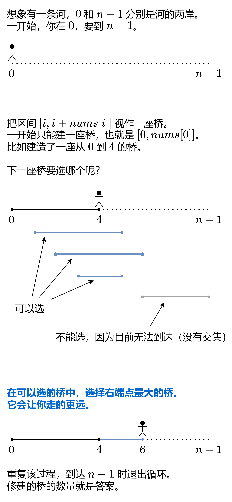

---
tags:
    - Array
    - Dynamic Programming
    - Greedy
    - Top Interviews
---

# [45. Jump Game II](https://leetcode.com/problems/jump-game-ii/)

You are given a **0-indexed** array of integers `nums` of length `n`. You are initially positioned at `nums[0]`.

Each element `nums[i]` represents the maximum length of a forward jump from index `i`. In other words, if you are at `nums[i]`, you can jump to any `nums[i + j]` where:

- `0 <= j <= nums[i]` and
- `i + j < n`

Return *the minimum number of jumps to reach* `nums[n - 1]`. The test cases are generated such that you can reach `nums[n - 1]`.

 

**Example 1:**

```
Input: nums = [2,3,1,1,4]
Output: 2
Explanation: The minimum number of jumps to reach the last index is 2. Jump 1 step from index 0 to 1, then 3 steps to the last index.
```

**Example 2:**

```
Input: nums = [2,3,0,1,4]
Output: 2
```


**Solution:**



⚠注意：不是在无路可走的那个位置造桥，而是当发现无路可走的时候，时光倒流到能跳到最远点的那个位置造桥。换句话说，在无路可走之前，我们只是在默默地收集信息，没有实际造桥。当发现无路可走的时候，才从收集到的信息中，选择最远点造桥。所建造的这座桥的左端点（起跳位置）在我们当前走的这座桥的中间，而不是桥的末尾。

答疑
问：为什么代码只需要遍历到 n−2？

答：代码中的 for 循环计算的是在到达终点之前需要造多少座桥。n−1 已经是终点了，不需要造桥。或者说，遍历到 n−2 时，要么已经可以到达终点，要么需要造最后一座桥。

问：如果题目没有保证一定能到达 n−1，代码要怎么改？

答：见[1326. Minimum Number of Taps to Open to Water a Garden](https://leetcode.com/problems/minimum-number-of-taps-to-open-to-water-a-garden/)，[我的题解](https://leetcode.cn/problems/minimum-number-of-taps-to-open-to-water-a-garden/solutions/2123855/yi-zhang-tu-miao-dong-pythonjavacgo-by-e-wqry/)。

```java
class Solution {
    public int jump(int[] nums) {
        int result = 0; 
        int curRight = 0; // 已建造的桥的右端点
        int nextRight = 0; // 下一座桥的右端点的最大值

        for (int i = 0; i < nums.length - 1; i++){
          // 遍历的过程中, 记录下一座桥的最远点
            nextRight = Math.max(nextRight, i + nums[i]);
            if (i == curRight){ // 无路可走, 必须建桥
                curRight = nextRight;// 建桥后, 最远可以到达next_right
                result++;
            }
        }

        return result;
    }
}

// TC: O(n)
// SC: O(1)
```


index 0 1 2 3 4 

​	 A=[2,3,1,1,4]

​				    1 0

​				<- linear scan

​										-> look back

​						

M[i]: represent minimum number of jumps needed from $ith$ index to last index

M[lastIndex] = 0


数学表达式 induction rule:

要不从自己这一步能跳到M[你] = 1

要不我能跳到一个已知能跳到target的中继节点

M[你] = M[中继节点] + 1

Min{all possible way}

M[i] = min(M[j] +1) or i 能直达: M[i] = 1


return: M[0]


```java
class Solution {
    public int jump(int[] nums) {
        // base case
        int[] m = new int[nums.length];
        m[nums.length -1] = 0;

        // induction rule
        for (int i = nums.length - 2; i >= 0; i--){
            m[i] = Integer.MAX_VALUE;
            for (int j = nums.length - 1; j > i; j--){
                if (i + 1 >= j || nums[i] + i >= j){
                    m[i] = Math.min(m[j] + 1, m[i]);
                }
            }
        }
        return m[0];
    }
}

/*

index  0    1   2   3   4
       2    3   1   1   4
M[i]   2     1    2    1    0      M[i]:represent the index i minmun step to the end
             <- linear scan 
             -> look back 
            i   
                           j

// induction rule
    for (i = nums.length -2; i >= 0; i--){
        M[i] = Integer.MAX_VALUE;
        for (j = nums.length -1 ; j > i; j--){
            if (i + 1 >= j || nums[i] + i >= j){
                m[i] = Math.min(m[j]+1, m[i])
            } 
        }

    }
    
// return  M[0]

*/
```

