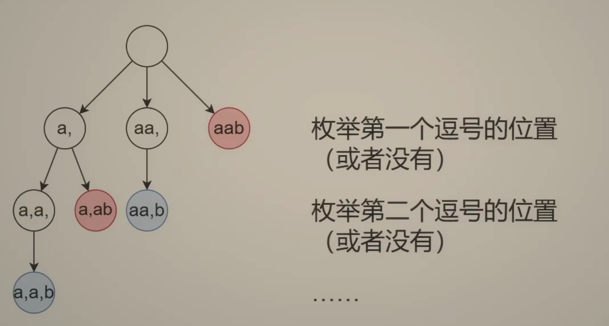
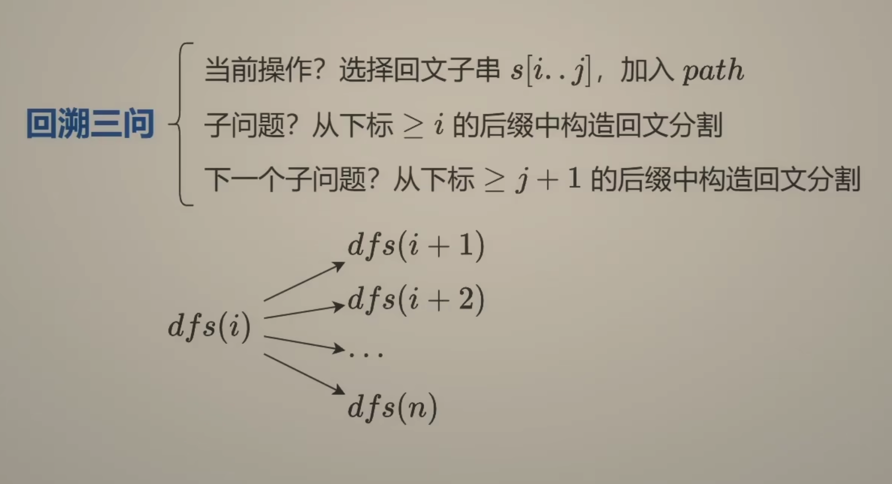
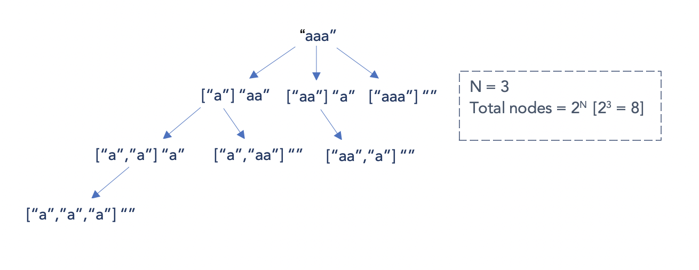

---
tags:
  - String
  - Dynamic Programming
  - Backtracking
  - Top Interviews
---

#[131. Palindrome Partitioning](https://leetcode.com/problems/palindrome-partitioning/)

Given a string `s`, partition `s` such that every substring of the partition is a **palindrome**. Return _all possible palindrome partitioning of_ `s`.

**Example 1:**

```
Input: s = "aab"
Output: [["a","a","b"],["aa","b"]]
```

**Example 2:**

```
Input: s = "a"
Output: [["a"]]
```

**Solution:**

**Approach 1: 输入视角 (逗号选或不选)**

假设每对相邻字符之间有个逗号, 那么久看每个逗号选还是不选

也可以理解成：是否要在 i 和 i+1 处分割，把 s[i] 作为当前子串的最后一个字符，把 s[i+1] 作为下一个子串的第一个字符。

注意 s[n−1] 一定是最后一个字符，所以在 i=n−1 的时候一定要分割。

```java
class Solution {
    public List<List<String>> partition(String s) {
        List<List<String>> result = new ArrayList<>();
        int start = 0;
        int end = 0;
        List<String> subResult = new ArrayList<>();

        dfs(0, 0, s, subResult, result);
        return result;

    }
    // 考虑i后面的逗号怎么选
    // start 表示当前这段回文子串的开始位置
    private void dfs(int i, int start, String s, List<String> subResult, List<List<String>> result){
        if (i == s.length()){ // s分割完毕
            result.add(new ArrayList<>(subResult)); // 复制 path
            return;
        }

        // 不分割, 不选i和i+1之间的逗号
        if (i < s.length() - 1){ // i = n-1时只能分割
            // 考虑i+1后面的逗号怎么选
            dfs(i+1, start, s, subResult, result);
        }

        // 分割, 选i 和 i+1之间的逗号(把s[i]作为子串的最后一个字符)
        if (isPalindrome(s, start, i)){
            subResult.add(s.substring(start, i + 1));
            // 考虑 i + 1 后面的逗号怎么选
            // start=i + 1 表示下一个子串从i+1开始
            dfs(i + 1, i + 1, s, subResult, result);
            subResult.remove(subResult.size() - 1);
        }
    }

    private boolean isPalindrome(String s, int left, int right){
        while(left < right){
            if (s.charAt(left++) != s.charAt(right--)){
                return false;
            }
        }

        return true;
    }
}
```


```java
class Solution {
    public List<List<String>> partition(String s) {
        List<List<String>> result = new ArrayList<>();
        int start = 0;
        int end = 0;
        List<String> subResult = new ArrayList<>();

        backtracking(start, end, s, result, subResult);
        return result;
    }

    private void backtracking(int start, int end, String s, List<List<String>> result, List<String> subResult){
        if (end == s.length()){
            result.add(new ArrayList<>(subResult));
            return;
        }

        if (end < s.length() - 1){
            backtracking(start, end + 1, s, result, subResult);
        }

        if (isP(s, start, end)){
            subResult.add(s.substring(start, end + 1));
            backtracking(end + 1, end + 1, s, result, subResult);
            subResult.remove(subResult.size() - 1);
        }
    }

    private boolean isP(String s, int left, int right){
        while(left < right){
            if (s.charAt(left) != s.charAt(right)){
                return false;
            }
            left++;
            right--;
        }

        return true;
    }
}

// TC: O(n * 2^n)
// SC: O(n)
```


**Approach 2: 答案视角(枚举子串结束位置)**





```java
class Solution {
    public List<List<String>> partition(String s) {
        List<List<String>> result = new ArrayList<List<String>>();
        List<String> subResult = new ArrayList<String>();
        int start = 0;
        helper(s, 0, subResult, result);
        return result;
    }

    private void helper(String s, int start, List<String> subResult, List<List<String>> result){
        if (start == s.length()){
            result.add(new ArrayList<>(subResult));
            return;
        }

        for (int end = start; end < s.length(); end++){
            if (isPalindrome(s, start, end)){
                subResult.add(s.substring(start, end + 1));
                helper(s, end + 1, subResult, result);
                subResult.remove(subResult.size() - 1);
            }
        }
    }

    private boolean isPalindrome(String s, int left, int right){
        while (left < right){ // O(n)
            if (s.charAt(left) != s.charAt(right)){
                return false;
            }

            left++;
            right--;
        }
        return true;
    }
}
//TC: O(n*2^n)
//The primary time-consuming part is the backtracking process. In the worst case, we have to explore every possible partition of the string. For a string of length n, there are 2^(n-1) partitions (since at each position in the string, we can choose to either make a cut or not, except at the end).

//SC: O(n) // length of string
```



```java
class Solution {
    public List<List<String>> partition(String s) {
        int len = s.length();
        boolean[][] dp = new boolean[len][len];

        for (int right = 0; right < len; right++){
            for (int left = 0; left <= right; left++){
                if (s.charAt(left) == s.charAt(right) && (right - left <= 2 || dp[left + 1][right - 1])){
                    dp[left][right] = true;
                }
            }
        }

        List<List<String>> result = new ArrayList<List<String>>();
        List<String> subResult = new ArrayList<String>();

        int start = 0;
        helper(s, start, subResult, result, dp);
        return result;

    }

    private void helper(String s, int start, List<String> subResult, List<List<String>> result, boolean[][] dp){
        if (start >= s.length()){
            result.add(new ArrayList<String>(subResult));
            return;
        }

        for (int end = start; end < s.length(); end++){
            if (dp[start][end]){
                subResult.add(s.substring(start, end+1));
                helper(s, end+1, subResult, result, dp);
                subResult.remove(subResult.size() -1);
            }
        }
    }
}

// TC: O(n * 2^n)
// SC: O(n^2)
```
