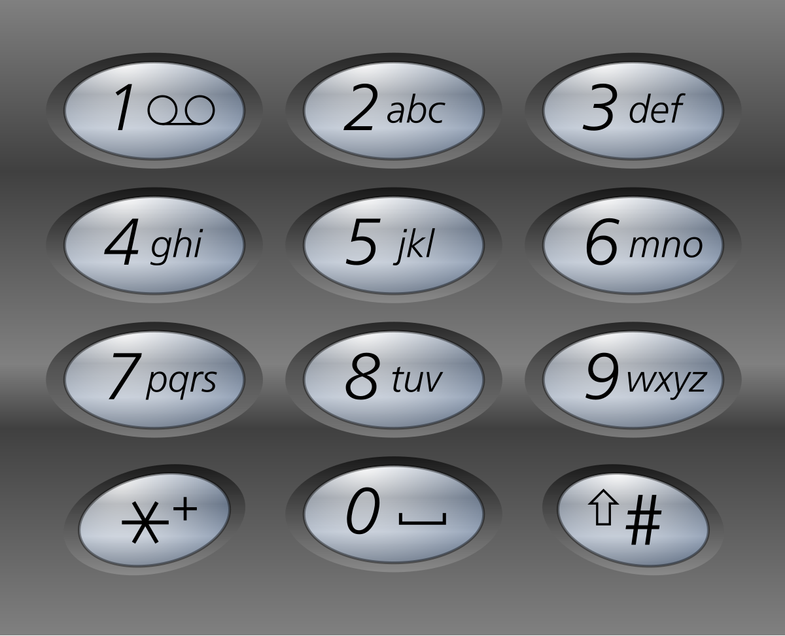
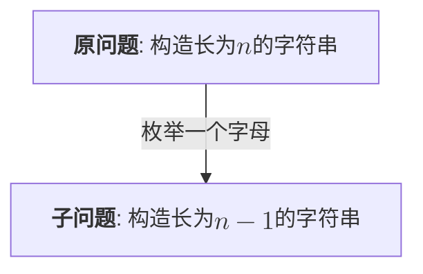
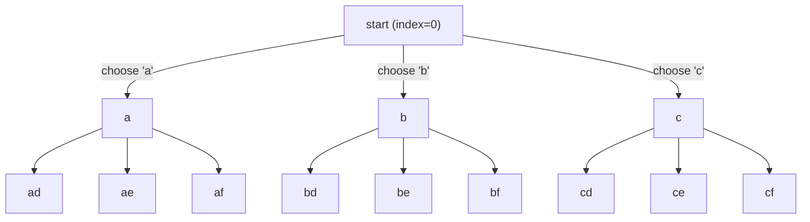

---
tags:
    - Hash Table
    - String
    - Backtracking
    - Top Interviews
---

# [17. Letter Combinations of a Phone Number](https://leetcode.com/problems/letter-combinations-of-a-phone-number/)

Given a string containing digits from `2-9` inclusive, return all possible letter combinations that the number could represent. Return the answer in **any order**.

A mapping of digits to letters (just like on the telephone buttons) is given below. Note that 1 does not map to any letters.



 

**Example 1:**

```
Input: digits = "23"
Output: ["ad","ae","af","bd","be","bf","cd","ce","cf"]
```

**Example 2:**

```
Input: digits = ""
Output: []
```

**Example 3:**

```
Input: digits = "2"
Output: ["a","b","c"]
```

 

**Constraints:**

- `0 <= digits.length <= 4`
- `digits[i]` is a digit in the range `['2', '9']`.


**Solution:**

```java
class Solution {
    public List<String> letterCombinations(String digits) {
        List<String> combinations = new ArrayList<>();
        int n = digits.length();
        if (n == 0){
            return combinations;
        }

        Map<Character, String> letters = Map.of(
            '2', "abc",
            '3', "def",
            '4', "ghi",
            '5', "jkl",
            '6', "mno",
            '7', "pqrs",
            '8', "tuv",
            '9', "wxyz"
        );
        StringBuilder sb = new StringBuilder();
        dfs(0, sb, digits, letters, combinations);
        return combinations;
    }

    private void dfs(int index, StringBuilder sb, String digits, Map<Character, String> letters, List<String> combinations){
        if (index == digits.length()){
            combinations.add(sb.toString());// O(n)
            return;
        }

        String possibleLetters = letters.get(digits.charAt(index));
        for (char letter : possibleLetters.toCharArray()){
            sb.append(letter);
            dfs(index + 1, sb, digits, letters, combinations);
            sb.deleteCharAt(sb.length() - 1);
        }
    }
}
```

TC: 时间复杂度:$O(n4^n)$, 其中$n$为$digits$的长度, 最坏情况下每次需要枚举4个字母, 递归次数为一个满四叉树的节点个数, 那么一共会递归$O(4^n)$次(等比数列和), 再算上加入答案时复制$path$需要$O(n)$的时间, 所以时间复杂度为$O(n4^n)$. 

SC: $O(n)$. 返回值的空间不计.


子问题和原问题是相似的, 这种从原问题到子问题的过程, 适合用**递归**解决.




回溯有一个增量构造答案的过程, 这个过程通常用递归实现





回溯三问:

1. 当前操作? 枚举$path[i]$ 要填入的字母
2. 子问题? 构造字符串$\geq i$ 的部分
3. 下一个子问题? 构造字符串$\geq i + 1$ 的部分

$dfs(i) \rightarrow dfs(i + 1)$


```java
class Solution {
    public List<String> letterCombinations(String digits) {
        List<String> combinations = new ArrayList<>();

        if (digits.length() == 0){
            return combinations;
        }

        Map<Character, String> letters = Map.of(
            '2', "abc", 
            '3', "def", 
            '4', "ghi", 
            '5', "jkl", 
            '6', "mno", 
            '7', "pqrs", 
            '8', "tuv", 
            '9', "wxyz"
        );

        backtrack(0, new StringBuilder(), digits, letters, combinations);
        return combinations;
    }

    private void backtrack(int index, StringBuilder sb, String digits, Map<Character, String> letters, List<String> combinations){
        if (sb.length() == digits.length()){
            combinations.add(sb.toString());
            return;
        }

        String possibleLetters = letters.get(digits.charAt(index));
        for (char letter : possibleLetters.toCharArray()){
            sb.append(letter);
            backtrack(index + 1, sb, digits, letters, combinations);

            sb.deleteCharAt(sb.length() - 1);
        }

    }
}

// TC: O(nbranch^level) = O(nk^n) = O(n4^n)
// SC: O(level) = O(n)
```


DFS vs Backtrack


> 区别分析：
>
> 1. **Terminology（术语上的区别）**：
>    - 上面的代码看似是 Backtracking 实现，实际上在某种程度上也可以被称为 DFS。这两者的差别更多在于问题类型和如何优化搜索，而不是在具体的实现细节上。
>    - **DFS** 更偏向于一种遍历方式，而 **Backtracking** 通常用于特定类型的问题，如组合问题、排列问题，且它会在无效的路径上做**剪枝**（通过回溯避免无效的搜索）。
> 2. **搜索方式**：
>    - **DFS** 是沿着一条路径走到底再回溯，一般不做复杂的判断（只是在目标找到时结束）。
>    - **Backtracking** 则会在某些路径不符合条件时提前结束搜索（比如数独、N皇后问题中发现某个选择导致解无效，就会提前回溯）。
>
> 代码上的区别：
>
> - **DFS** 版本通常不强调剪枝机制，更多的是简单地递归遍历所有可能的路径。
> - **Backtracking** 版本则会在递归的过程中进行选择，并且通常带有“撤销选择”（即回溯）的机制。
>
> 综上，**DFS 和 Backtracking 在实现上的区别其实并不大**，都是通过递归进行深度搜索。在具体问题中，Backtracking 更强调“尝试 + 回溯”的过程，而 DFS 只是单纯地进行深度遍历。


> **时间复杂度空间复杂度 数学推导**
>
> 设：
>
> - 输入长度：$$n = |digits|$$
> - 第 $$i$$ 个数字对应的字母数：$$k_i \in \{3,4\}$$
> - 如果每个数字的字母数近似相等，记为常数 $$k$$（$$3 \le k \le 4$$）
>
> 1. 递归树节点数
>
>    递归形成一棵深度为 $$n$$ 的树，第 $$d$$ 层的节点数为：
>    $$
>    \prod_{i=1}^{d} k_i = k_1 \times k_2 \times k_3 \times \dots \times k_d
>    $$
>    因为等比数列(Geometric series):
>    $$
>    S_n = 1 + k + k^2 + \cdots + k^n
>    $$
>    其中：
>
>    - 首项 $a=1$ 
>    - 公比 $r=k$
>
>    $$
>    S_n = a \cdot \frac{r^{n+1} - 1}{r - 1}
>    $$
>
>    带入$a=1, r=k$:
>    $$
>    \sum_{d=0}^n k^d = \frac{k^{n+1} - 1}{k - 1}
>    $$
>    当 $$n$$ 很大时，主导项是 $$k^{n+1}$$，因为：
>
>    $$
>    k^{n+1} \gg 1
>    $$
>    分母 $$k - 1$$ 是常数，不影响渐进复杂度，因此：
>    $$
>    \frac{k^{n+1} - 1}{k - 1} \approx \frac{k^{n+1}}{k - 1}
>    $$
>    去掉常数因子$\frac{1}{k-1}$后：
>
>    $$
>    \sum_{d=0}^n k^d = \Theta(k^{n+1})
>    $$
>    均匀情形下近似为：
>
> $$
> \sum_{d=0}^n k^d = \frac{k^{n+1} - 1}{k - 1} = \Theta(k^{n+1})
> $$
>
> 2. 叶子节点输出成本
>
>    叶子节点总数为：
>    $$
>    L = \prod_{i=1}^n k_i
>    $$
>    均匀情形为：
>    $$
>    L = k^n
>    $$
>    每个叶子生成字符串的成本为 $$O(n)$$，因此总成本为：
>    $$
>    O\left( n \cdot k^n \right)
>    $$
>
> 3. 总时间复杂度
>
>    总时间为：
>    $$
>    T(n) = \Theta(k^{n+1}) + O\left( n \cdot k^n \right)
>    $$
>    当 $$n \ge \frac{k}{k-1}$$（对于 $$k=3,4$$，即 $$n \ge 2$$）时，第二项占主导：
>    $$
>    T(n) = O\left( n \cdot k^n \right)
>    $$
>    最坏情况 $$k=4$$：
>    $$
>    T(n) = O\left( n \cdot 4^n \right)
>    $$
>    平均情况 $$k \approx 3$$：
>    $$
>    T(n) = O\left( n \cdot 3^n \right)
>    $$
>    
>
> 空间复杂度
>
> 1. 递归栈空间
>
>    递归深度最多为 $$n$$（每处理一位数字递一层调用），调用栈占用：
>    $$
>    O(n)
>    $$
>
> 2.  临时变量
>
> `StringBuilder` 在递归中复用，最大长度为 $$n$$，空间为 $$O(n)$$
>
> 数字到字母的映射 `Map.of(...)` 是常量大小，空间为 $$O(1)$$
>
> 3. 总辅助空间
>
>    去掉返回值所需的存储空间后，辅助空间复杂度为：
>    $$
>    O(n) + O(n) + O(1) = O(n)
>    $$
