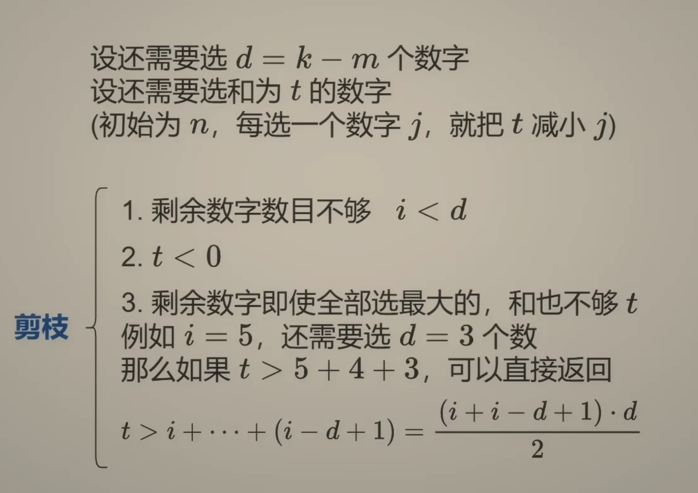

---
tags:
    - Array
    - Backtracking
    - Top Interviews
---

# [216. Combination Sum III](https://leetcode.com/problems/combination-sum-iii/)

Find all valid combinations of `k` numbers that sum up to `n` such that the following conditions are true:

- Only numbers `1` through `9` are used.
- Each number is used **at most once**.

Return *a list of all possible valid combinations*. The list must not contain the same combination twice, and the combinations may be returned in any order.

 

**Example 1:**

```
Input: k = 3, n = 7
Output: [[1,2,4]]
Explanation:
1 + 2 + 4 = 7
There are no other valid combinations.
```

**Example 2:**

```
Input: k = 3, n = 9
Output: [[1,2,6],[1,3,5],[2,3,4]]
Explanation:
1 + 2 + 6 = 9
1 + 3 + 5 = 9
2 + 3 + 4 = 9
There are no other valid combinations.
```

**Example 3:**

```
Input: k = 4, n = 1
Output: []
Explanation: There are no valid combinations.
Using 4 different numbers in the range [1,9], the smallest sum we can get is 1+2+3+4 = 10 and since 10 > 1, there are no valid combination.
```

 

**Constraints:**

- `2 <= k <= 9`
- `1 <= n <= 60`


Solution:

方法一: 枚举选哪个

**注**：这题如果改成求方案个数（而不是具体方案），就是**恰好装满型 0-1 背包**。

设还需要选d=k-m个数字

设还需要选和为t的数字(初始为n, 每选一个数字j, 就把t减小j)

剪枝: 

1. 剩余数字数目不够i<d

2. t<0

3. 剩余数字即使全部选最大的, 和也不够t.例如i = 5, 还需要选d=3个数. 那么如果t>5+4+3, 可以直接返回
   $$
   t > i + \dots + (i - d + 1) = \frac{(i + i - d + 1)\cdot d}{2}
   $$

4. 

```java
class Solution {
    public List<List<Integer>> combinationSum3(int k, int n) {
        List<List<Integer>> result = new ArrayList<>();
        List<Integer> subResult = new ArrayList<>();

        int index = 9;
        dfs(index, k, n, subResult, result); // 从i=9开始倒着枚举
        return result; 
    }

    private void dfs(int i, int k, int leftSum, List<Integer> subResult, List<List<Integer>> result){
        int d = k - subResult.size(); // 还要选d个数
        if (leftSum < 0 || leftSum > (i + i - d + 1) * d / 2){
            // 剪枝
            return;
        } 

        if (d == 0){ // 找到一个合法组合
            result.add(new ArrayList<>(subResult));
            return;
        }

        // 枚举的数不能太小, 否则后面没有数可以选
        for (int j = i; j >= d; j--){
            subResult.add(j);
            dfs(j - 1, k, leftSum - j, subResult, result);
            subResult.remove(subResult.size() - 1);
        }

    }
}
```

复杂度分析
时间复杂度：分析回溯问题的时间复杂度，有一个简易公式：路径长度×搜索树的叶子数。对于本题，路径长度始终为 k，叶子个数为 C(9,k)，所以时间复杂度为 O(k⋅C(9,k))（去掉剪枝就是 77. 组合）。
空间复杂度：O(k)。返回值不计入。


方法二: 选或不选


```java
class Solution {
    public List<List<Integer>> combinationSum3(int k, int n) {
        List<List<Integer>> result = new ArrayList<>();

        List<Integer> subResult = new ArrayList<>();

        int index = 1;
        int curSum = 0;
        backtrack(index, k, n,subResult, result, curSum);
        return result;
    }

    private void backtrack(int index, int k, int n, List<Integer> subResult, List<List<Integer>> result, int curSum){
        if (subResult.size() == k || curSum > n){
            if (curSum == n){
                result.add(new ArrayList<>(subResult));
            }

            return;
        }


        for (int i = index; i <= 9; i++){
            subResult.add(i);
            backtrack(i + 1, k, n, subResult, result, curSum + i);
            subResult.remove(subResult.size() -1);
        }

        return;
    }
}

// TC: O(kC_n^k)
// SC: O(k)
```


```java
class Solution {
    public List<List<Integer>> combinationSum3(int k, int n) {
        List<List<Integer>> result = new ArrayList<>();
        List<Integer> subResult = new ArrayList<>();

        dfs(9, k, n, subResult, result);
        return result;
    }

    private void dfs(int i, int k, int leftSum, List<Integer> subResult, List<List<Integer>> result){
        int d = k - subResult.size(); // 还要选d个数
        if (leftSum < 0 || leftSum > (i + i - d + 1) * d / 2){
            return;
        }

        if (d == 0){
            // 找到一个合法组合
            result.add(new ArrayList<>(subResult));
            return;
        }

        // 不选i
        if (i > d){
            dfs(i - 1, k, leftSum, subResult, result);
        }

        // 选i
        subResult.add(i);
        dfs(i - 1, k, leftSum - i, subResult, result);
        subResult.remove(subResult.size() -1);
        return;
    }
}
```




```java
class Solution {
    public List<List<Integer>> combinationSum3(int k, int n) {
        List<List<Integer>> result = new ArrayList<>();

        List<Integer> subResult = new ArrayList<>();
        int curSum = 0;
        int index = 1;
        backtracking(index,n, k, curSum, subResult, result);
        return result;
    }

    private void backtracking(int index, int n, int k, int curSum, List<Integer> subResult, List<List<Integer>> result){
        if (subResult.size() == k){
            if (curSum == n){
                result.add(new ArrayList<>(subResult));
            }
            return;
        }

        if (subResult.size() > k){
            return;
        }

        if (curSum > n){
            return;
        }

        for(int i = index; i <= 9; i++){
            subResult.add(i);
            backtracking(i + 1, n, k , curSum + i, subResult, result);
            subResult.remove(subResult.size() - 1);
        }


    }
}
```


