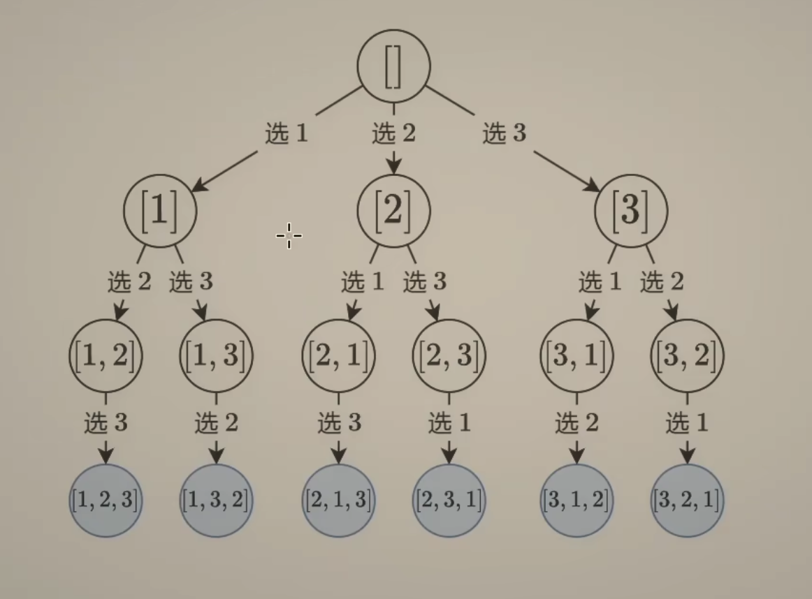
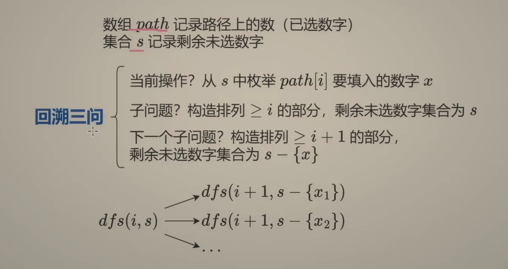
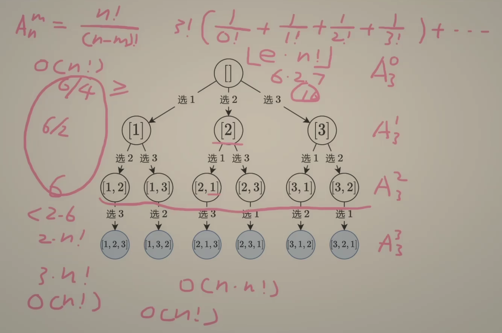
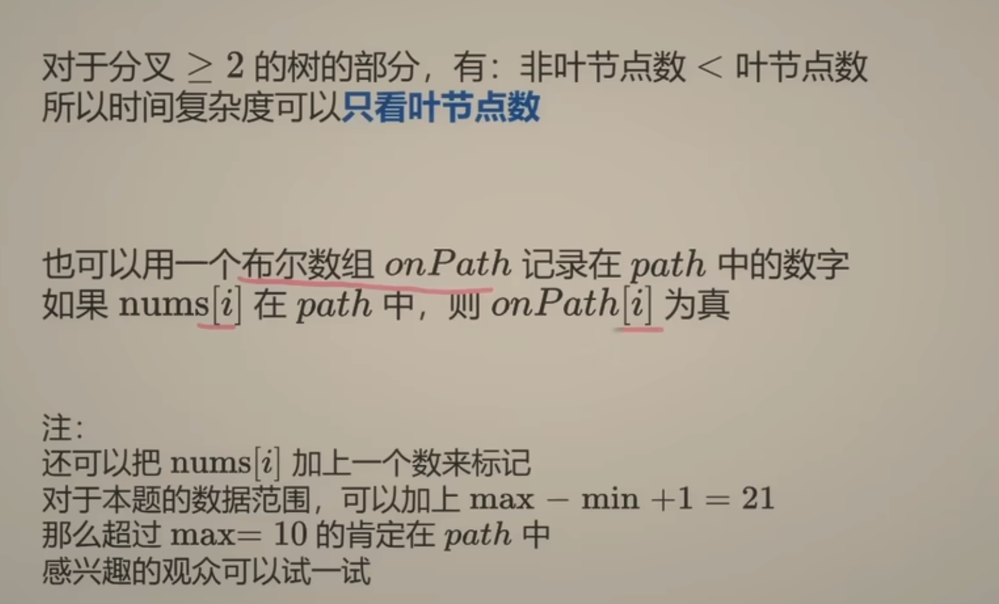

# [46. Permutations](https://leetcode.com/problems/permutations/)

Given an array `nums` of distinct integers, return *all the possible permutations*. You can return the answer in **any order**.


**Example 1:**

```
Input: nums = [1,2,3]
Output: [[1,2,3],[1,3,2],[2,1,3],[2,3,1],[3,1,2],[3,2,1]]
```

**Example 2:**

```
Input: nums = [0,1]
Output: [[0,1],[1,0]]
```

**Example 3:**

```
Input: nums = [1]
Output: [[1]]
```

```java
class Solution {
    public List<List<Integer>> permute(int[] nums) {
        List<List<Integer>> result = new ArrayList<>();
        Set<Integer> visited = new HashSet<>();
        List<Integer> subResult = new ArrayList<>();

        int index = 0;
        backtrack(index, result, visited, subResult, nums);
        return result;
    }

    private void backtrack(int index, List<List<Integer>> result, Set<Integer> visited, List<Integer> subResult, int[] nums){
        if (index == nums.length){
            result.add(new ArrayList<>(subResult));// O(n) copy time
            return;
        }

        for (int i = 0; i < nums.length; i++){
            if (visited.contains(i)){
                continue;
            }else{
                visited.add(i);
                subResult.add(nums[i]);
                backtrack(index + 1, result, visited, subResult, nums);

                visited.remove(i);
                subResult.remove(subResult.size() - 1);

            }
        }
    }
}

// TC: O(n * n!)   A
// SC: O(n)
```










```java
class Solution {
    public List<List<Integer>> permute(int[] nums) {
        List<List<Integer>> result = new ArrayList<List<Integer>>();
        if (nums == null || nums.length == 0){
            return result;
        }

        int index = 0;
        helper(nums, index, result);
        return result;
        
    }

    private static void helper(int[] nums, int index, List<List<Integer>> result){
        if (index == nums.length){
            List<Integer> subResult = new ArrayList<Integer>();
            for (int i = 0; i < nums.length; i++){
                subResult.add(nums[i]);
            }
            result.add(new ArrayList<>(subResult));
        }

        for (int i = index; i < nums.length; i++){
            swap(nums, i, index);
            helper(nums, index+1, result);
            swap(nums, i, index);
        }
    }

    private static void swap(int[] nums, int i , int j){
        int rem = nums[i];
        nums[i] = nums[j];
        nums[j] = rem;
    }
}


/*

1. Draw recursive tree

2. level: swap num[level] => protect the index of level  
           
3. branch:  swap(i, index)   after protect number posibility


    level                                      [1, 2, 3]
                              /              /             \
       0                  [1|2,3]           [2|1,3]          [3|2, 1]
                         swap(0,0)         swap(0,1)         swap(0,2)       -> for( int i=index; index < nums.length)
                       /     \              /    \            /       \
      1          [1 2|3].    [1 3| 2]    [2 1|3].  [2 3 |1]   [3 2| 1]  [3 1 |2]   
               swap(1,1)     s(1,2)     s(1,1)     s(1,2)    s(1,1)     s(1,2)
                    |          |           |         |         |          |
      2           [1 2 3].    [1 3 2]    [2 13].  [2 3 1]   [3 2 1]  [3 1 2] 
               swap(2,2)      s(2,2)     s(2,2)    s(2,2)     s(2,2)   s(2,2)

// TC:  1*2*3= > 6.     O(n!)

// SC:  O(n)


*/ 
```


## DFS经典例题4 Given a string with no duplicate letters, how to print out all permutations of the string.


64. All Permutations I

Given a string with no duplicate characters, return a list with all permutations of the characters.

Assume that input string is not null.

**Examples**

Set = “abc”, all permutations are [“abc”, “acb”, “bac”, “bca”, “cab”, “cba”]

Set = "", all permutations are [""]


Permutation:

1. 顺序 matter

   output 顺序matter

2. 能不选吗? 不能

它和subset不一样

\_	 _	 _                                

类似高中里学的排序

数的个数固定

 n = > n!

3 x 2 x 1 = 3!


DFS基本方法:

1. what does it store on each level? (每层代表什么意义? 一般来讲解题之前就知道DF要recurse多少层)

   选定一个字母加

   

2. How many different states should we try to put on this level? (每层有多少个状态/ case 需要try?) 

   所有这一层可以加的元素

   

   ​																		[ ]

   ​											/								|						\

   level 1 							a_ _           				b _ _					c _ _

   ​										/	\							/   \						/	\

   level 2 					ab_       ac_ 					ba_  bc_				ca_    cb_

   ​								  |          |        				  |		|					|		|

   level3					 abc        acb         			bac     bca             cab      cba

    


O(n) time loop 看一下

Set O(1)  用 O(n)的空间换O(1)时间

O(n) 能知道加没加过任何一个character

Time: O(n^n) => O(n! * n)             * n 每一层都得知道加没加

Space O(n)


Laioffer 骚操作:

**==Method: Swap - Swap==**

每一层: 用swap的方式把一个元素固定到一个index

一共多少层: n

分支: 能把谁固定到这个位置

挡板的数已经固定住了, 不用再检查一遍了

swap(0, 0): 相当于把0这个位置 用0的位置的a固定住了

​															index			0 1 2

​																				[a, b, c]

​									/	swap(0, 0)                | swap(1,0)			\	swap(2, 0)      经过第一层 index = 0固定好了

level 1:					[==a==, |b,c]								[==b==, |a, c]							[==c==, |b, a]   无形中就有了一个挡板

index= 0       

​								/ swap(1,1)   \swap(1,2)        /swap(1,1) \swap(1,2)                 /swap(1,1)         \swap(1,2)

level 2:				[==a, b==,|c]             [==a, c==,| b]       [==b, a,== c]			[==b, c==, a]             [==c, b==, a]						[==c, a==, b]

index =1

​							swap(2,2)

level 3:   			[a, b,|c]             [a, c,| b]       [b, a, c]			[b, c, a]             [c, b, a]						[c, a, b]  所有的收集解.               abc                   acb                    bac                 bca                    cba                               cab


index: 我当前层要固定到哪儿个位置 + 挡板

[0.....index-1] 已经固定好的元素

 ==a== |     b      c

​		index

[inde, ... index -1] 还没固定的元素

```java
void permutation(char[] input, int index){
  if (index == input.length){ // print solution and return;
    System.out.println(input);
    return;                   // base case
  }
  // put each letter in the index-th position of the input str.
  // branch: 这一层所有之前没加过可以被swap到index的元素
  for (int i = index; i < input.length; i++ ){
    swap(input, i, index);          // 吃
    permutation(input, index + 1);
    
    swap(input, i, index);    // 吐
  }
}
```


如果不换回 为什么会错:

​											[a, b, c]

level 1:                   / swap (0, 0)                       \ swap(1, 0)                                                \ swap(2, 0)

index = 0		     [==a==, b, c]		                         ^          [ c, a, b]         					   ^         [a, b, c]  ❌

​						/				\	                             |             /        \						   	|

level 2:     swap(1,1)      swap(2,1)                  |     swap(1,1)  swap(2, 1)		  	|	

index =1   [==a, b==, c]         |---> [a, c, b]              |    [c,a, b]        [c, b, a]		 		  |

​						|              |           \                     |           |               |						 |

level 3:		swap(2, 2)  |        swap(2, 2)       |     s(2, 2)          s(2,2) 					|

index =2      [==a, b, c==]  -----          [a, c, b] ---------       [c, a, b]      [c, b, a]         ---------

​						OK 						OK

​            原本是要退回 上一层[a, b, c] 但是这儿不退回 直接去swap(2, 1)

不吐的话会漏解，因为会重复.


1. subset  => 结果中每个元素的顺序无关2分支
2. () => 结果中每个元素的顺序有关 2 分支
3. 99 cents => 结果中每个元素的顺序没关系 4层 99 分支
4. permutation => swap swap


```java
public class Solution {
  public List<String> permutations(String input) {
    // Write your solution here
    List<String> result = new ArrayList<String>();
    char[] inputChar = input.toCharArray();
    if (inputChar == null){
      return result;
    }
    int index = 0;
    helper(inputChar, index, result);
    return result;
  }

  private static void helper(char[] inputChar, int index, List<String> result){
    if (index == inputChar.length){
      String subResult = new String(inputChar);
      result.add(subResult);
      return;
    }

    for (int i = index; i < inputChar.length; i++){
      swap(inputChar, i, index);
      helper(inputChar, index+1, result);
      swap(inputChar, i, index);
    }
  }

  private static void swap(char[] inputChar, int i, int j){
    char rem = inputChar[i];
    inputChar[i] = inputChar[j];
    inputChar[j] = rem;
  }
}

```

