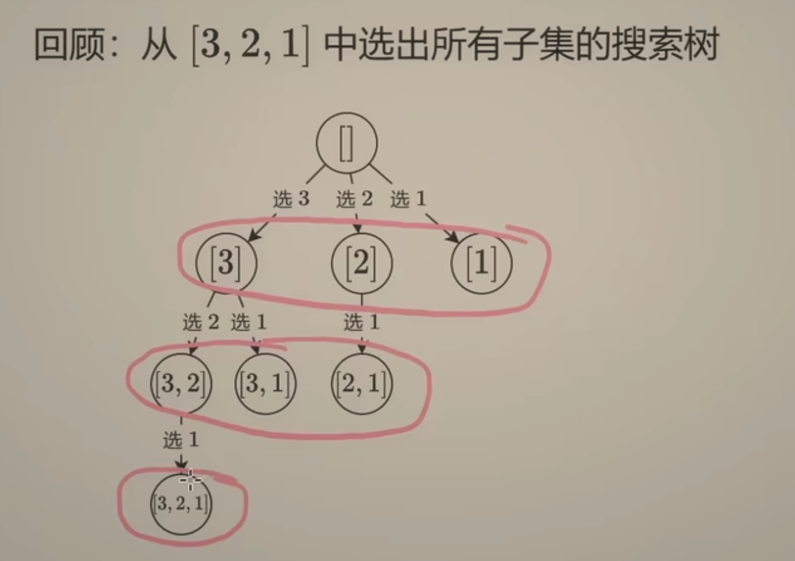
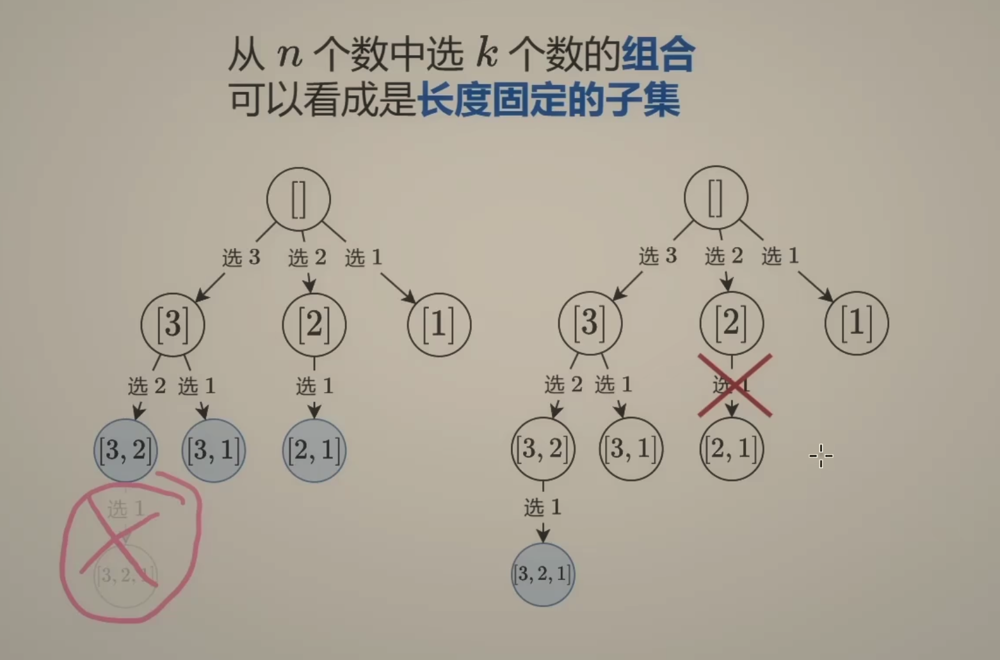
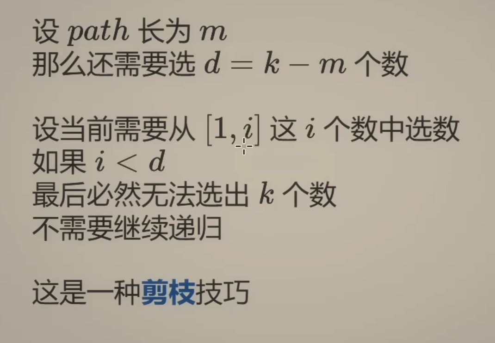
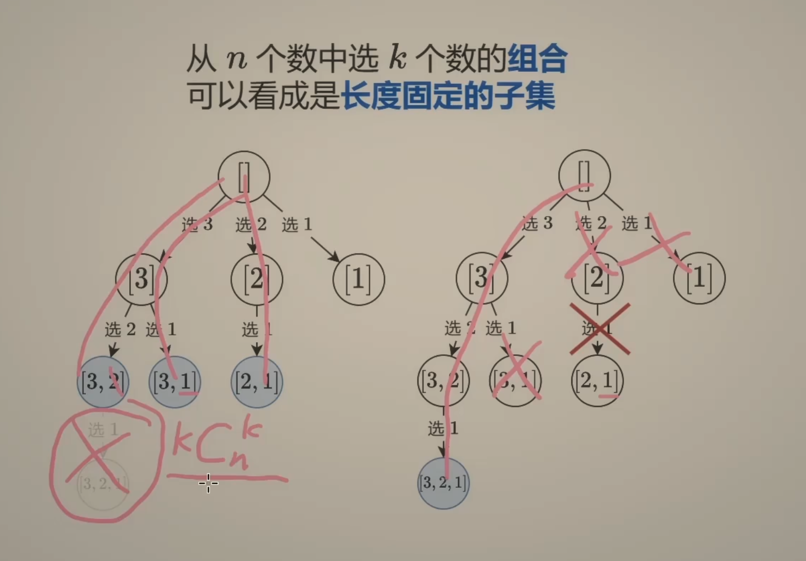

---
tags:
    - Backtracking
    - Top Interviews
---

# [77. Combinations](https://leetcode.com/problems/combinations/)

Given two integers `n` and `k`, return *all possible combinations of* `k` *numbers chosen from the range* `[1, n]`.

You may return the answer in **any order**. 

**Example 1:**

```
Input: n = 4, k = 2
Output: [[1,2],[1,3],[1,4],[2,3],[2,4],[3,4]]
Explanation: There are 4 choose 2 = 6 total combinations.
Note that combinations are unordered, i.e., [1,2] and [2,1] are considered to be the same combination.
```

**Example 2:**

```
Input: n = 1, k = 1
Output: [[1]]
Explanation: There is 1 choose 1 = 1 total combination.
```

 **Solution:**

选或不选:

```java
class Solution {
    public List<List<Integer>> combine(int n, int k) {
        List<List<Integer>> result = new ArrayList<>();

        List<Integer> subResult = new ArrayList<>();

        int index = 1;

        backtracking(index, n, k, result, subResult);
        return result;
    }

    private void backtracking(int index, int n, int k, List<List<Integer>> result, List<Integer> subResult){
        if (subResult.size() == k){
            result.add(new ArrayList<>(subResult));
            return;
        }

        for (int i = index; i <= n; i++){
            subResult.add(i);
            backtracking(i + 1, n, k, result, subResult);
            subResult.remove(subResult.size() - 1);
        }

        return;
    }
}

// TC: O(kC_n^k)
// SC: O(n)
```

1.组合型回溯: leetcode 77, 216, 22

2. 剪枝
3. 分析回溯时间复杂度的通用方法








枚举下一个数选哪个:

```java
class Solution {
    public List<List<Integer>> combine(int n, int k) {
        List<List<Integer>> reuslt = new ArrayList<>();
        List<Integer> subResult = new ArrayList<>();
        dfs(n, k, subResult, result); // 从i=n开始倒着枚举, 这样dfs中就不需要n了,少传一个参数
        return result;
    }

    private void dfs(int i, int k, List<Integer> subResult, List<List<Integer>> result){
        int d = k - subResult.size(); // 还要选d个数
        if (d == 0){ // 选好了
            result.add(new ArrayList<>(subResult));
            return;
        }

        // 枚举的数不能太小, 否则后面没有数可以选
        for (int j = i; j >= d; j--){
            subResult.add(j);
            dfs(j - 1, k, subResult, result);
            subResult.remove(subResult.size() - 1); 
        }

    }
}
// 时间复杂度：分析回溯问题的时间复杂度，有一个简易公式：路径长度×搜索树的叶子数。对于本题，路径长度始终为 k，叶子个数为 C(n,k)，所以时间复杂度为 O(k⋅C(n,k))。
// TC: O(k). 返回值不计入
```


```java
class Solution {
    public List<List<Integer>> combine(int n, int k) {  
        List<List<Integer>> result = new ArrayList<List<Integer>>();
        // base case
        if (n == 0 || k == 0){
            return result;
        }

        int[] nums = new int[n];
        for (int i = 1; i <= n; i++){
            nums[i-1] = i; 
        }

        List<Integer> subResult =  new ArrayList<Integer>();

        helper(nums, 0, subResult, result, k);
        return result;
        
    }

    private static void helper(int[] nums, int index, List<Integer> subResult, List<List<Integer>> result, int k){
        // check
        if (subResult.size() == k){
            result.add(new ArrayList<Integer>(subResult));
            return;
        }

        // base case
        if (index == nums.length){
            return;
        }

        subResult.add(nums[index]);
        helper(nums, index + 1, subResult, result, k);

        subResult.remove(subResult.size() - 1);
        helper(nums, index + 1, subResult, result, k);
    }
}


/*
            n = 4     k = 2
          1 2 3 4
        /      \
0      1             - 
      / \           / \
1    12   -         2   -
         /\       / \    /\
2       3  -     23 2   3  -
       / \  /\      /\  / \   /\
3     34  3 4 -    24 2 34 -  4 -
          /
4       index = n; return 
 
*/
// O((n!)/(k−1)!(n−k)!)
//	SC: O(k)
```

branch means pick 

level size


$$
\binom{n}{k} = \frac{n!}{k!\,(n-k)!}
$$
读作"从n个元素里选k个".

> 1. 回溯搜索树是什么
>
>    当你写 `dfs(i, k, subResult, result)` 的时候，其实构造了一棵**搜索树**：
>
>    - 每一层代表「选择一个数」。
>    - 每一条路径（从根到叶子）就是一组选择序列。
>    - 当选满 \(k\) 个数时（深度 = k），就到达了一个叶子结点。
>
> 2. 为什么一条完整路径对应一个组合
>
>    组合的定义是：从 \(n\) 个数里挑 \(k\) 个数，不考虑顺序。
>
>    在搜索过程中：
>    - 从大到小枚举 \(j\)，避免重复或顺序交换（\(\{1,2\}\) 和 \(\{2,1\}\) 只会出现一次）。
>    - 一旦路径长度 = \(k\)，这条路径正好是一个合法组合。
>
>    👉 因此：
>    $$
>    \text{完整路径} \quad \Longleftrightarrow \quad \text{一个组合}
>    $$
>
> 3. 为什么叶子结点数 = $\binom{n}{k}$
>    - **叶子结点** = 当搜索深度 = \(k\) 时的终止点。
>    - 此时 `subResult` 含有 \(k\) 个数，构成一个组合。
>    - 所有可能的组合数正好是二项式系数：
>    $$
>    \binom{n}{k} = \frac{n!}{k!\,(n-k)!}
>    $$
>
> 4. 直观类比
>
>    想象一棵树：
>
>    - 根结点：还没选任何数。
>    - 第 1 层：选了第一个数。
>    - 第 2 层：选了第二个数。
>    - …
>    - 第 \(k\) 层：选满 \(k\) 个数，到达叶子。
>
>    每个叶子就是一条独立路径，而这条路径就是一个组合。  叶子总数 = 组合总数 =$ \binom{n}{k}$.

