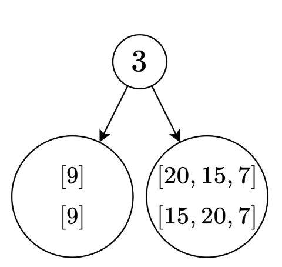
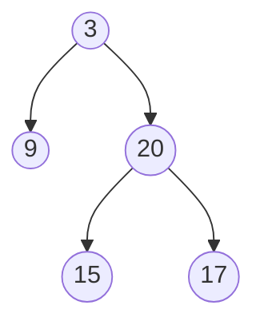

---
tags:
    - Array
    - Hash Table
    - Divide and Conquer
    - Tree
    - Binary Tree
    - Top Interviews
---

# [105. Construct Binary Tree from Preorder and Inorder Traversal](https://leetcode.com/problems/construct-binary-tree-from-preorder-and-inorder-traversal/)

Given two integer arrays `preorder` and `inorder` where `preorder` is the preorder traversal of a binary tree and `inorder` is the inorder traversal of the same tree, construct and return *the binary tree*.

 

**Example 1:**


```
Input: preorder = [3,9,20,15,7], inorder = [9,3,15,20,7]
Output: [3,9,20,null,null,15,7]
```

**Example 2:**

```
Input: preorder = [-1], inorder = [-1]
Output: [-1]
```


**Solution:** 

想要独一无二地还原，必须要有in-order

Given PreOrder      root left right

​			abc 		 ->         preOrderArray left right     preOrder[left] -> root

Given PostOrder 	left right root  (root最后去的)

​			cba                       preOrderArray left right    postOrder[right] -> root


=>

​	       	a

​		   /           \

​                b                c

​										 left   right

preOrder [a, b, c]          [0, preOrder.length-1]   ->   preOrder[0] = preOrder[left]

postOrder [b, c, a]		[0, postOrder.length-1] -> postOrder[postOrder.length -1] = postOrder[right]


preorder = [==3==,9,20,15,7] 

​		      l                r


root= preorder[left]

​		  0 1  2   3   4

inorder = [9,==3==,15,20,7]

​                   l                r


hashmap: <9,0> <3,1> <15,2>, <20, 3>, <7,4>

-> indexofMid = 1

root.left = 1-1, 

```java
/**
 * Definition for a binary tree node.
 * public class TreeNode {
 *     int val;
 *     TreeNode left;
 *     TreeNode right;
 *     TreeNode() {}
 *     TreeNode(int val) { this.val = val; }
 *     TreeNode(int val, TreeNode left, TreeNode right) {
 *         this.val = val;
 *         this.left = left;
 *         this.right = right;
 *     }
 * }
 */
class Solution {
    public TreeNode buildTree(int[] preorder, int[] inorder) {
        // base case 
        if (preorder == null || preorder.length == 0){
            return null;
        }

        if (preorder.length == 1){
            return new TreeNode(preorder[0]);
        }

        Map<Integer, Integer> inIndex = new HashMap<Integer, Integer>(); // 预分配空间
        for (int i = 0; i < inorder.length; i++){
            inIndex.put(inorder[i], i);
        }

        int preLeft = 0;
        int preRight = preorder.length - 1;
        int inLeft = 0;
        int inRight = inorder.length - 1;
        return helper(preorder, inIndex, preLeft, preRight, inLeft, inRight);           // 闭区间
    }

    private TreeNode helper(int[] preorder, Map<Integer,Integer> inIndex, int preLeft, int preRight, int inLeft, int inRight){
        if (inLeft> inRight){
            return null;
        }

        TreeNode root = new TreeNode(preorder[preLeft]);

        int inMid = inIndex.get(preorder[preLeft]);

        root.left = helper(preorder, inIndex, preLeft + 1, preLeft + inMid - inLeft, inLeft, inMid - 1);
        root.right = helper(preorder, inIndex, preLeft + inMid - inLeft + 1, preRight, inMid +1, inRight);

        return root;
    }
}

// TC: O(N)
// SC: O(n)
/*
     pre [3, 9, 20, 15, 7]
          l              r          pre[l] = root
          l  nr            left part
                 ln      r right part
     in  [9, 3, 15, 20, 7]
          l  m           r
          l
          nr
    inr > l
    return null

map<Integer, Integer>  in[i], i


 */
```


```java
/**
 * Definition for a binary tree node.
 * public class TreeNode {
 *     int val;
 *     TreeNode left;
 *     TreeNode right;
 *     TreeNode() {}
 *     TreeNode(int val) { this.val = val; }
 *     TreeNode(int val, TreeNode left, TreeNode right) {
 *         this.val = val;
 *         this.left = left;
 *         this.right = right;
 *     }
 * }
 */
class Solution {
    // Mehthod 1: Utilizing the inOrder sequence to determine
    // the size of left/right subtrees.
    public TreeNode buildTree(int[] preorder, int[] inorder) {
        // base case
        if (preorder == null || preorder.length == 0){
            return null;
        }

        if (preorder.length == 1){
            return new TreeNode(preorder[0]);
        }
        // Assumptions: pre, in are not null, there is no duplicates
        // in the binary tree, the length of pre and in are guaranteed
        // to be the same
        Map<Integer, Integer> inIndex = indexMap(inorder);
        return helper(preorder, inIndex, 0, inorder.length - 1, 0, preorder.length -1);
    }

    private Map<Integer, Integer> indexMap(int[] in){
        Map<Integer, Integer> map = new HashMap<>();
        for (int i = 0; i < in.length; i++){
            map.put(in[i], i);
        }
        return map;
    }

    private TreeNode helper(int[] pre, Map<Integer, Integer> inIndex, int inLeft, int inRight, int preLeft, int preRight){
        if (inLeft > inRight){
            return null;
        }

        TreeNode root = new TreeNode(pre[preLeft]);
        // get the position of the root in inOrder sequence, so that we will know
        // the size of left/right subtrees.

        int inMid = inIndex.get(root.val);

        root.left = helper(pre, inIndex, inLeft, inMid - 1, preLeft + 1, preLeft + inMid - inLeft);
        root.right = helper(pre, inIndex, inMid + 1, inRight, preLeft + inMid - inLeft + 1, preRight);
        return root;
    }
}

// TC: O(n)
// SC: O(n)
```


```java
/**
 * Definition for a binary tree node.
 * public class TreeNode {
 *     int val;
 *     TreeNode left;
 *     TreeNode right;
 *     TreeNode() {}
 *     TreeNode(int val) { this.val = val; }
 *     TreeNode(int val, TreeNode left, TreeNode right) {
 *         this.val = val;
 *         this.left = left;
 *         this.right = right;
 *     }
 * }
 */
class Solution {
  // Method 2: Another Linear Solution with traversing and constructing
  // the binary tree using preOrder and inOrder at the same time
    public TreeNode buildTree(int[] preorder, int[] inorder) {
      // Assumptions: pre, in are not null, there is no duplicates
      // in the binary tree, the length of pre and in are guaranteed
      // to be the same.
        int[] preIndex = new int[]{0};
        int[] inIndex = new int[]{0};
        return helper(preorder, inorder, preIndex, inIndex, Integer.MAX_VALUE); 
    }
  


    private TreeNode helper(int[] pre, int[] in, int[] preIndex, int[] inIndex, int target){
        if (inIndex[0] >= in.length || in[inIndex[0]] == target){
            return null;
        }
        TreeNode root = new TreeNode(pre[preIndex[0]]);

        preIndex[0]++;
        root.left = helper(pre, in, preIndex, inIndex, root.val);

        inIndex[0]++;
        root.right = helper(pre, in, preIndex, inIndex, target);
        return root;
    }
}
```


前序遍历: 按照[根-左子树-右子树]的顺序遍历二叉树.

中序遍历: 按照[左子树-根-右子树]的顺序遍历二叉树.


来看看示例1是怎么生成这棵二叉树的

[3, 9, 20, 15, 7] 前序遍历: 根-左-右

[9, 3, 15, 20, 7] 中序遍历: 左-根-右


preorder[0]是二叉树的根

[<span style="color:red">9</span>, 3, <span style="color:blue"> 15, 20, 7</span>] 
在中序遍历中找到3的位置, 3左边的数都在左子树中, 3右边的数都在右子树中.这样就知道了左右子树的大小.


[3, <span style="color:red">9</span>, <span style="color:blue"> 20, 15, 7</span>] 根据左右子树的大小, 可以知道在前序遍历中左右子树对应着子树组[9]和[20, 15, 7]


现在我们知道了左右子树的前序遍历和中序遍历, 这是一个和原问题一样的子问题, 可以用递归解决.




递归结束后.



递归边界: 如果preorder的长度是0, 对应着空节点, 返回空.


```java
/**
 * Definition for a binary tree node.
 * public class TreeNode {
 *     int val;
 *     TreeNode left;
 *     TreeNode right;
 *     TreeNode() {}
 *     TreeNode(int val) { this.val = val; }
 *     TreeNode(int val, TreeNode left, TreeNode right) {
 *         this.val = val;
 *         this.left = left;
 *         this.right = right;
 *     }
 * }
 */
class Solution {
    public TreeNode buildTree(int[] preorder, int[] inorder) {
        // [3, 9, 20, 15, 7 ]
        // pl
        //                pr
        // [9, 3, 15, 20, 7 ]
        //  il       
        //                ir
       //      m
        if (preorder == null || preorder.length == 0){
            return null;
        }

        int n = preorder.length;

        if (n == 1){
            return new TreeNode(preorder[0]);
        }

        Map<Integer, Integer> inIndex = new HashMap<>();
        for (int i = 0; i < n; i++){
            inIndex.put(inorder[i], i);
        }

        int preLeft = 0;
        int preRight = n - 1;
        int inLeft = 0;
        int inRight = n - 1;

        return dfs(preorder, inorder,inIndex, preLeft, preRight, inLeft, inRight);

    }
        // [3, 9, 20, 15, 7 ]
        // pl
        //                 pr
        //   [] 
        // 0.  1.  2.  3  4
        // [9, 3, 15, 20, 7 ]
        //  il       
        //                ir
       //      m
    private TreeNode dfs(int[] preorder, int[] inorder, Map<Integer, Integer> inIndex, int preLeft, int preRight, int inLeft, int inRight){
        if (preLeft > preRight){
            return null;
        }
        
        int curRootVal = preorder[preLeft];
        TreeNode root = new TreeNode(curRootVal);

        int leftTreeBoundary = inIndex.get(curRootVal); 

        int leftTreeCount = leftTreeBoundary - inLeft; // 1 -0 // 1  

        root.left = dfs(preorder, inorder, inIndex, preLeft + 1, preLeft + leftTreeCount, inLeft, leftTreeBoundary -1);

        root.right = dfs(preorder, inorder, inIndex, preLeft + leftTreeCount + 1, preRight, leftTreeBoundary + 1, inRight);
        return root;
    }
}
```

#### 复杂度分析

- 时间复杂度：O(*n*)，其中 *n* 为 *preorder* 的长度。递归 O(*n*) 次，每次只需要 O(1) 的时间。
- 空间复杂度：O(*n*)。


```java
/**
 * Definition for a binary tree node.
 * public class TreeNode {
 *     int val;
 *     TreeNode left;
 *     TreeNode right;
 *     TreeNode() {}
 *     TreeNode(int val) { this.val = val; }
 *     TreeNode(int val, TreeNode left, TreeNode right) {
 *         this.val = val;
 *         this.left = left;
 *         this.right = right;
 *     }
 * }
 */
class Solution {
    public TreeNode buildTree(int[] preorder, int[] inorder) {
        if (preorder == null){
            return null;
        }

        int n = preorder.length;
        if (n == 0){
            return null;
        }

        if (n == 1){
            return new TreeNode(preorder[0]);
        }

        Map<Integer, Integer> inIndex = new HashMap<>();

        for (int i = 0; i < n; i++){
            inIndex.put(inorder[i], i);
        }

        int preLeft = 0;
        int preRight = n - 1;

        int inLeft = 0;
        int inRight = n - 1;

        return dfs(preorder, inorder, inIndex, preLeft, preRight, inLeft, inRight);
    }

    private TreeNode dfs(int[] preorder, int[] inorder, Map<Integer, Integer> inIndex, int preLeft, int preRight, int inLeft, int inRight){
        if (preLeft > preRight){
            return null;
        }

        int curRootVal = preorder[preLeft];

        TreeNode root = new TreeNode(curRootVal);
        // [3, 9, 20, 15, 7]
        // pl
        //                pr 
        
        // [9, 3, 15, 20, 7]
        //  il   
        //                ir
        //      b 
        int leftTreeBoundary = inIndex.get(curRootVal);
        int leftTreeCount = leftTreeBoundary - inLeft; // 1- 0 = 1

        root.left = dfs(preorder, inorder, inIndex, preLeft + 1, preLeft + leftTreeCount, inLeft, leftTreeBoundary - 1);

        root.right = dfs(preorder, inorder, inIndex, preLeft + leftTreeCount + 1, preRight, leftTreeBoundary + 1, inRight);

        return root;

    }
}

// TC: O(n)
// SC: O(n)
```

