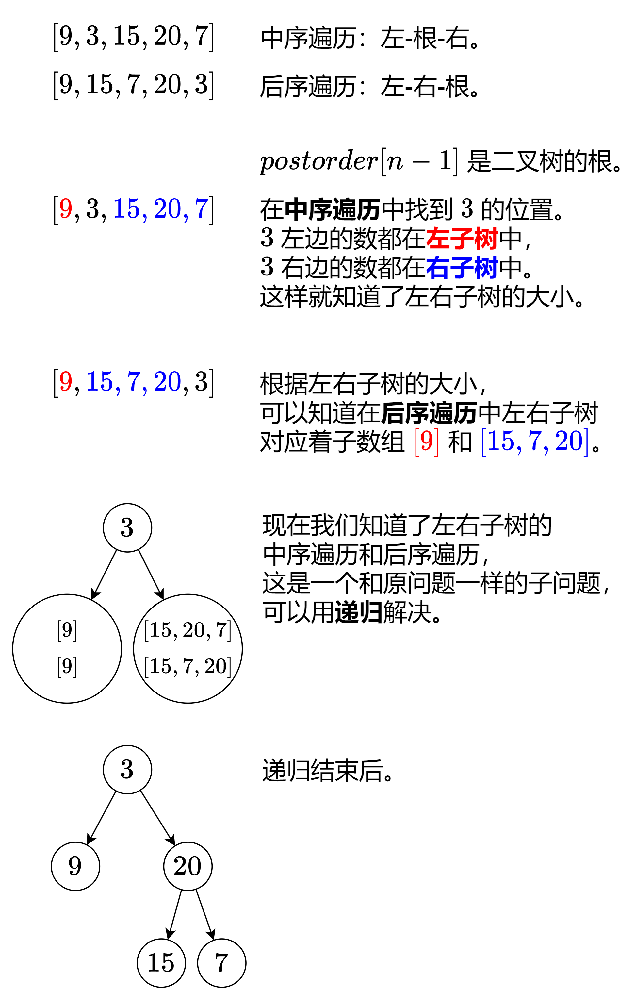

---
tags:
    - Array
    - Hash Table
    - Divide and Conquer
    - Tree
    - Binary Tree
    - Top Interview 150
---

# [106. Construct Binary Tree from Inorder and Postorder Traversal](https://leetcode.com/problems/construct-binary-tree-from-inorder-and-postorder-traversal/)

Given two integer arrays `inorder` and `postorder` where `inorder` is the inorder traversal of a binary tree and `postorder` is the postorder traversal of the same tree, construct and return *the binary tree*.

 

**Example 1:**


```
Input: inorder = [9,3,15,20,7], postorder = [9,15,7,20,3]
Output: [3,9,20,null,null,15,7]
```

**Example 2:**

```
Input: inorder = [-1], postorder = [-1]
Output: [-1]
```


**Solution**:

```java
/**
 * Definition for a binary tree node.
 * public class TreeNode {
 *     int val;
 *     TreeNode left;
 *     TreeNode right;
 *     TreeNode() {}
 *     TreeNode(int val) { this.val = val; }
 *     TreeNode(int val, TreeNode left, TreeNode right) {
 *         this.val = val;
 *         this.left = left;
 *         this.right = right;
 *     }
 * }
 */
class Solution {
    public TreeNode buildTree(int[] inorder, int[] postorder) {
        if (inorder == null){
            return null;
        }

        int n = inorder.length; 

        if (n == 0){
            return null;
        }

        if (n == 1){
            return new TreeNode(inorder[0]);
        }

        Map<Integer, Integer> inIndex = new HashMap<>();
        for (int i = 0; i < n; i++){
            inIndex.put(inorder[i],i);
        }

        int inLeft = 0;
        int inRight = n - 1;
        int postLeft = 0;
        int postRight = n - 1;

        return dfs(inorder, postorder, inIndex, postLeft, postRight, inLeft, inRight);
    }

    private TreeNode dfs(int[] inorder, int[] postorder, Map<Integer, Integer> inIndex, int postLeft, int postRight, int inLeft, int inRight){
        if (postLeft > postRight){
            return null;
        }
        int curRootVal = postorder[postRight];
        TreeNode root = new TreeNode(curRootVal);

        int leftTreeBoundary = inIndex.get(curRootVal);
        int leftTreeCount = leftTreeBoundary - inLeft;

        root.left = dfs(inorder, postorder, inIndex, postLeft, postLeft + leftTreeCount - 1, inLeft, leftTreeBoundary - 1);
        root.right = dfs(inorder, postorder, inIndex, postLeft + leftTreeCount, postRight - 1, leftTreeBoundary + 1, inRight);

        return root;
    }
}

// TC: O(n)
// SC: O(n)
```


```java
/**
 * Definition for a binary tree node.
 * public class TreeNode {
 *     int val;
 *     TreeNode left;
 *     TreeNode right;
 *     TreeNode() {}
 *     TreeNode(int val) { this.val = val; }
 *     TreeNode(int val, TreeNode left, TreeNode right) {
 *         this.val = val;
 *         this.left = left;
 *         this.right = right;
 *     }
 * }
 */
class Solution {
    public TreeNode buildTree(int[] inorder, int[] postorder) {
        // base case 
        if (inorder == null || inorder.length == 0){
            return null;
        }

        if (inorder.length == 1){
            return new TreeNode(inorder[0]);
        }

        Map<Integer, Integer> inIndex = new HashMap<Integer, Integer>();
        for (int i = 0; i < inorder.length; i++){
            inIndex.put(inorder[i], i);
        }

        int inLeft = 0;
        int inRight= inorder.length -1;
        int postLeft = 0;
        int postRight = postorder.length -1;
        return helper(postorder, inIndex, inLeft, inRight, postLeft, postRight);
    }

    private TreeNode helper(int[] postorder, Map<Integer, Integer> inIndex, int inLeft, int inRight, int postLeft, int postRight){
        if (inLeft > inRight){
            return null;
        }

        TreeNode root = new TreeNode(postorder[postRight]);
        
        int inMid = inIndex.get(postorder[postRight]);

        root.left = helper(postorder, inIndex, inLeft, inMid-1, postLeft, postLeft + (inMid-inLeft) -1);
        root.right = helper(postorder, inIndex, inMid+1, inRight, postLeft+(inMid-inLeft) , postRight-1);
        return root;
    }
}


/*

postorder = [9,15,7,20, 3]
             l          r
left part    l l+(m-l)-1
right part     l+(m-1) r-1

inMid = 
inorder = [9,3,15,20,7], 
           l m       r
left part  l(m-1)
right part     m+1    r
Map<Integer, Integer> 

*/
```

中序遍历：按照「左子树-根-右子树」的顺序遍历二叉树。

后序遍历：按照「左子树-右子树-根」的顺序遍历二叉树。

我们来看看示例 1 是怎么生成这棵二叉树的。




