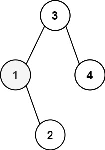
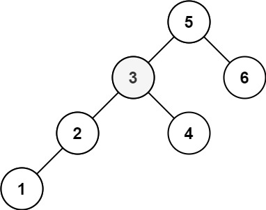

---
tags:
    - Tree
    - Depth-First Search
    - Binary Search Tree
    - Binary Tree
    - Top Interviews
---

# [230. Kth Smallest Element in a BST](https://leetcode.com/problems/kth-smallest-element-in-a-bst/)

Given the `root` of a binary search tree, and an integer `k`, return *the* `kth` *smallest value (**1-indexed**) of all the values of the nodes in the tree*.

 

**Example 1:**



```
Input: root = [3,1,4,null,2], k = 1
Output: 1
```

**Example 2:**



```
Input: root = [5,3,6,2,4,null,null,1], k = 3
Output: 3
```

 

**Solution**:

由于**中序遍历**就是在从小到大遍历节点值，所以遍历到的第 *k* 个节点值就是答案。

在中序遍历，即「左-根-右」的过程中，每次递归完左子树，就把 k 减少 1，表示我们按照中序遍历访问到了一个节点。如果减一后 k 变成 0，那么答案就是当前节点的值，用一个外部变量 ans 记录。

```java
/**
 * Definition for a binary tree node.
 * public class TreeNode {
 *     int val;
 *     TreeNode left;
 *     TreeNode right;
 *     TreeNode() {}
 *     TreeNode(int val) { this.val = val; }
 *     TreeNode(int val, TreeNode left, TreeNode right) {
 *         this.val = val;
 *         this.left = left;
 *         this.right = right;
 *     }
 * }
 */
class Solution {
    private int result;
    private int k;
    public int kthSmallest(TreeNode root, int k) {
       this.k = k;
       dfs(root);
       return result;
    }

    private void dfs(TreeNode node){
        if (node == null || k == 0){
            return;
        }

        dfs(node.left);// left
        k--;
        if (k == 0){
            result = node.val; // root
        }

        dfs(node.right); // right 
    }
}

// TC: O(n)
// SC: O(n)
```

复杂度分析
时间复杂度：O(n)，其中 n 是二叉树的大小（节点个数）。
空间复杂度：O(h)，其中 h 是树高，递归需要 O(h) 的栈空间。最坏情况下树是一条链，h=n，空间复杂度为 O(n)。


```java
/**
 * Definition for a binary tree node.
 * public class TreeNode {
 *     int val;
 *     TreeNode left;
 *     TreeNode right;
 *     TreeNode() {}
 *     TreeNode(int val) { this.val = val; }
 *     TreeNode(int val, TreeNode left, TreeNode right) {
 *         this.val = val;
 *         this.left = left;
 *         this.right = right;
 *     }
 * }
 */
class Solution {
    public int kthSmallest(TreeNode root, int k) {
        if (root == null){
            return -1;
        }

        PriorityQueue<TreeNode> maxHeap = new PriorityQueue<TreeNode>(new Comparator<TreeNode>(){
            @Override
            public int compare(TreeNode t1, TreeNode t2){
                if (t1.val > t2.val){
                    return -1;
                }else if (t1.val == t2.val){
                    return 0;
                }else{
                    return 1;
                }
            }
        });

        DFS(root, maxHeap, k);
        return maxHeap.poll().val;
        
    }

    private void DFS(TreeNode root, PriorityQueue<TreeNode> maxHeap, int k){
        if (root == null){
            return;
        }

        if (maxHeap.size() < k){
            maxHeap.offer(root);
        }else if (maxHeap.peek().val > root.val){
            maxHeap.poll();
            maxHeap.offer(root);
        }

        DFS(root.left, maxHeap, k);
        DFS(root.right, maxHeap, k);
    }
}
//TC: O(n)
//SC: O(n)
```


```java
/**
 * Definition for a binary tree node.
 * public class TreeNode {
 *     int val;
 *     TreeNode left;
 *     TreeNode right;
 *     TreeNode() {}
 *     TreeNode(int val) { this.val = val; }
 *     TreeNode(int val, TreeNode left, TreeNode right) {
 *         this.val = val;
 *         this.left = left;
 *         this.right = right;
 *     }
 * }
 */
class Solution {
    public int kthSmallest(TreeNode root, int k) {
        PriorityQueue<Integer> pq = new PriorityQueue<Integer>(Collections.reverseOrder()); // max heap 初始化为最大堆
        helper(root, k, pq);
        return pq.poll(); 
    }

    private void helper(TreeNode root, int k, PriorityQueue<Integer> pq){
        if (root == null){
            return;
        }
        
      if (pq.size() < k){ // If size is not k yet then add any element
            pq.add(root.val);
        }else if (root.val < pq.peek()){
            pq.poll();  // pop the top
            pq.add(root.val); // add cur value to pq
        }

        helper(root.left, k, pq);
        helper(root.right, k, pq);
        return;
    }
}

//Time complexity: O(n) + O(log(n)) = O(n)
//Space complexity: O(n)
```

