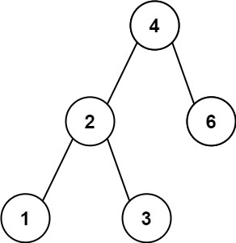
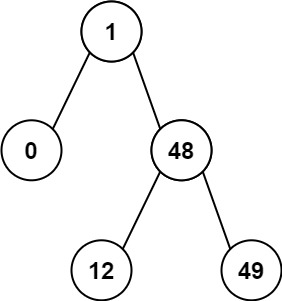

# [530. Minimum Absolute Difference in BST](https://leetcode.com/problems/minimum-absolute-difference-in-bst/)

Given the `root` of a Binary Search Tree (BST), return *the minimum absolute difference between the values of any two different nodes in the tree*.

 

**Example 1:**



```
Input: root = [4,2,6,1,3]
Output: 1
```

**Example 2:**



```
Input: root = [1,0,48,null,null,12,49]
Output: 1
```

 

**Constraints:**

- The number of nodes in the tree is in the range `[2, 104]`.
- `0 <= Node.val <= 105`

 

**Note:** This question is the same as 783: https://leetcode.com/problems/minimum-distance-between-bst-nodes/


Solution:

```java
/**
 * Definition for a binary tree node.
 * public class TreeNode {
 *     int val;
 *     TreeNode left;
 *     TreeNode right;
 *     TreeNode() {}
 *     TreeNode(int val) { this.val = val; }
 *     TreeNode(int val, TreeNode left, TreeNode right) {
 *         this.val = val;
 *         this.left = left;
 *         this.right = right;
 *     }
 * }
 */
class Solution {
    private int result = Integer.MAX_VALUE;
    private int pre = Integer.MIN_VALUE /2;
    public int getMinimumDifference(TreeNode root) {
        dfs(root);
        return result;
    }

    private void dfs(TreeNode node) {
        if (node == null){
            return;
        }

        dfs(node.left);

        result = Math.min(result, node.val - pre);

        pre = node.val;

        dfs(node.right);
    }
}

// TC: O(n)
// SC: O(n)
```

示例 1，把数字排序后，得到 [1,2,3,4,6]。最小差值一定是相邻两个数的差值。

由于二叉搜索树的中序遍历得到的序列是有序的，我们可以计算中序遍历中的相邻两数的差值，取最小值，即为答案。

中序遍历：左子树 → 根 → 右子树。

复杂度分析
时间复杂度：O(n)，其中 n 为二叉搜索树的节点个数。
空间复杂度：O(n)。最坏情况下，二叉搜索树退化成一条链，递归需要 O(n) 的栈空间。


```java
/**
 * Definition for a binary tree node.
 * public class TreeNode {
 *     int val;
 *     TreeNode left;
 *     TreeNode right;
 *     TreeNode() {}
 *     TreeNode(int val) { this.val = val; }
 *     TreeNode(int val, TreeNode left, TreeNode right) {
 *         this.val = val;
 *         this.left = left;
 *         this.right = right;
 *     }
 * }
 */
class Solution {
    private int result = Integer.MAX_VALUE;
    private int pre = Integer.MIN_VALUE / 2; // 防止减法溢出
    public int getMinimumDifference(TreeNode root) {
        dfs(root);
        return result;
    }

    private void dfs(TreeNode node){
        if (node == null){
            return;
        }

        dfs(node.left);
        int cur = node.val;
        int curAbsolute = Math.abs(cur - pre);
        result = Math.min(curAbsolute, result);

        pre = node.val;

        dfs(node.right);
    }
}
// TC: O(n)
// SC: O(n)
```

