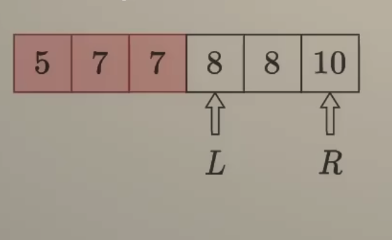
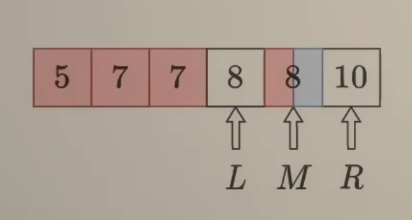
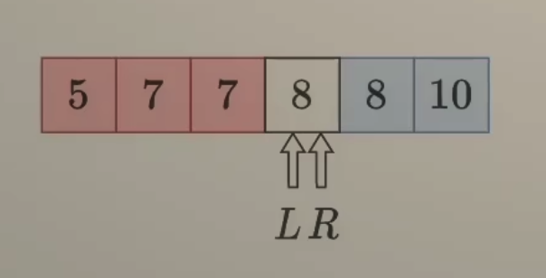
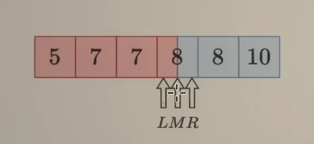
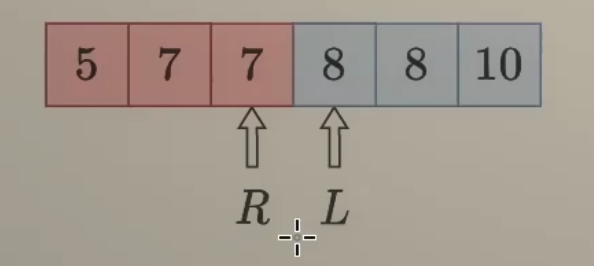

# [34. Find First and Last Position of Element in Sorted Array](https://leetcode.com/problems/find-first-and-last-position-of-element-in-sorted-array/)

Given an array of integers `nums` sorted in non-decreasing order, find the starting and ending position of a given `target` value.

If `target` is not found in the array, return `[-1, -1]`.

You must write an algorithm with `O(log n)` runtime complexity.

 

**Example 1:**

```
Input: nums = [5,7,7,8,8,10], target = 8
Output: [3,4]
```

**Example 2:**

```
Input: nums = [5,7,7,8,8,10], target = 6
Output: [-1,-1]
```

**Example 3:**

```
Input: nums = [], target = 0
Output: [-1,-1]
```


Solution:

Brute force:

```java
class Solution {
    public int[] searchRange(int[] nums, int target) {
        int[] result = new int[]{-1, -1};

        for (int i = 0; i < nums.length; i++){
            if ((i == 0 || nums[i - 1] < target) && nums[i] == target){
                result[0] = i;
            }

            if ((i == nums.length - 1 || nums[i + 1] > target) && nums[i] == target){
                result[1] = i;
            }
        }

        return result;
    }
}

// TC: O(n)
// SC: O(1)
```


Binary Search:

5, 7, 7, 8, 8, 10

L和R分别指向询问的左右边界, 即闭区间[L, R]

M指向当前正在询问的数

红色背景表示false, 即<8

蓝色背景表示true, 即>= 8

白色背景表示不确定


M是红色 -> [L,M]都是红色

剩余不确定的区间为[M+1, R]

因此下一步L <- M+1

这也同时说明, L-1指向的一定是红色




继续



M是蓝色-> [M, R]都是蓝色

剩余不确定的区间为[L, M - 1]

因此下一步 R <- M - 1

这也同时说明, R + 1 指向的一定是蓝色



继续



关键: 循环不变量

L-1始终是红色

R+1始终是蓝色

根据循环不变量, R + 1是我们要找的答案

由于循环结束后 R + 1 = L

所以答案也可以用L表示



```java
class Solution {
    public int[] searchRange(int[] nums, int target) {
        int first = binarySearch(nums, target);

        if (first == nums.length || nums[first] != target){
            return new int[]{-1, -1};
        }

        int last = binarySearch(nums, target + 1) - 1; 

        return new int[]{first, last};
    }

    public int binarySearch(int[] nums, int target){
        int left = 0;
        int right = nums.length - 1;

        while(left <= right){ // == nums.length == 1
            int mid = left + (right - left)/2; // 0
            // 0 + 5 - 0 /2 = 2.5 = 2
            // 3 + (5 - 3) /2 = 3 + 2/2 =4
            // 3 + ( 3- 3) /2 = 3
            if (nums[mid] < target){
                left = mid + 1;
            }else{
                right = mid - 1; 
            }
        }

        return left;
    }

    /*
    0 1 2 3 4 5
    5,7,7,8,8,10
          l          
          r
          m
          nums[mid] 
    
     
    */
}

// TC: O(logn)
// SC: O(1)
```


```java
class Solution {
    public int[] searchRange(int[] nums, int target) {
        // base case 
        if (nums == null || nums.length == 0){
            return new int[]{-1,-1};
        }

        int left = 0;
        int right = nums.length - 1;
        int count = -1;

        while (left <= right){
            int mid = left + (right - left)/2;
            if (nums[mid] == target){
                count = mid;
                break;
            } else if (nums[mid] < target){
                left = mid + 1;
            } else {
                right = mid - 1;
            }

        }

        if (count == -1){
            return new int[]{-1,-1};
        }
        int first = count;
        int last = count;


        while((first != 0) && nums[first-1] == target){
            first = first -1;
        }

        while((last != nums.length-1) && nums[last+1] == target){
            last = last + 1;
        }

        return new int[]{first, last};
        
    }

}

// Time complexity: O(logN)
// Space complexity: O(1)
```

