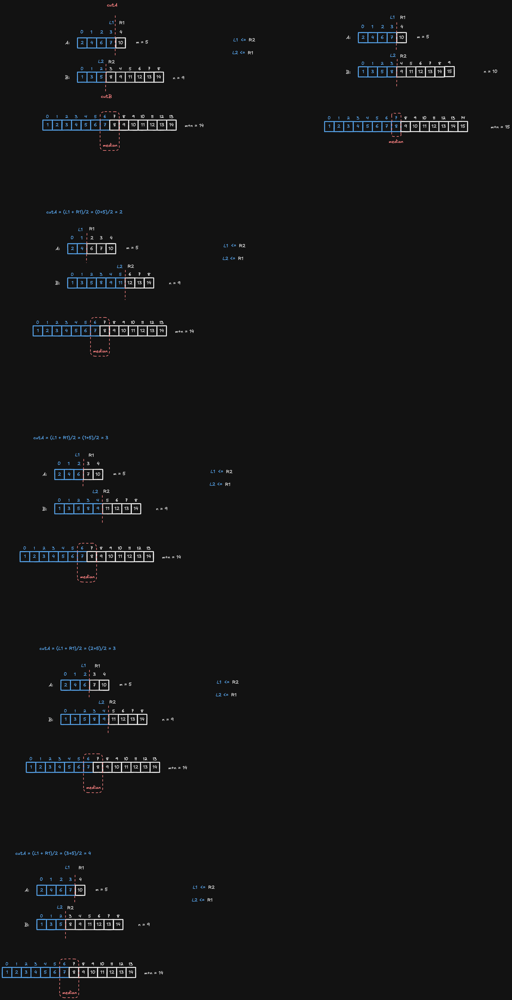

---
tags:
    - Array
    - Binary Search
    - Divide and Conquer
    - Top Interviews
---

# [4. Median of Two Sorted Arrays](https://leetcode.com/problems/median-of-two-sorted-arrays/)

Given two sorted arrays `nums1` and `nums2` of size `m` and `n` respectively, return **the median** of the two sorted arrays.

The overall run time complexity should be `O(log (m+n))`.

 

**Example 1:**

```
Input: nums1 = [1,3], nums2 = [2]
Output: 2.00000
Explanation: merged array = [1,2,3] and median is 2.
```

**Example 2:**

```
Input: nums1 = [1,2], nums2 = [3,4]
Output: 2.50000
Explanation: merged array = [1,2,3,4] and median is (2 + 3) / 2 = 2.5.
```

 

**Constraints:**

- `nums1.length == m`
- `nums2.length == n`
- `0 <= m <= 1000`
- `0 <= n <= 1000`
- `1 <= m + n <= 2000`
- `-106 <= nums1[i], nums2[i] <= 106`


**Solution:**


**Binary Search:**

```java
class Solution {
    public double findMedianSortedArrays(int[] nums1, int[] nums2) {
        if (nums1.length > nums2.length) {
            int[] temp = nums1;
            nums1 = nums2;
            nums2 = temp;
        }
        int len1 = nums1.length;
        int len2 = nums2.length;
        int left = 0;
        int right = len1 - 1;
        while (left <= right) {
            int mid = left + (right - left) / 2;
            int j = (len1 + len2 + 1) / 2 - mid - 2;
            if (nums1[mid] <= nums2[j + 1]) {
                left = mid + 1;
            } else {
                right = mid - 1;
            }
        }

        // 此时left-1=right;
        int i = left - 1;
        int j = (len1 + len2 + 1) / 2 - i - 2;
        int ai = i >= 0 ? nums1[i] : Integer.MIN_VALUE;
        int bj = j >= 0 ? nums2[j] : Integer.MIN_VALUE;
        int ai1 = i + 1 < len1 ? nums1[i + 1] : Integer.MAX_VALUE;
        int bj1 = j + 1 < len2 ? nums2[j + 1] : Integer.MAX_VALUE;
        int max1 = Math.max(ai, bj);
        int min2 = Math.min(ai1, bj1);
        return (len1 + len2) % 2 == 0 ? (max1 + min2) / 2.0 : max1;
    }
}
```


```java
class Solution {
    public double findMedianSortedArrays(int[] nums1, int[] nums2) {
        int len1 = nums1.length;
        int len2 = nums2.length;
        int len = len1 + len2;

        if (len1 > len2){
            return findMedianSortedArrays(nums2, nums1);
        }

        int left = 0;
        int right = len1;

        // value for the left right boundary of nums

        int l1 = 0;
        int r1 = 0;
        int l2 = 0;
        int r2 = 0;

        while(left <= right){
            int mid1 = left + (right - left)/2;
            int mid2 = (len + 1)/ 2 - mid1; // 6 - 2 = 4
						// 加 1 是为了处理当元素总数为奇数的情况，使得左半部分比右半部分多一个元素。无论总数是奇数还是偶数，这个分割线都能正确分割数组
            // (m + n + 1) / 2 - i; 
            // 5 + 8 + 1 /2 -3 
            // 13+1 = 14 /2 = 7 - 3 = 4 
            if (mid1 == 0){
                l1 = Integer.MIN_VALUE;
            }else {
                l1 = nums1[mid1 -1];
            }

            if (mid1 == len1){
                r1 = Integer.MAX_VALUE;
            }else {
                r1 = nums1[mid1];
            }

            if (mid2 == 0){
                l2 = Integer.MIN_VALUE;
            }else{
                l2 = nums2[mid2 - 1];
            }

            if (mid2 == len2){
                r2 = Integer.MAX_VALUE;
            }else{
                r2 = nums2[mid2];
            }

            // check 是否满足正确的分割条件
            if (l1 <= r2 && l2 <= r1){
                if ((len) % 2 == 0){
                    return ((double) Math.max(l1, l2) + Math.min(r1, r2)) /2.0;
                }else{
                    return Math.max(l1, l2);
                }
            }else if (l1 > l2){
                right = mid1 - 1;
            }else{
                left = mid1 + 1;
            }


        }

        return -1;


    }
}
// TC: O(log(min(m,n)))
// SC: O(1)
```

> 嗯...两天啥也没干是吧...
>
> I am back again
>
> Back again 还是不会


Two Pointers:

```java
class Solution {
    public double findMedianSortedArrays(int[] nums1, int[] nums2) {
        int[] nums = new int[nums1.length + nums2.length];

        int i = 0;
        int j = 0;
        int k = 0;

        while (i < nums1.length && j < nums2.length){
            if (nums1[i] < nums2[j]){
                nums[k] = nums1[i];
                k++;
                i++;
            }else {
                nums[k] = nums2[j];
                k++;
                j++;
            }
        }

        while(i < nums1.length){
            nums[k] = nums1[i];
            k++;
            i++;
        }

        while(j < nums2.length){
            nums[k] = nums2[j];
            k++;
            j++;
        }

        int mid = nums.length / 2;
        if (nums.length % 2 == 0){
            return (nums[mid - 1] + nums[mid] )/2.0;
        }else{
            return nums[mid];
        }

    }
}


// TC: O(n + m)
// SC: O(n + m)
```

> 虽然能过 但其实是不满足题意的


Binary Search:

```java
class Solution {
    public double findMedianSortedArrays(int[] nums1, int[] nums2) {

        if (nums1.length > nums2.length){
            return findMedianSortedArrays(nums2, nums1);
        }

        int n1 = nums1.length; 
        int n2 = nums2.length;

        if (n1 == 0){
            return ((double) nums2[(n2 - 1) / 2] + (double) nums2[n2/2]  ) / 2; // directly return nums2 median
        }
        
        int len = n1 + n2; // 14
        //  0 1 2 3 4  5
        // [2,4,6,7,10]      n = 5
        //  As
        //             Ae

        int ALeft = 0;
        int ARight = n1; // 切割的是元素个数
        int cutA = 0; // 左边分割元素的个数
        int cutB = 0; // 数组B的分割线的左边的个数

        while(ALeft <= ARight){
            cutA = (ALeft + ARight)/2; // 5/2 = 2 // (1 + 5)/2=3 // (3 + 5)/2 =4 // mid
            cutB = (len + 1)/2 - cutA; //(14+1)/2 - 2 = 15 /2 -2 = 7 -2 = 5 // (14+1)/2 - 3 = 15/2 - 3 = 7 -3 =4
            // 7 - 4 = 3
            double L1 = (cutA == 0) ? Integer.MIN_VALUE : nums1[cutA - 1]; // nums[2-1] = nums[1] = 4 // 6
            double R1 = (cutA == n1) ? Integer.MAX_VALUE : nums1[cutA]; // 6 // 7

            double L2 = (cutB == 0) ? Integer.MIN_VALUE : nums2[cutB - 1]; // 11 // 9
            double R2 = (cutB == n2) ? Integer.MAX_VALUE : nums2[cutB]; // 12 // 11

            if (L1 > R2){ //  
                ARight = cutA - 1;
            }else if (L2 > R1){ // 11 > 6 // 9 > 7
                ALeft = cutA + 1; // 1 // 2 // 3
            }else{
                if (len % 2 == 0){
                    return (Math.max(L1, L2) + Math.min(R1, R2)) / 2;
                }else{
                    return Math.max(L1, L2);
                }
            }
        }

        return -1;

        
    }
}

// TC: O(log(min(m,n)))
// SC: O(1)
```





https://www.youtube.com/watch?v=q6IEA26hvXc

```java
class Solution {
    public double findMedianSortedArrays(int[] nums1, int[] nums2) {
        int half = (nums1.length +nums2.length)/2;

        if(nums2.length <nums1.length){
            return findMedianSortedArrays(nums2,nums1);
        }

        int left = 0;
        int right = nums1.length-1;
        while(true){
            int mid1 =(int)Math.floor((right+left)/2.0);
            int mid2 = half -(mid1+1)-1;
            int l1 = mid1>=0?nums1[mid1]:Integer.MIN_VALUE;
            int l2 = mid2>=0?nums2[mid2]:Integer.MIN_VALUE;
            int r1 = (mid1+1)<nums1.length?nums1[mid1+1]:Integer.MAX_VALUE;
            int r2 = (mid2+1)<nums2.length?nums2[mid2+1]:Integer.MAX_VALUE;
            if(l1<=r2 && l2<=r1 ){
                //found it
                if((nums1.length+nums2.length) %2 ==0){
                    return ((double)Math.max(l1,l2) +(double)Math.min(r1,r2))/2.0;
                }else{
                    return Math.min(r1,r2);
                }
            }
            else if(l1>r2){
                right = mid1-1;
            }else{
                left = mid1+1;
            }
        }
        
    }
}
```


```java
class Solution {
public double findMedianSortedArrays(int[] nums1, int[] nums2) {
    // Ensure nums1 is the smaller array
    if (nums2.length < nums1.length) {
        return findMedianSortedArrays(nums2, nums1);
    }

    int totalLength = nums1.length + nums2.length;
    int half = totalLength / 2;
    l1
    int left = 0;
    int right = nums1.length - 1;

    // Use 'while (left <= right)'
    while (left <= right) {
        int mid1 = left + (right - left) / 2;
        int mid2 = half - (mid1 + 1) - 1;

        int l1 = (mid1 >= 0) ? nums1[mid1] : Integer.MIN_VALUE;
        int l2 = (mid2 >= 0) ? nums2[mid2] : Integer.MIN_VALUE;
        int r1 = (mid1 + 1 < nums1.length) ? nums1[mid1 + 1] : Integer.MAX_VALUE;
        int r2 = (mid2 + 1 < nums2.length) ? nums2[mid2 + 1] : Integer.MAX_VALUE;

        // Check if correct partition is found
        if (l1 <= r2 && l2 <= r1) {
            if (totalLength % 2 == 0) {
                return ((double) Math.max(l1, l2) + (double) Math.min(r1, r2)) / 2.0;
            } else {
                return Math.min(r1, r2);
            }
        } else if (l1 > r2) {
            right = mid1 - 1;  // Move left
        } else {
            left = mid1 + 1;   // Move right
        }
    }

    // When 'left' crosses 'right', handle the case where nums1 might be empty
    int l1 = (left > 0 && left <= nums1.length) ? nums1[left - 1] : Integer.MIN_VALUE;
    int l2 = (half - left - 1 >= 0) ? nums2[half - left - 1] : Integer.MIN_VALUE;
    int r1 = (left < nums1.length) ? nums1[left] : Integer.MAX_VALUE;
    int r2 = (half - left < nums2.length) ? nums2[half - left] : Integer.MAX_VALUE;

    if (totalLength % 2 == 0) {
        return ((double) Math.max(l1, l2) + (double) Math.min(r1, r2)) / 2.0;
    } else {
        return Math.min(r1, r2);
    }
}


}
```

