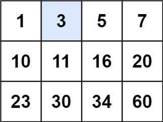
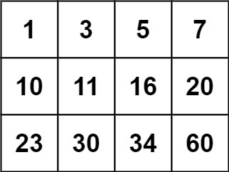

---
tags:
    - Array
    - Binary Search
    - Matrix
    - Top Interviews
---

# [74. Search a 2D Matrix](https://leetcode.com/problems/search-a-2d-matrix/)

You are given an `m x n` integer matrix `matrix` with the following two properties:

- Each row is sorted in non-decreasing order.
- The first integer of each row is greater than the last integer of the previous row.

Given an integer `target`, return `true` *if* `target` *is in* `matrix` *or* `false` *otherwise*.

You must write a solution in `O(log(m * n))` time complexity.

 

**Example 1:**



```
Input: matrix = [[1,3,5,7],[10,11,16,20],[23,30,34,60]], target = 3
Output: true
```

**Example 2:**



```
Input: matrix = [[1,3,5,7],[10,11,16,20],[23,30,34,60]], target = 13
Output: false
```

 

**Constraints:**

- `m == matrix.length`
- `n == matrix[i].length`
- `1 <= m, n <= 100`
- `-104 <= matrix[i][j], target <= 104`


**Solution:**

```java
class Solution {
    public boolean searchMatrix(int[][] matrix, int target) {
        if (matrix == null || matrix[0].length == 0){
            return false;
        }

        for (int i = 0; i < matrix.length; i++){
            boolean result = binarySearch(matrix[i], target);
            if (result == true){
                return true;
            }
        }   
        return false;
    }

    public static boolean binarySearch(int[] array, int target){
        int left = 0; 
        int right = array.length -1;
        while (left <= right){
            int mid = left + (right - left)/2;
            if (array[mid] == target){
                return true;
            }else if (array[mid] < target){
                left = mid + 1;
            }else if (array[mid] > target){
                right = mid - 1;
            } 
        }

        return false;
    }
}

// TC O(nlogn)
// SC O(1)
```


Because each row of the matrix is sorted in ascending order and the first element of each row is greater than the last element of the previous row, the entire matrix can be treated as one sorted array.

So we can apply binary search on this virtual array.

Instead of actually flattening the matrix, we convert an index in the virtual array into a row and column in the matrix:

- `row = i / n`
- `col = i % n`

where `n` is the number of columns.

At each step of binary search, we access the element as:

```
matrix[row][col]
```

This allows us to search the matrix in **O(log(m · n))** time with **O(1)** extra space.

> Since the matrix is globally sorted, I treat it as a 1D sorted array and use binary search, mapping index `i` to `matrix[i / n][i % n]`, achieving O(log(mn)) time and O(1) space.

```java
class Solution {
    public boolean searchMatrix(int[][] matrix, int target) {
        int n = matrix.length;
        int m = matrix[0].length;

        int left = 0;
        int right = m * n - 1;

        while(left <= right){
            int mid = left + (right - left) /2;
            int x = matrix[mid / m][mid % m];

            if (x == target){
                return true;
            }else if (x < target){
                left = mid + 1;
            }else {
                right = mid - 1;
            }

        }
        return false;
    }
}
// TC: O(log(n *m ))
// SC: O(1)
```

