---
tags:
    - Tree
    - Breadth-First Search	
    - Binary Tree
    - Top Interviews
---

# [102. Binary Tree Level Order Traversal](https://leetcode.com/problems/binary-tree-level-order-traversal/)

Given the `root` of a binary tree, return *the level order traversal of its nodes' values*. (i.e., from left to right, level by level).

**Example 1:**


```
Input: root = [3,9,20,null,null,15,7]
Output: [[3],[9,20],[15,7]]
```

**Example 2:**

```
Input: root = [1]
Output: [[1]]
```

**Example 3:**

```
Input: root = []
Output: []
```


**Solution:**

Tree里头关于层有关的请优先想到BFS, queue


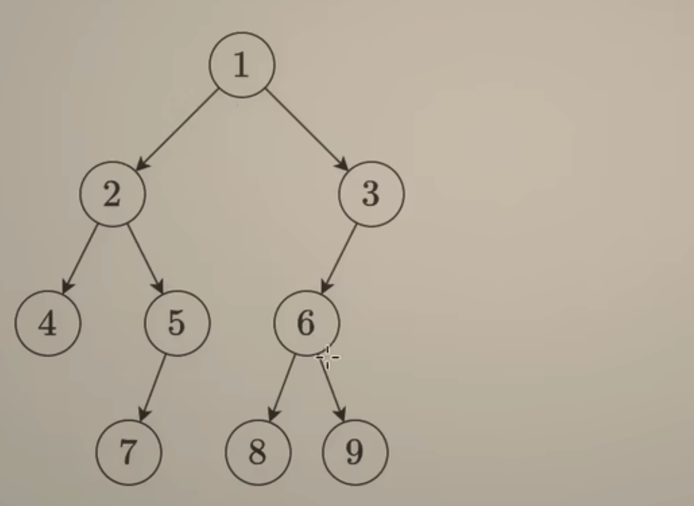

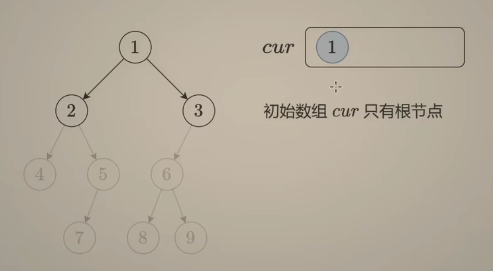

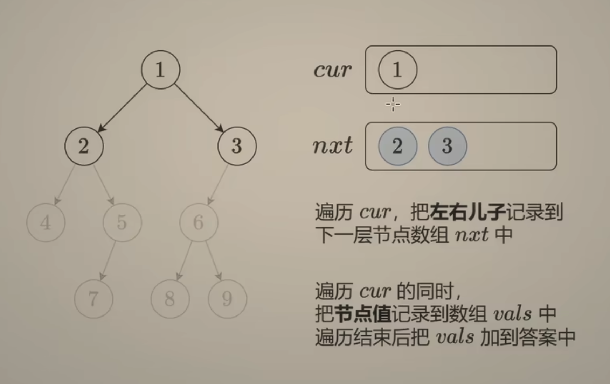

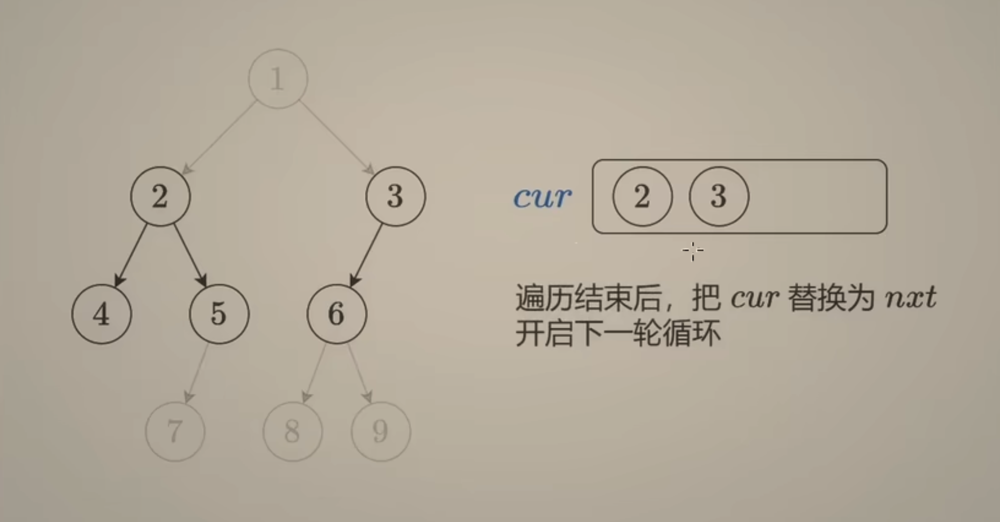

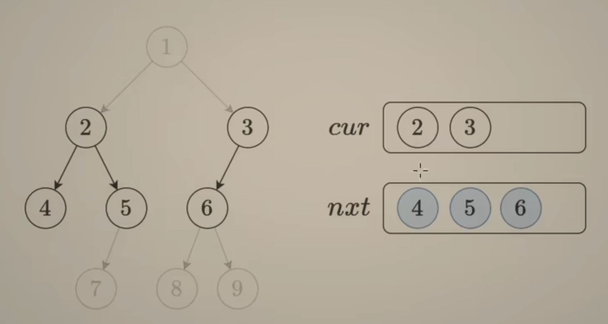

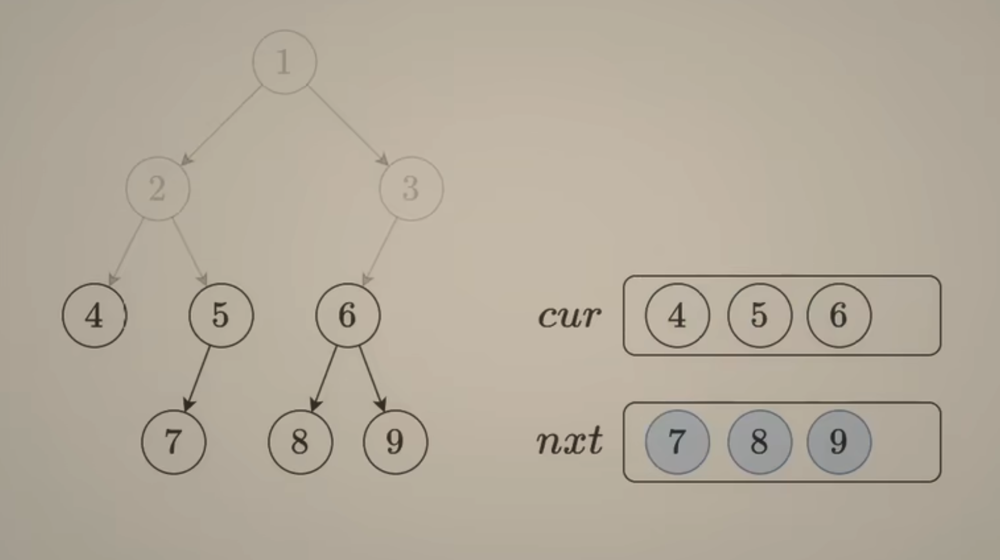

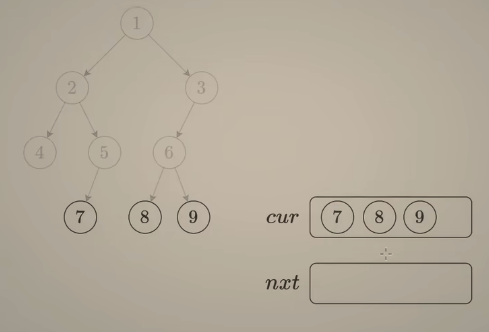

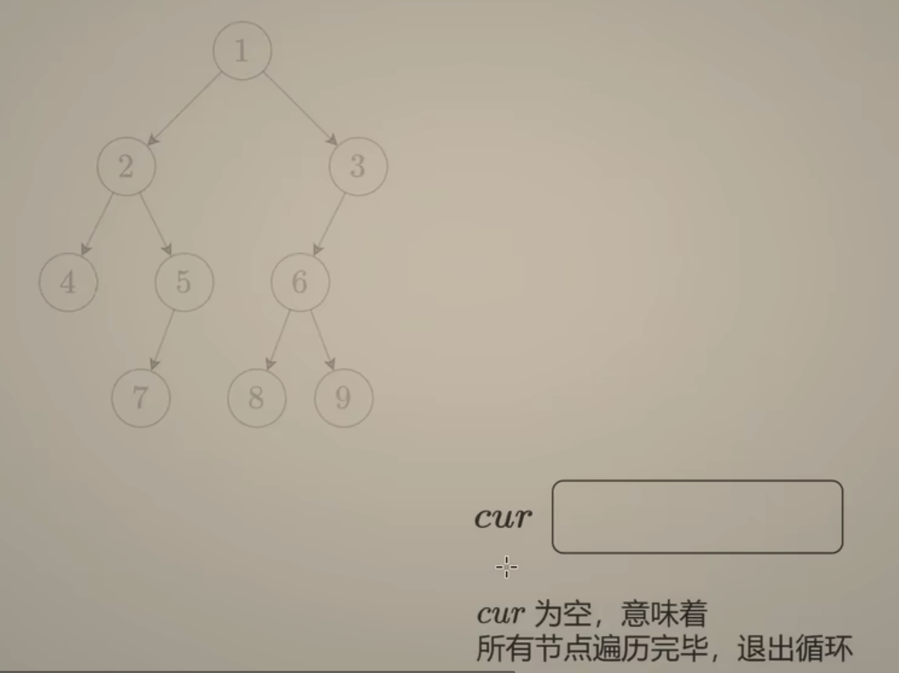

方法一：两个数组

```java
/**
 * Definition for a binary tree node.
 * public class TreeNode {
 *     int val;
 *     TreeNode left;
 *     TreeNode right;
 *     TreeNode() {}
 *     TreeNode(int val) { this.val = val; }
 *     TreeNode(int val, TreeNode left, TreeNode right) {
 *         this.val = val;
 *         this.left = left;
 *         this.right = right;
 *     }
 * }
 */
class Solution {
    public List<List<Integer>> levelOrder(TreeNode root) {
        List<List<Integer>> result = new ArrayList<>();
        if (root == null){
            return result;
        } 

        List<TreeNode> cur = new ArrayList<>();
        cur.add(root);

        while(cur.size() > 0){
            List<TreeNode> nxt = new ArrayList<>();
            List<Integer> subResult = new ArrayList<>();
            for (TreeNode node : cur){
                subResult.add(node.val);
                if (node.left != null){
                    nxt.add(node.left);
                }
                if (node.right != null){
                    nxt.add(node.right);
                }
            }
            cur = nxt;
            result.add(subResult); 
        }

        return result;
    }
}

//TC: O(n)
//SC: O(n)
```

时间复杂度：O(n)，其中 n 为二叉树的节点个数。虽然写了个二重循环，但每个节点只会添加到列表中一次，所以总的循环次数是节点个数之和，即 O(n)。
空间复杂度：O(n)。满二叉树（每一层都填满）最后一层有大约 n/2 个节点，因此数组中最多有 O(n) 个元素，所以空间复杂度是 O(n) 的。


**方法二：一个队列**

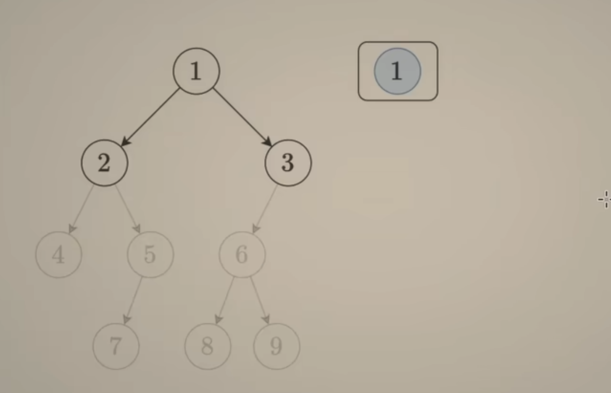

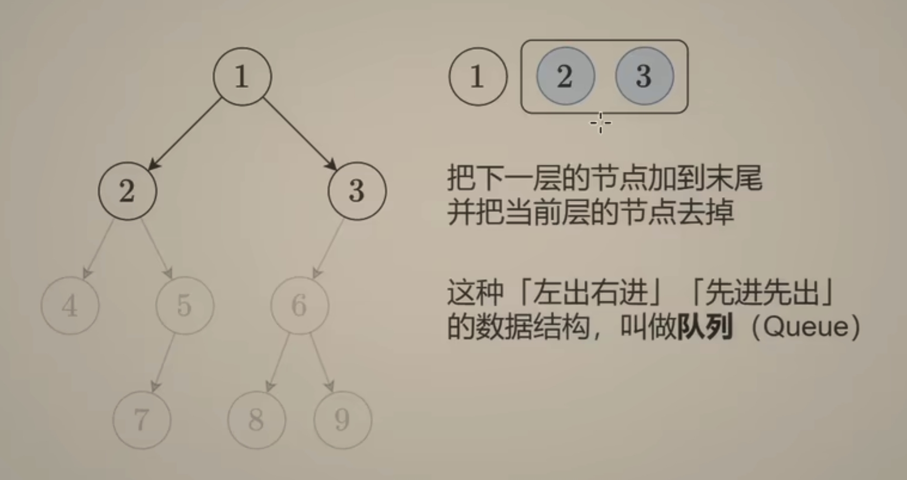

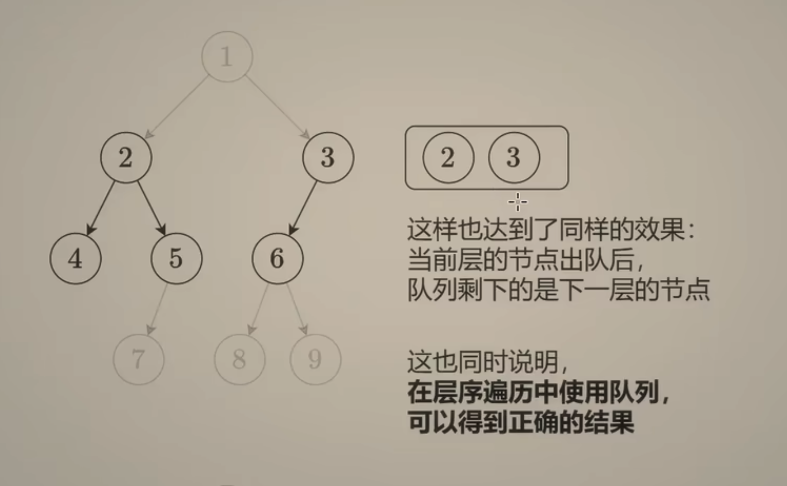

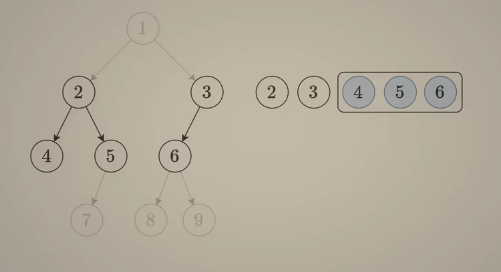

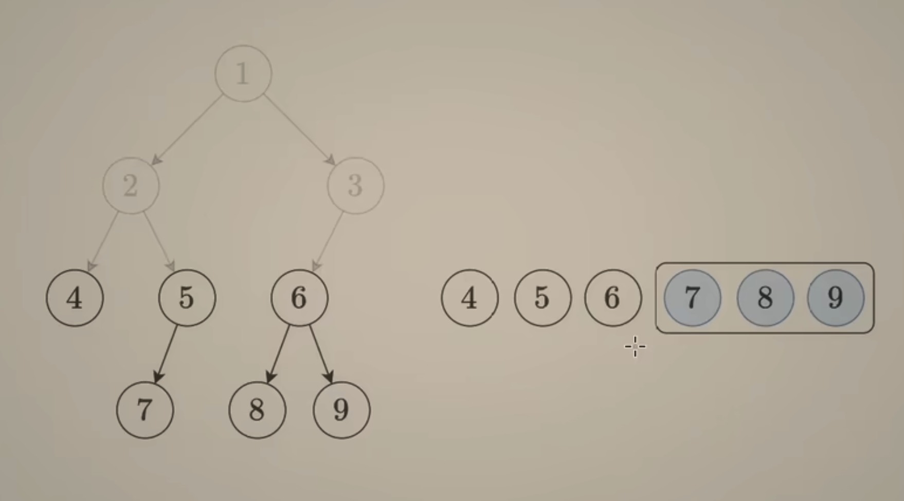

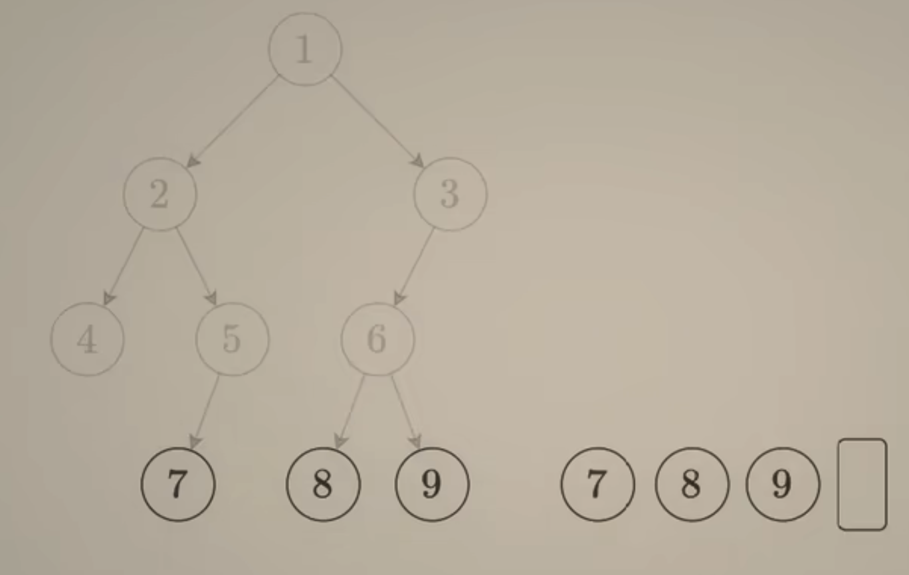

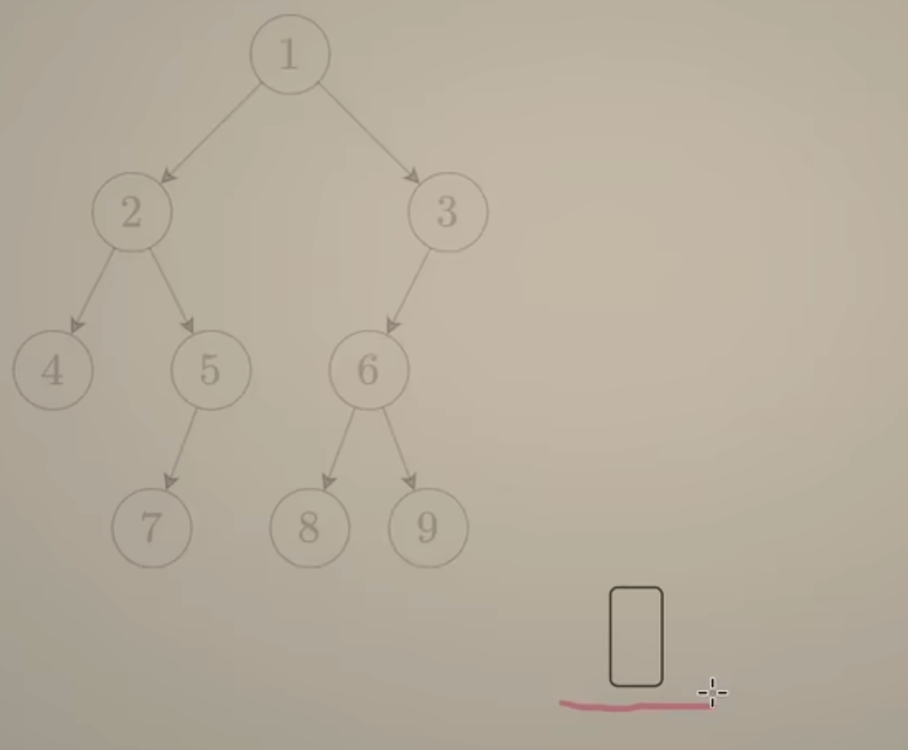

```java
/**
 * Definition for a binary tree node.
 * public class TreeNode {
 *     int val;
 *     TreeNode left;
 *     TreeNode right;
 *     TreeNode() {}
 *     TreeNode(int val) { this.val = val; }
 *     TreeNode(int val, TreeNode left, TreeNode right) {
 *         this.val = val;
 *         this.left = left;
 *         this.right = right;
 *     }
 * }
 */
class Solution {
    public List<List<Integer>> levelOrder(TreeNode root) {
        List<List<Integer>> result = new ArrayList<>();

        if (root == null){
            return result;
        }

        Deque<TreeNode> queue = new ArrayDeque<>();
        queue.offerLast(root);

        while(!queue.isEmpty()){
            int size = queue.size();
            List<Integer> subResult = new ArrayList<>();
            for(int i = 0; i < size; i++){
                TreeNode cur = queue.pollFirst();
                subResult.add(cur.val);
                if (cur.left != null){
                    queue.offerLast(cur.left);
                }

                if (cur.right != null){
                    queue.offerLast(cur.right);
                }    
            } 
            result.add(subResult);

        }

        return result;
    }
}
// TC: O(n)
// SC: O(n)
```


DFS:

```java
/**
 * Definition for a binary tree node.
 * public class TreeNode {
 *     int val;
 *     TreeNode left;
 *     TreeNode right;
 *     TreeNode() {}
 *     TreeNode(int val) { this.val = val; }
 *     TreeNode(int val, TreeNode left, TreeNode right) {
 *         this.val = val;
 *         this.left = left;
 *         this.right = right;
 *     }
 * }
 */
class Solution {
    public List<List<Integer>> levelOrder(TreeNode root) {
        List<List<Integer>> result = new ArrayList<List<Integer>>();

        int index = 0;

        dfs(root, index, result);
        return result;
    }

    private void dfs(TreeNode root, int index, List<List<Integer>> result){
        if (root == null){
            return;
        }

        if (index >= result.size()){
            result.add(new ArrayList<Integer>());
        }


        result.get(index).add(root.val);

        dfs(root.left, index + 1, result);
        dfs(root.right, index + 1, result);
    }
}

// TC: O(n)
// SC: O(n)
```


```java
/**
 * Definition for a binary tree node.
 * public class TreeNode {
 *     int val;
 *     TreeNode left;
 *     TreeNode right;
 *     TreeNode() {}
 *     TreeNode(int val) { this.val = val; }
 *     TreeNode(int val, TreeNode left, TreeNode right) {
 *         this.val = val;
 *         this.left = left;
 *         this.right = right;
 *     }
 * }
 */
class Solution {
    public List<List<Integer>> levelOrder(TreeNode root) {
        List<List<Integer>> result = new ArrayList<List<Integer>>();
        if (root == null){
            return result;
        }

        int index = 0;
        dfs(root, index, result);

        return result;
    }

    private void dfs (TreeNode root, int index, List<List<Integer>> result){
        if (root == null){
            return;
        }

        if (index >= result.size()){
            result.add(new ArrayList<Integer>());
        }

        result.get(index).add(root.val);
        dfs(root.left, index + 1, result);
        dfs(root.right, index + 1, result);
    }
}
// TC: O(n)
// SC: O(n)
```


```java
/**
 * Definition for a binary tree node.
 * public class TreeNode {
 *     int val;
 *     TreeNode left;
 *     TreeNode right;
 *     TreeNode() {}
 *     TreeNode(int val) { this.val = val; }
 *     TreeNode(int val, TreeNode left, TreeNode right) {
 *         this.val = val;
 *         this.left = left;
 *         this.right = right;
 *     }
 * }
 */
class Solution {
    public List<List<Integer>> levelOrder(TreeNode root) {
        List<List<Integer>> result = new ArrayList<List<Integer>>();
        if (root == null){
            return result;
        }

        int index = 0;
        DFS(root, index, result);

        return result;
        
    }

    private void DFS(TreeNode root, int index, List<List<Integer>> result){
        // base case
        if (root == null){
            return;
        }

        if (index >= result.size()){
            result.add(new ArrayList<Integer>());
        }

        result.get(index).add(root.val);
        DFS(root.left, index + 1, result);
        DFS(root.right, index +1 , result);
    }
}

// TC: O(n)
// SC: O(n)
```


Tree的题 代码答案不难理解, 单纯让你想思路 感觉很容易无从下手的感觉 -> 但基本上都要遍历


