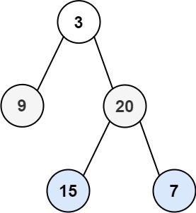

---
tags:
    - Tree
    - Breadth-First Search
    - Binary Tree
    - Top Interviews
---


# [103. Binary Tree Zigzag Level Order Traversal](https://leetcode.com/problems/binary-tree-zigzag-level-order-traversal/)

Given the `root` of a binary tree, return *the zigzag level order traversal of its nodes' values*. (i.e., from left to right, then right to left for the next level and alternate between).

 

**Example 1:**



```
Input: root = [3,9,20,null,null,15,7]
Output: [[3],[20,9],[15,7]]
```

**Example 2:**

```
Input: root = [1]
Output: [[1]]
```

**Example 3:**

```
Input: root = []
Output: []
```

 


**Solution:**

BFS:

```java
/**
 * Definition for a binary tree node.
 * public class TreeNode {
 *     int val;
 *     TreeNode left;
 *     TreeNode right;
 *     TreeNode() {}
 *     TreeNode(int val) { this.val = val; }
 *     TreeNode(int val, TreeNode left, TreeNode right) {
 *         this.val = val;
 *         this.left = left;
 *         this.right = right;
 *     }
 * }
 */
class Solution {
    public List<List<Integer>> zigzagLevelOrder(TreeNode root) {
        List<List<Integer>> result = new ArrayList<>();
        if (root == null){
            return result;
        }
        Deque<TreeNode> queue = new ArrayDeque<>();
        queue.offerLast(root);
        boolean isEven = true;

        while(!queue.isEmpty()){
            int size = queue.size();
            List<Integer> subResult = new ArrayList<>();
            for (int i = 0; i < size; i++){
                TreeNode cur = queue.pollFirst();
                if (isEven == true){
                    subResult.add(cur.val);
                }else{
                    subResult.add(0, cur.val);
                }

                if (cur.left != null){
                    queue.offerLast(cur.left);

                }

                if (cur.right != null){
                    queue.offerLast(cur.right);
                }
            }
            isEven = !isEven;

            result.add(subResult);
        }

        return result;


    
    }
}

// TC: O(n)
// SC: O(n)
```


```java
/**
 * Definition for a binary tree node.
 * public class TreeNode {
 *     int val;
 *     TreeNode left;
 *     TreeNode right;
 *     TreeNode() {}
 *     TreeNode(int val) { this.val = val; }
 *     TreeNode(int val, TreeNode left, TreeNode right) {
 *         this.val = val;
 *         this.left = left;
 *         this.right = right;
 *     }
 * }
 */
class Solution {
    public List<List<Integer>> zigzagLevelOrder(TreeNode root) {
        List<List<Integer>> result = new ArrayList<List<Integer>>();

        if (root == null){
            return result;
        }

        int index = 0;
        boolean flag = false;
        helper(root, index, result);
        return result;
    }

    private void helper(TreeNode root, int index, List<List<Integer>> result){
        if (root == null){
            return;
        }

        if (index >= result.size()){
            result.add(new ArrayList<Integer>());
        }

        if (index % 2 == 0){
            result.get(index).add(root.val);
        }else{
            result.get(index).add(0, root.val); // 0 means add first place.
        }

        helper(root.left, index+1, result);
        helper(root.right, index+1, result);
    }

}
//TC: O(n)
//SC: O(n)
```

