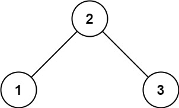
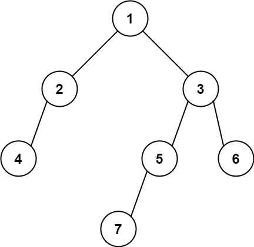

---
tags:
    - Tree
    - Depth-First Search
    - Breadth-First Search
    - Binary Tree
    - Top Interviews
---


# [513. Find Bottom Left Tree Value](https://leetcode.com/problems/find-bottom-left-tree-value/)

Given the `root` of a binary tree, return the leftmost value in the last row of the tree.

 

**Example 1:**



```
Input: root = [2,1,3]
Output: 1
```

**Example 2:**



```
Input: root = [1,2,3,4,null,5,6,null,null,7]
Output: 7
```

 

**Constraints:**

- The number of nodes in the tree is in the range `[1, 104]`.
- `-231 <= Node.val <= 231 - 1`


**Solution:**

```java
/**
 * Definition for a binary tree node.
 * public class TreeNode {
 *     int val;
 *     TreeNode left;
 *     TreeNode right;
 *     TreeNode() {}
 *     TreeNode(int val) { this.val = val; }
 *     TreeNode(int val, TreeNode left, TreeNode right) {
 *         this.val = val;
 *         this.left = left;
 *         this.right = right;
 *     }
 * }
 */
class Solution {
    public int findBottomLeftValue(TreeNode root) {
       Deque<TreeNode> queue = new ArrayDeque<>();
       queue.offerLast(root);
       TreeNode cur = null;
       while(!queue.isEmpty()){
        cur = queue.pollFirst();

        if (cur.right != null){
            queue.offerLast(cur.right);
        }

        if (cur.left != null){
            queue.offerLast(cur.left);
        }
       } 

       return cur.val;
    }
}

// TC: O(n)
// SC: O(n)
```


```java
/**
 * Definition for a binary tree node.
 * public class TreeNode {
 *     int val;
 *     TreeNode left;
 *     TreeNode right;
 *     TreeNode() {}
 *     TreeNode(int val) { this.val = val; }
 *     TreeNode(int val, TreeNode left, TreeNode right) {
 *         this.val = val;
 *         this.left = left;
 *         this.right = right;
 *     }
 * }
 */
class Solution {
    public int findBottomLeftValue(TreeNode root) {

        List<List<Integer>> result = new ArrayList<>();
        if (root == null){
            return -1;
        }

        Deque<TreeNode> queue = new ArrayDeque<>();
        queue.offerLast(root);

        while(!queue.isEmpty()){
            int size = queue.size();
            List<Integer> subResult = new ArrayList<>();
            for (int i = 0; i < size; i++){
                TreeNode cur = queue.pollFirst();
                subResult.add(cur.val);
                if (cur.left != null){
                    queue.offerLast(cur.left);
                }

                if (cur.right != null){
                    queue.offerLast(cur.right);
                }
            }

            result.add(subResult);
        }

        return result.get(result.size() - 1).get(0);
    }
}

// TC: O(n)
// SC: O(n)
```


