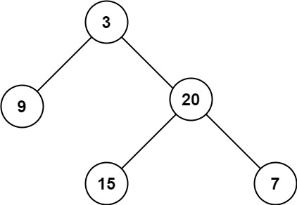
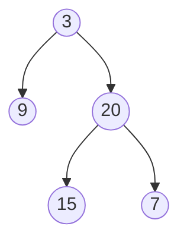
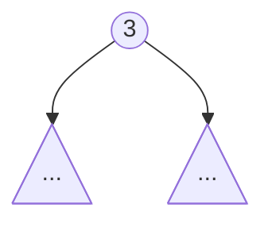
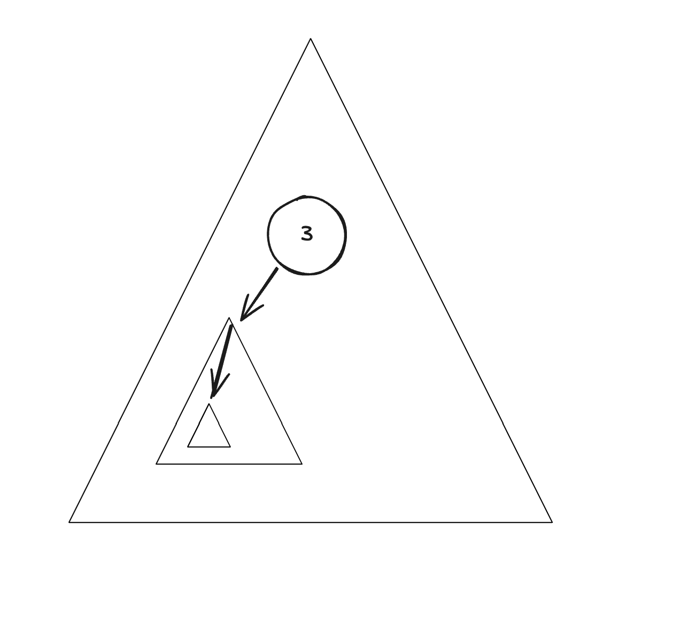

---
tags:
    - Tree
    - Depth-First Search
    - Breadth-First Search
    - Binary Tree
    - Top Interviews
---

# [104. Maximum Depth of Binary Tree](https://leetcode.com/problems/maximum-depth-of-binary-tree/)

Given the `root` of a binary tree, return *its maximum depth*.

A binary tree's **maximum depth** is the number of nodes along the longest path from the root node down to the farthest leaf node.

 

**Example 1:**



```
Input: root = [3,9,20,null,null,15,7]
Output: 3
```

**Example 2:**

```
Input: root = [1,null,2]
Output: 2
```


**Solution:**

```java
/**
 * Definition for a binary tree node.
 * public class TreeNode {
 *     int val;
 *     TreeNode left;
 *     TreeNode right;
 *     TreeNode() {}
 *     TreeNode(int val) { this.val = val; }
 *     TreeNode(int val, TreeNode left, TreeNode right) {
 *         this.val = val;
 *         this.left = left;
 *         this.right = right;
 *     }
 * }
 */
class Solution {
    public int maxDepth(TreeNode root) {
       if (root == null){
        return 0;
       } 

       int leftMaxDepth = maxDepth(root.left);
       int rightMaxDepth = maxDepth(root.right);

       return Math.max(leftMaxDepth, rightMaxDepth) + 1;
    }
}

// TC: O(n)
// SC: O(n)
```


递归用的是栈空间.


二叉树与递归recursion

1. 如何思考二叉树相关问题?
2. 为什么需要使用递归?
3. 为什么这样写就一定能算出正确答案?
4. 计算机是怎么执行递归的?
5. 另一种递归思路

### Recursion (Down-Top)

```java
/**
 * Definition for a binary tree node.
 * public class TreeNode {
 *     int val;
 *     TreeNode left;
 *     TreeNode right;
 *     TreeNode() {}
 *     TreeNode(int val) { this.val = val; }
 *     TreeNode(int val, TreeNode left, TreeNode right) {
 *         this.val = val;
 *         this.left = left;
 *         this.right = right;
 *     }
 * }
 */
class Solution {
    public int maxDepth(TreeNode root) {
        if (root == null){
            return 0;
        }
        int left = maxDepth(root.left);
        int right = maxDepth(root.right);

        return Math.max(left, right) + 1;
    }
}
// TC: O(n)
// SC: O(n)
```


```java
/**
 * Definition for a binary tree node.
 * public class TreeNode {
 *     int val;
 *     TreeNode left;
 *     TreeNode right;
 *     TreeNode() {}
 *     TreeNode(int val) { this.val = val; }
 *     TreeNode(int val, TreeNode left, TreeNode right) {
 *         this.val = val;
 *         this.left = left;
 *         this.right = right;
 *     }
 * }
 */
class Solution {
    public int maxDepth(TreeNode root) {
        if (root == null){
            return 0;
        }

        int left = maxDepth(root.left) + 1;
        int right = maxDepth(root.right) + 1;
        return Math.max(left, right);
    }
}
```


**Complexity analysis**

- Time complexity : we visit each node exactly once, thus the time complexity is $O(N)$, where $N$ is the number of nodes.
- Space complexity : in the worst case, the tree is completely unbalanced, *e.g.* each node has only left child node, the recursion call would occur $N$ times (the height of the tree), therefore the storage to keep the call stack would be $O(N)$.
  But in the best case (the tree is completely balanced), the height of the tree would be $log(N)$. Therefore, the space complexity in this case would be $O(log⁡(N))$. 




不要一开始就陷入细节, 而是思考整棵树与其左右子树的关系

整棵树的最大深度 = max(左子树的最大深度, 右子树的最大深度) + 1



原问题: 计算整棵树的最大深度

子问题: 计算左/右子树的最大深度

子问题和原问题是相似的

类比循环, 执行的代码也应该是相同的, 但子问题需要把计算结果返回给上一级问题这更适合用递归实现.


由于子问题的规模比原问题小, 不断递下去, 总会有个尽头, 即递归的边界条件(base case), 直接返回它的答案(归).




最简单和常见的数学归纳法是证明当n等于任意一个自然数时某命题成立. 证明分下面两步:

1. 证明“当n=1时命题成立", (选择数字1因其作为自然数集合中中最小值)

2. 证明, “若假设在n=m时命题成立, 可推导出在n=m+1时命题成立. (m代表任意自然数)


### Top-Down

```java
/**
 * Definition for a binary tree node.
 * public class TreeNode {
 *     int val;
 *     TreeNode left;
 *     TreeNode right;
 *     TreeNode() {}
 *     TreeNode(int val) { this.val = val; }
 *     TreeNode(int val, TreeNode left, TreeNode right) {
 *         this.val = val;
 *         this.left = left;
 *         this.right = right;
 *     }
 * }
 */
class Solution {
    public int result;
    public int maxDepth(TreeNode root) {
        result = 0;
        dfs(root, 0);
        return result;
    }

    private void dfs(TreeNode root, int depth){
        if (root == null){
            return;
        }

        depth++;
        result = Math.max(result, depth);
        dfs(root.left, depth);
        dfs(root.right, depth);
    }
}

// TC: O(n)
// SC: O(n)
```

- 时间复杂度：O(*n*)，其中 *n* 为二叉树的节点个数。
- 空间复杂度：O(*n*)。最坏情况下，二叉树退化成一条链，递归需要 O(*n*) 的栈空间。
