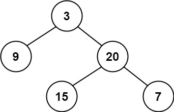
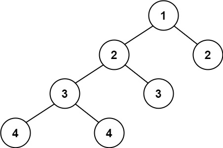

---
tags:
    - Tree
    - Depth-First Search
    - Binary Tree
    - Top Interviews
---

# [110. Balanced Binary Tree](https://leetcode.com/problems/balanced-binary-tree/)

Given a binary tree, determine if it is **height-balanced**.

**Example 1:**



```
Input: root = [3,9,20,null,null,15,7]
Output: true
```

**Example 2:**



```
Input: root = [1,2,2,3,3,null,null,4,4]
Output: false
```

**Example 3:**

```
Input: root = []
Output: true
```


**Solution1:**

```java
/**
 * Definition for a binary tree node.
 * public class TreeNode {
 *     int val;
 *     TreeNode left;
 *     TreeNode right;
 *     TreeNode() {}
 *     TreeNode(int val) { this.val = val; }
 *     TreeNode(int val, TreeNode left, TreeNode right) {
 *         this.val = val;
 *         this.left = left;
 *         this.right = right;
 *     }
 * }
 */
class Solution {
    public boolean isBalanced(TreeNode root) {
        if (root == null){
            return true;
        }

        if (root.left == null && root.right == null){
            return true;
        }

        int left = getH(root.left);
        int right = getH(root.right);

        if (Math.abs(left - right) > 1){
            return false;
        }

        return isBalanced(root.left) && isBalanced(root.right);
    }


    public int getH(TreeNode root){
        if (root == null){
            return 0;
        }

        int left = getH(root.left);
        int right = getH(root.right);

        return Math.max(left, right) + 1;
    }
}


// TC: O(n)
// SC: O(n)
```


Top-down recursion:

```java
/**
 * Definition for a binary tree node.
 * public class TreeNode {
 *     int val;
 *     TreeNode left;
 *     TreeNode right;
 *     TreeNode() {}
 *     TreeNode(int val) { this.val = val; }
 *     TreeNode(int val, TreeNode left, TreeNode right) {
 *         this.val = val;
 *         this.left = left;
 *         this.right = right;
 *     }
 * }
 */
// class Solution {
//     public boolean isBalanced(TreeNode root) {
        
//     }
// }

class Solution{
    public boolean isBalanced(TreeNode root){
	    // base case 
	    // base case1: root is null
	    if (root == null){
	        return true;
        }
        //  base case2: root no left and no right
	    if (root.left == null && root.right == null){
	        return true;
        }

           // left right height
	    int leftHeight = getHeight(root.left);
	    int rightHeight = getHeight(root.right);
         


          // check diff
        int diff = Math.abs(leftHeight - rightHeight);
	    if (diff > 1){ 
		    return false;
        }

          
         // return result
        boolean checkLeftTree = isBalanced(root.left);
        boolean checkRightTree = isBalanced(root.right);
        return checkLeftTree && checkRightTree;
	
	
    }
    
    private int getHeight(TreeNode root){
	    if (root == null){
	        return 0;
        }
        
        int leftHeight = getHeight(root.left);
        int rightHeight = getHeight(root.right);

        return Math.max(leftHeight, rightHeight) + 1;
    }

}

```


```java
/**
 * Definition for a binary tree node.
 * public class TreeNode {
 *     int val;
 *     TreeNode left;
 *     TreeNode right;
 *     TreeNode() {}
 *     TreeNode(int val) { this.val = val; }
 *     TreeNode(int val, TreeNode left, TreeNode right) {
 *         this.val = val;
 *         this.left = left;
 *         this.right = right;
 *     }
 * }
 */
class Solution {
    public boolean isBalanced(TreeNode root) { // n = 2^? =>  nlogn
        // base case 
        if (root == null){
            return true;
        }

        int diff = getHeight(root.left) - getHeight(root.right);
        if (Math.abs(diff) > 1){
            return false;
        }

        return (isBalanced(root.left) && isBalanced(root.right));
    }

    private static int getHeight(TreeNode root){    // O(n)
        if (root == null){
            return 0;
        }

        return (Math.max(getHeight(root.left), getHeight(root.right)) + 1);
    }
}


// TC: O(nlogn)
// SC: O(n)
```


**Solution2:** 

```java
/**
 * Definition for a binary tree node.
 * public class TreeNode {
 *     int val;
 *     TreeNode left;
 *     TreeNode right;
 *     TreeNode() {}
 *     TreeNode(int val) { this.val = val; }
 *     TreeNode(int val, TreeNode left, TreeNode right) {
 *         this.val = val;
 *         this.left = left;
 *         this.right = right;
 *     }
 * }
 */
class Solution {
    public boolean isBalanced(TreeNode root) {
        if (root == null){
            return true;
        }
        // use -1 to denote the tree is not balanced
        // >= 0 value means the tree is balanced and it is the height of the tree.
        return height(root) != -1;
    }

    private static int height(TreeNode root){
        if (root == null){
            return 0;
        }

        int leftHeight = height(root.left);
        // if left subtree is already not balanced, we do not need to continue
        // and we can return -1 directly.
        if (leftHeight == -1){
            return -1;
        }

        int rightHeight = height(root.right);
        if (rightHeight == -1){
            return -1;
        }

        // if not balanced, return -1;
        if (Math.abs(leftHeight - rightHeight) > 1){
            return -1;
        }

        return Math.max(leftHeight, rightHeight)+1;

    }
}

// Time: O(n)
// Space: O(height)
```


```java
/**
 * Definition for a binary tree node.
 * public class TreeNode {
 *     int val;
 *     TreeNode left;
 *     TreeNode right;
 *     TreeNode() {}
 *     TreeNode(int val) { this.val = val; }
 *     TreeNode(int val, TreeNode left, TreeNode right) {
 *         this.val = val;
 *         this.left = left;
 *         this.right = right;
 *     }
 * }
 */
class Solution {
    public boolean isBalanced(TreeNode root) {
        // base case 
        if (root == null){
            return true;
        }

        if (root.left == null && root.right == null){
            return true;
        }

        int leftHeight = height(root.left);
        int rightHeight = height(root.right);

        if (Math.abs(leftHeight - rightHeight) > 1){
            return false;
        }

        return isBalanced(root.left) && isBalanced(root.right);
    }

    private int height(TreeNode root){
        if (root == null){
            return 0;
        }

        int leftHeight = height(root.left);
        int rightHeight = height(root.right);

        return Math.max(leftHeight, rightHeight) + 1;
    }
}

// TC: O(n)
// SC: O(n)
```


```java
/**
 * Definition for a binary tree node.
 * public class TreeNode {
 *     int val;
 *     TreeNode left;
 *     TreeNode right;
 *     TreeNode() {}
 *     TreeNode(int val) { this.val = val; }
 *     TreeNode(int val, TreeNode left, TreeNode right) {
 *         this.val = val;
 *         this.left = left;
 *         this.right = right;
 *     }
 * }
 */
class Solution {
    public boolean isBalanced(TreeNode root) {
        int hight = getHeight(root);
        if (hight >= 0){
            return true;
        }else{
            return false;
        }

    }

    private int getHeight(TreeNode node){
        if (node == null){
            return 0;
        }

        int left = getHeight(node.left);
        int right = getHeight(node.right);
        if (left == -1 || right == -1){
            return -1;
        }
        int balanced = Math.abs(right - left);

        if (balanced > 1){
            return -1;
        }else{
            return Math.max(left, right) + 1;
        }

    }
}

// TC: O(n)
// SC: O(n)
```

