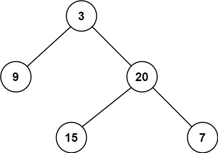

---
tags:
    - Tree
    - Depth-First Search
    - Breadth-First Search
    - Binary Tree
    - Top Interveiws
---

# [111. Minimum Depth of Binary Tree](https://leetcode.com/problems/minimum-depth-of-binary-tree/)

Given a binary tree, find its minimum depth.

The minimum depth is the number of nodes along the shortest path from the root node down to the nearest leaf node.

**Note:** A leaf is a node with no children.

 

**Example 1:**



```
Input: root = [3,9,20,null,null,15,7]
Output: 2
```

**Example 2:**

```
Input: root = [2,null,3,null,4,null,5,null,6]
Output: 5
```

**Solution:**


## 方法一：自顶向下「递」

可以在 DFS 这棵树的同时，额外传入一个计数器 cnt，表示路径上的节点个数，例如上图从根到叶子的路径 3→20→15：

递归前，cnt=0。
从 3 开始递归，cnt 加一，现在 cnt=1。
向下递归到 20，cnt 加一，现在 cnt=2。
向下递归到 15，cnt 加一，现在 cnt=3。由于 15 是叶子，用 3 更新答案的最小值。

```java
/**
 * Definition for a binary tree node.
 * public class TreeNode {
 *     int val;
 *     TreeNode left;
 *     TreeNode right;
 *     TreeNode() {}
 *     TreeNode(int val) { this.val = val; }
 *     TreeNode(int val, TreeNode left, TreeNode right) {
 *         this.val = val;
 *         this.left = left;
 *         this.right = right;
 *     }
 * }
 */
class Solution {
    private int result = Integer.MAX_VALUE;
    public int minDepth(TreeNode root) {
        dfs(root, 0);
        return root != null ? result : 0;
    }

    private void dfs(TreeNode node, int cnt){
        if (node == null){
            return;
        }

        cnt++;
        if (node.left == null && node.right == null){
            // node is leaf
            result = Math.min(result, cnt);
            return;
        }

        dfs(node.left, cnt);
        dfs(node.right, cnt);
    }

}

// TC: O(n)
// SC: O(n)

```

### 优化

如果递归中发现 *cnt*≥*ans*，由于继续向下递归也不会让 *ans* 变小，直接返回。

这一技巧叫做「最优性剪枝」。

```java
/**
 * Definition for a binary tree node.
 * public class TreeNode {
 *     int val;
 *     TreeNode left;
 *     TreeNode right;
 *     TreeNode() {}
 *     TreeNode(int val) { this.val = val; }
 *     TreeNode(int val, TreeNode left, TreeNode right) {
 *         this.val = val;
 *         this.left = left;
 *         this.right = right;
 *     }
 * }
 */
class Solution {
    private int result = Integer.MAX_VALUE;
    public int minDepth(TreeNode root) {
        dfs(root, 0);
        return root != null ? result : 0;
    }

    private void dfs(TreeNode node, int cnt){
        if (node == null){
            return;
        }

        cnt++;

        if (cnt > result){
            return;
        }
        
        if (node.left == null && node.right == null){
            // node is leaf
            result = Math.min(result, cnt);
            return;
        }

        dfs(node.left, cnt);
        dfs(node.right, cnt);
    }

}

// TC: O(n)
// SC: O(n)
```

#### 复杂度分析

- 时间复杂度：O(*n*)，其中 *n* 为二叉树的节点个数。
- 空间复杂度：O(*n*)。最坏情况下，二叉树退化成一条链，递归需要 O(*n*) 的栈空间。

## 方法二：自底向上「归」

定义 *dfs*(*node*) 表示以节点 *node* 为根的**子树**的最小深度。

分类讨论：

如果 node 是空节点，由于没有节点，返回 0。
如果 node 没有右儿子，那么深度就是左子树的深度加一，即 dfs(node)=dfs(node.left)+1。
如果 node 没有左儿子，那么深度就是右子树的深度加一，即 dfs(node)=dfs(node.right)+1。
如果 node 左右儿子都有，那么分别递归计算左子树的深度，以及右子树的深度，二者取最小值再加一，即
dfs(node)=min(dfs(node.left),dfs(node.right))+1
注意：并不需要特判 node 是叶子的情况，因为在没有右儿子的情况下，我们会递归 node.left，如果它是空节点，递归的返回值是 0，加一后得到 1，这正是叶子节点要返回的值。

答案：dfs(root)。

代码实现时，可以直接递归调用 minDepth。

答疑
问：本题和 104. 二叉树的最大深度 的区别是什么？为什么本题代码要更复杂一些？

答：对于非叶节点，把握一个共同原则：如果一个儿子是空节点，另一个儿子不是空节点，那么答案只能来自非空的那一侧。

求最大深度，空节点返回 0，直接计算 max，一定会取到有节点的那一侧（因为深度比 0 大）。
求最小深度，空节点返回 0，直接计算 min，会取到空节点，不符合「答案只能来自非空的那一侧」。所以求最小深度必须多写一些逻辑。

```java
/**
 * Definition for a binary tree node.
 * public class TreeNode {
 *     int val;
 *     TreeNode left;
 *     TreeNode right;
 *     TreeNode() {}
 *     TreeNode(int val) { this.val = val; }
 *     TreeNode(int val, TreeNode left, TreeNode right) {
 *         this.val = val;
 *         this.left = left;
 *         this.right = right;
 *     }
 * }
 */
class Solution {
    public int minDepth(TreeNode root) {
        if (root == null){
            return 0;
        }

        if (root.right == null){
            return minDepth(root.left) + 1;
        }

        if (root.left == null){
            return minDepth(root.right) + 1;
        }

        return Math.min(minDepth(root.left), minDepth(root.right)) + 1; 
    }
}
// TC: O(n)
// SC: O(n)
```

#### 复杂度分析

- 时间复杂度：O(*n*)，其中 *n* 为二叉树的节点个数。
- 空间复杂度：O(*n*)。最坏情况下，二叉树退化成一条链，递归需要 O(*n*) 的栈空间。

```java
/**
 * Definition for a binary tree node.
 * public class TreeNode {
 *     int val;
 *     TreeNode left;
 *     TreeNode right;
 *     TreeNode() {}
 *     TreeNode(int val) { this.val = val; }
 *     TreeNode(int val, TreeNode left, TreeNode right) {
 *         this.val = val;
 *         this.left = left;
 *         this.right = right;
 *     }
 * }
 */
class Solution {
    public int minDepth(TreeNode root) {
        if (root == null){
            return 0;
        } 

        if (root.left == null && root.right == null){
            return 1;
        }
        int result = Integer.MAX_VALUE;
        if (root.left != null && root.right != null){
            int left = minDepth(root.left);
            int right = minDepth(root.right);
            result = Math.min(left, right);
        }
        if (root.left == null){
            result = minDepth(root.right);
        }

        if (root.right == null){
            result = minDepth(root.left);
        }


        return result + 1;
    }
}

// TC: O(n)
// SC: O(n)
```


