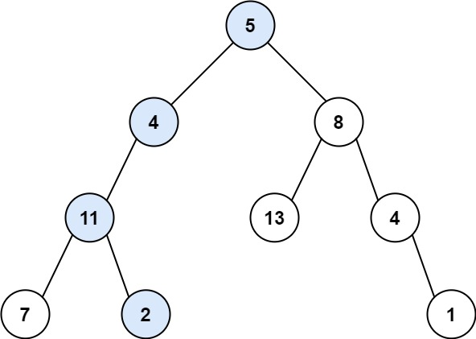
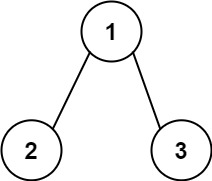

---
tags:
    - Tree
    - Depth-First Search
    - Breadth-First Search
    - Binary Tree
    - Top Interviews
---

# [112. Path Sum](https://leetcode.com/problems/path-sum/)

Given the `root` of a binary tree and an integer `targetSum`, return `true` if the tree has a **root-to-leaf** path such that adding up all the values along the path equals `targetSum`.

A **leaf** is a node with no children.

**Example 1:**



```
Input: root = [5,4,8,11,null,13,4,7,2,null,null,null,1], targetSum = 22
Output: true
Explanation: The root-to-leaf path with the target sum is shown.
```

**Example 2:**



```
Input: root = [1,2,3], targetSum = 5
Output: false
Explanation: There two root-to-leaf paths in the tree:
(1 --> 2): The sum is 3.
(1 --> 3): The sum is 4.
There is no root-to-leaf path with sum = 5.
```

**Example 3:**

```
Input: root = [], targetSum = 0
Output: false
Explanation: Since the tree is empty, there are no root-to-leaf paths.
```


**Solution:**

```java
/**
 * Definition for a binary tree node.
 * public class TreeNode {
 *     int val;
 *     TreeNode left;
 *     TreeNode right;
 *     TreeNode() {}
 *     TreeNode(int val) { this.val = val; }
 *     TreeNode(int val, TreeNode left, TreeNode right) {
 *         this.val = val;
 *         this.left = left;
 *         this.right = right;
 *     }
 * }
 */
class Solution {
    public boolean hasPathSum(TreeNode root, int targetSum) {
       if (root == null){
        return false;
       } 
       targetSum = targetSum - root.val;
       if (root.left == null && root.right == null){
        if (targetSum == 0){
            return true;
        }else{
            return false;
        }
       }

       return hasPathSum(root.left, targetSum) || hasPathSum(root.right, targetSum);


    }
}

// TC: O(n)
// SC: O(n)
```


```java
/**
 * Definition for a binary tree node.
 * public class TreeNode {
 *     int val;
 *     TreeNode left;
 *     TreeNode right;
 *     TreeNode() {}
 *     TreeNode(int val) { this.val = val; }
 *     TreeNode(int val, TreeNode left, TreeNode right) {
 *         this.val = val;
 *         this.left = left;
 *         this.right = right;
 *     }
 * }
 */
class Solution {
    public boolean hasPathSum(TreeNode root, int targetSum) {
        // base case 
        if (root == null){
            return false;
        }

        targetSum = targetSum - root.val;
        if (targetSum == 0 && root.left == null && root.right == null){
            return true;
        }

        boolean left = hasPathSum(root.left, targetSum);
        boolean right = hasPathSum(root.right, targetSum);

        if (left == true || right == true){
            return true;
        }else{
            return false;
        }
    }
}
```


```java
/**
 * Definition for a binary tree node.
 * public class TreeNode {
 *     int val;
 *     TreeNode left;
 *     TreeNode right;
 *     TreeNode() {}
 *     TreeNode(int val) { this.val = val; }
 *     TreeNode(int val, TreeNode left, TreeNode right) {
 *         this.val = val;
 *         this.left = left;
 *         this.right = right;
 *     }
 * }
 */
class Solution {
    public boolean hasPathSum(TreeNode root, int targetSum) {
        if (root == null){
            return false;
        }

        targetSum = targetSum - root.val;

        if (root.left == null && root.right == null){
            return targetSum == 0;
        }

        return hasPathSum(root.left, targetSum) || hasPathSum(root.right, targetSum);
    }
}
// TC 时间复杂度：O(n)，其中 n 为二叉树的节点个数。
// SC 空间复杂度：O(n)。最坏情况下，二叉树退化成一条链，递归需要 O(n) 的栈空间。
```


```java
/**
 * Definition for a binary tree node.
 * public class TreeNode {
 *     int val;
 *     TreeNode left;
 *     TreeNode right;
 *     TreeNode() {}
 *     TreeNode(int val) { this.val = val; }
 *     TreeNode(int val, TreeNode left, TreeNode right) {
 *         this.val = val;
 *         this.left = left;
 *         this.right = right;
 *     }
 * }
 */
class Solution {
    private boolean result = false;
    public boolean hasPathSum(TreeNode root, int targetSum) {
        if (root == null){
            return result;
        }
        dfs(root, targetSum);
        return result;
    }

    private void dfs(TreeNode root, int targetSum){
        if (root == null || result == true){
            return;
        }

        if (root.left == null && root.right == null && targetSum - root.val == 0){
            result = true;
            return;
        }// 判断叶子节点

        dfs(root.left, targetSum - root.val);
        dfs(root.right, targetSum - root.val);
    }
}

// TC: O(n)
// SC: O(n)
```

题目要求的能拐弯吗? 不能-> case b

```java
/**
 * Definition for a binary tree node.
 * public class TreeNode {
 *     int val;
 *     TreeNode left;
 *     TreeNode right;
 *     TreeNode() {}
 *     TreeNode(int val) { this.val = val; }
 *     TreeNode(int val, TreeNode left, TreeNode right) {
 *         this.val = val;
 *         this.left = left;
 *         this.right = right;
 *     }
 * }
 */
class Solution {
    public boolean hasPathSum(TreeNode root, int targetSum) {
       if (root == null){
           return false;
       }

       if (root.left == null && root.right == null && root.val == targetSum){
           return true;
       }

       int sum = 0;
       return helper(root, sum, targetSum);
    }

    public static boolean helper(TreeNode root, int sum, int targetSum){
        // base case
        if (root == null){
            return false;
        }

        sum = sum + root.val;

        if (root.left == null && root.right == null){
            if (sum == targetSum){
                return true;
            }else{
                return false;
            }
        }

        if (root.left == null){
            return helper(root.right, sum, targetSum);
        }

        if (root.right == null){
            return helper(root.left, sum, targetSum);
        }

        return (helper(root.left, sum, targetSum) || helper(root.right, sum, targetSum));
    }
}

// TC: O(n)
// SC: O(n)
```

