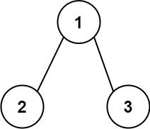
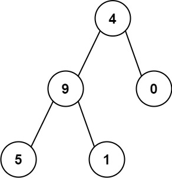

---
tags:
    - Tree
    - Depth-First Search
    - Binary Tree
    - Top Interviews
---

# [129. Sum Root to Leaf Numbers](https://leetcode.com/problems/sum-root-to-leaf-numbers/)

You are given the `root` of a binary tree containing digits from `0` to `9` only.

Each root-to-leaf path in the tree represents a number.

- For example, the root-to-leaf path `1 -> 2 -> 3` represents the number `123`.

Return *the total sum of all root-to-leaf numbers*. Test cases are generated so that the answer will fit in a **32-bit** integer.

A **leaf** node is a node with no children.

 

**Example 1:**



```
Input: root = [1,2,3]
Output: 25
Explanation:
The root-to-leaf path 1->2 represents the number 12.
The root-to-leaf path 1->3 represents the number 13.
Therefore, sum = 12 + 13 = 25.
```

**Example 2:**




**Solution**:

```java
/**
 * Definition for a binary tree node.
 * public class TreeNode {
 *     int val;
 *     TreeNode left;
 *     TreeNode right;
 *     TreeNode() {}
 *     TreeNode(int val) { this.val = val; }
 *     TreeNode(int val, TreeNode left, TreeNode right) {
 *         this.val = val;
 *         this.left = left;
 *         this.right = right;
 *     }
 * }
 */
class Solution {
    private int result = 0;
    public int sumNumbers(TreeNode root) {
        if (root == null){
            return result;
        }

        dfs(root, 0);
        return result;
    }

    private void dfs(TreeNode root, int cur){
        if (root == null){
            return;
        }

        cur = cur * 10 + root.val;
        if (root.left == null && root.right == null){
            result = result + cur;
            return;
        }

        dfs(root.left, cur);
        dfs(root.right, cur);

        
    }
}

// TC: O(n)
// SC: O(n)
```


```java
/**
 * Definition for a binary tree node.
 * public class TreeNode {
 *     int val;
 *     TreeNode left;
 *     TreeNode right;
 *     TreeNode() {}
 *     TreeNode(int val) { this.val = val; }
 *     TreeNode(int val, TreeNode left, TreeNode right) {
 *         this.val = val;
 *         this.left = left;
 *         this.right = right;
 *     }
 * }
 */
class Solution {
    int total = 0;
    public int sumNumbers(TreeNode root) {
        if (root == null){
            return Integer.MIN_VALUE;
        }

        if (root.left == null && root.right == null){
            return root.val;
        }

        int sum = 0;
        helper(root, 0);
        return total;
    }

    private void helper(TreeNode root, int sum){
        if (root == null){
            return;
        }

        sum = sum * 10 + root.val;
        if (root.left == null && root.right == null){
            total = total + sum;
            return;
        }

        helper(root.left, sum);
        helper(root.right, sum);
        return;
    }
}

// TC: O(n)
// SC: O(n)
```

