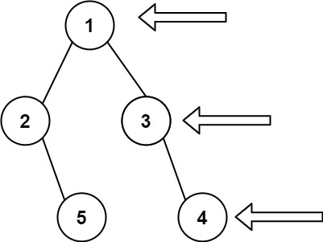

---
tags:
    - Tree
    - Depth-First Search
    - Breadth-First Search
    - Binary Tree
    - Top Interviews
---

# [199. Binary Tree Right Side View](https://leetcode.com/problems/binary-tree-right-side-view/)

Given the `root` of a binary tree, imagine yourself standing on the **right side** of it, return *the values of the nodes you can see ordered from top to bottom*.

 

**Example 1:**



```
Input: root = [1,2,3,null,5,null,4]
Output: [1,3,4]
```

**Example 2:**

```
Input: root = [1,null,3]
Output: [1,3]
```

**Example 3:**

```
Input: root = []
Output: []
```


**Solution:**

**思路**：先递归右子树，再递归左子树，当某个深度首次到达时，对应的节点就在右视图中。

```java
/**
 * Definition for a binary tree node.
 * public class TreeNode {
 *     int val;
 *     TreeNode left;
 *     TreeNode right;
 *     TreeNode() {}
 *     TreeNode(int val) { this.val = val; }
 *     TreeNode(int val, TreeNode left, TreeNode right) {
 *         this.val = val;
 *         this.left = left;
 *         this.right = right;
 *     }
 * }
 */
class Solution {
    public List<Integer> rightSideView(TreeNode root) {
        List<Integer> result = new ArrayList<>();
        dfs(root, 0, result);
        return result;
    }

    private void dfs(TreeNode root, int depth, List<Integer> result){
        if (root == null){
            return;
        }

        if (depth == result.size()){ // 这个深度首次遇到
            result.add(root.val);
        }

        dfs(root.right, depth + 1, result); // 先递归右子树，保证首次遇到的一定是最右边的节点
        dfs(root.left, depth + 1, result);
    }
}
// TC: O(n)
// SC: O(n)
```

复杂度分析
时间复杂度：O(n)，其中 n 是二叉树的节点个数。
空间复杂度：O(h)，其中 h 是二叉树的高度。递归需要 O(h) 的栈空间。最坏情况下，二叉树退化成一条链，递归需要 O(n) 的栈空间。


```java
/**
 * Definition for a binary tree node.
 * public class TreeNode {
 *     int val;
 *     TreeNode left;
 *     TreeNode right;
 *     TreeNode() {}
 *     TreeNode(int val) { this.val = val; }
 *     TreeNode(int val, TreeNode left, TreeNode right) {
 *         this.val = val;
 *         this.left = left;
 *         this.right = right;
 *     }
 * }
 */
class Solution {
    public List<Integer> rightSideView(TreeNode root) {
       List<Integer> result = new ArrayList<>();
       if (root == null){
        return result;
       }
       Deque<TreeNode> queue = new ArrayDeque<>();
       queue.offerLast(root);

       while(!queue.isEmpty()){
        int size = queue.size();
        for (int i = 0; i < size; i++){
            TreeNode cur = queue.pollFirst();
            if (i == size - 1){
                result.add(cur.val);
            }

            if (cur.left != null){
                queue.offerLast(cur.left);
            }

            if (cur.right != null){
                queue.offerLast(cur.right);
            }
        }
       }

       return result;
    }
}
// TC: O(n)
// SC: O(n)
```


```java
/**
 * Definition for a binary tree node.
 * public class TreeNode {
 *     int val;
 *     TreeNode left;
 *     TreeNode right;
 *     TreeNode() {}
 *     TreeNode(int val) { this.val = val; }
 *     TreeNode(int val, TreeNode left, TreeNode right) {
 *         this.val = val;
 *         this.left = left;
 *         this.right = right;
 *     }
 * }
 */
class Solution {
    public List<Integer> rightSideView(TreeNode root) {
        List<Integer> result = new ArrayList<Integer>();
        helper(root, result, 0);
        return result;
    }

    private void helper(TreeNode root, List<Integer> result, int index){
        if (root == null){
            return;
        }

        if (index == result.size()){
            result.add(root.val);
        }

        helper(root.right, result, index + 1);
        helper(root.left, result, index + 1);
    }
}
// TC: O(n)
// SC: O(n)
```


```java
/**
 * Definition for a binary tree node.
 * public class TreeNode {
 *     int val;
 *     TreeNode left;
 *     TreeNode right;
 *     TreeNode() {}
 *     TreeNode(int val) { this.val = val; }
 *     TreeNode(int val, TreeNode left, TreeNode right) {
 *         this.val = val;
 *         this.left = left;
 *         this.right = right;
 *     }
 * }
 */
class Solution {
    public List<Integer> rightSideView(TreeNode root) {
        List<Integer> result = new ArrayList<>();

        dfs(root, 0, result);
        return result;
    }

    private void dfs(TreeNode root, int depth, List<Integer> result){
        if (root == null){
            return;
        }

        if (depth == result.size()){
            result.add(root.val);
        }

        dfs(root.right, depth + 1, result);
        dfs(root.left, depth + 1, result);
    }
}


// TC: O(n)
// SC: O(n)
```


