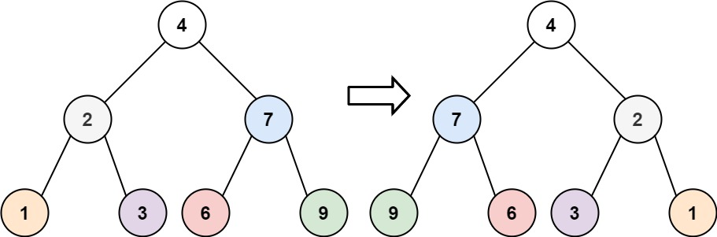
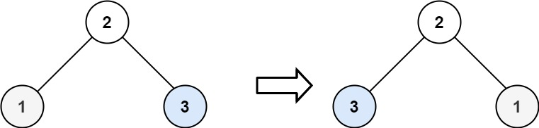

---
tags:
    - Tree
    - Depth-First Search
    - Breadth-First Search
    - Binary Tree
    - Top Interviews
---


# [226. Invert Binary Tree](https://leetcode.com/problems/invert-binary-tree/)

Given the `root` of a binary tree, invert the tree, and return *its root*.

 

**Example 1:**



```
Input: root = [4,2,7,1,3,6,9]
Output: [4,7,2,9,6,3,1]
```

**Example 2:**



```
Input: root = [2,1,3]
Output: [2,3,1]
```

**Example 3:**

```
Input: root = []
Output: []
```

 

**Constraints:**

- The number of nodes in the tree is in the range `[0, 100]`.
- `-100 <= Node.val <= 100`


Solution:

```java
/**
 * Definition for a binary tree node.
 * public class TreeNode {
 *     int val;
 *     TreeNode left;
 *     TreeNode right;
 *     TreeNode() {}
 *     TreeNode(int val) { this.val = val; }
 *     TreeNode(int val, TreeNode left, TreeNode right) {
 *         this.val = val;
 *         this.left = left;
 *         this.right = right;
 *     }
 * }
 */
class Solution {
    public TreeNode invertTree(TreeNode root) {
        if (root == null){
            return null;
        }

        TreeNode left = invertTree(root.left);
        TreeNode right = invertTree(root.right);
        
        TreeNode cur = root.left;
        root.left = root.right;

        root.right = cur;

        return root;

    }
}

// TC: O(n)
// SC: O(n)
```


```java
/**
 * Definition for a binary tree node.
 * public class TreeNode {
 *     int val;
 *     TreeNode left;
 *     TreeNode right;
 *     TreeNode() {}
 *     TreeNode(int val) { this.val = val; }
 *     TreeNode(int val, TreeNode left, TreeNode right) {
 *         this.val = val;
 *         this.left = left;
 *         this.right = right;
 *     }
 * }
 */
class Solution {
    public TreeNode invertTree(TreeNode root) {
        if (root == null){
            return root;
        }

        if (root.left == null && root.right == null){
            return root;
        }

        if (root.left != null && root.right != null){
            TreeNode left = invertTree(root.left);
            TreeNode right = invertTree(root.right);
            root.left = right;
            root.right = left;
            return root;
        }else if (root.left != null){
            TreeNode left = invertTree(root.left);
            root.right = left;
            root.left = null;
            return root;
        }else {
            TreeNode right = invertTree(root.right);
            root.left = right;
            root.right = null;
            return root; 
        }


        


    }
}

// TC: O(n)
// SC: O(n)
```

