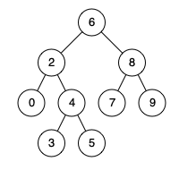

---
tags:
  - Tree
  - Depth-First Search
  - Binary Search Tree
  - Binary Tree
  - Top Interviews
---

# [235. Lowest Common Ancestor of a Binary Search Tree](https://leetcode.com/problems/lowest-common-ancestor-of-a-binary-search-tree/)

Given a binary search tree (BST), find the lowest common ancestor (LCA) node of two given nodes in the BST.

According to the [definition of LCA on Wikipedia](https://en.wikipedia.org/wiki/Lowest_common_ancestor): “The lowest common ancestor is defined between two nodes `p` and `q` as the lowest node in `T` that has both `p` and `q` as descendants (where we allow **a node to be a descendant of itself**).”

**Example 1:**



```
Input: root = [6,2,8,0,4,7,9,null,null,3,5], p = 2, q = 8
Output: 6
Explanation: The LCA of nodes 2 and 8 is 6.
```

**Example 2:**


```
Input: root = [6,2,8,0,4,7,9,null,null,3,5], p = 2, q = 4
Output: 2
Explanation: The LCA of nodes 2 and 4 is 2, since a node can be a descendant of itself according to the LCA definition.
```

**Example 3:**

```
Input: root = [2,1], p = 2, q = 1
Output: 2
```

**Constraints:**

- The number of nodes in the tree is in the range `[2, 105]`.
- `-109 <= Node.val <= 109`
- All `Node.val` are **unique**.
- `p != q`
- `p` and `q` will exist in the BST.


**Solution:**

1. 当前节点是空节点 不用判断  `p` and `q` will exist in the BST.

2. p和q都在左子树: 返回递归左子树的结果

3. p和q都在右子树: 返回递归右子树的结果

4. 其他: 

   4.1 p和q分别在左右子树

   4.2 当前节点是p

   4.3 当前节点是q

   返回当前节点

搜索树的好处: 提前剪枝

```java
/**
 * Definition for a binary tree node.
 * public class TreeNode {
 *     int val;
 *     TreeNode left;
 *     TreeNode right;
 *     TreeNode(int x) { val = x; }
 * }
 */

class Solution {
    public TreeNode lowestCommonAncestor(TreeNode root, TreeNode p, TreeNode q) {
        int cur = root.val;
        if (p.val < cur && q.val < cur){
            return lowestCommonAncestor(root.left, p, q);
        }


        if (p.val > cur && q.val > cur){
            return lowestCommonAncestor(root.right, p, q);
        }

        return root;

    }
}

// TC: O(n)
// SC: O(n)
```


```java
/**
 * Definition for a binary tree node.
 * public class TreeNode {
 *     int val;
 *     TreeNode left;
 *     TreeNode right;
 *     TreeNode(int x) { val = x; }
 * }
 */

class Solution {
    public TreeNode lowestCommonAncestor(TreeNode root, TreeNode p, TreeNode q) {
        // base case
        if (root == null){
            return null;
        }

        if (root == p || root == q){
            return root;
        }

        TreeNode left = lowestCommonAncestor(root.left, p, q);
        TreeNode right = lowestCommonAncestor(root.right, p, q);

        if (left != null && right != null){
            return root;
        }

        if (left == null && right == null){
            return null;
        }

        if (left != null){
            return left;
        }else{
            return right;
        }
    }
}
/*
    case 1 : root.left == null && root.right == null -> return null
    case 2 : root.left != null || root.right != null -> return not null side like root.left or root.right
    case 3 : root.left && root.right != null return root;
*/
// TC: O(n)
// SC: O(n)
```

**Binary Search Tree (BST)**: Due to the inherent property of a BST (left child is smaller, and right child is larger), finding the LCA is relatively easier and can be done in a more straightforward manner.


