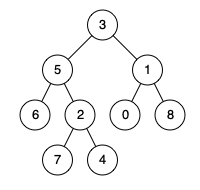
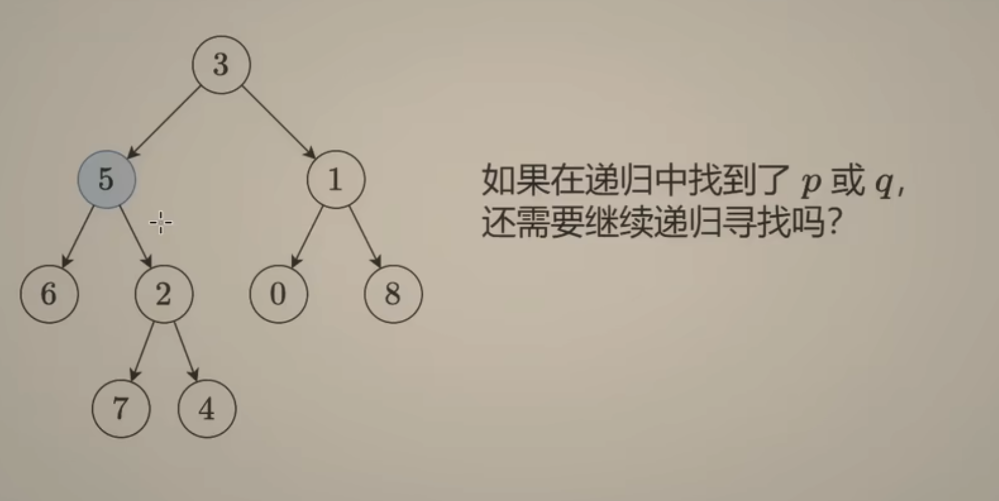
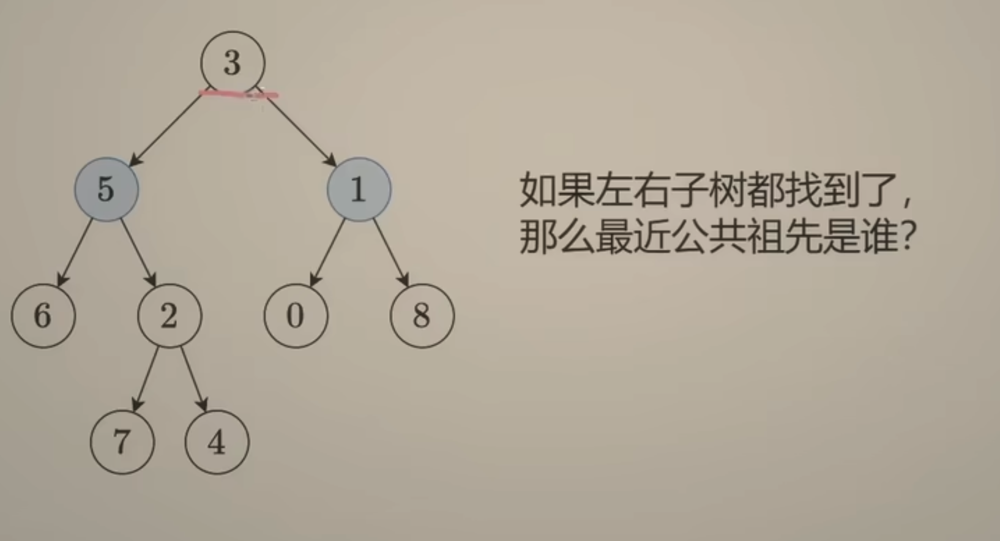
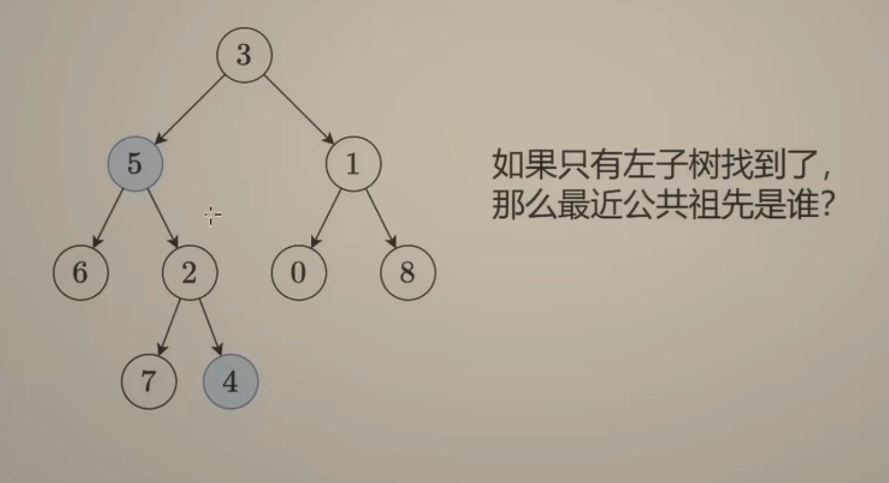

---
tags:
    - Tree
    - Depth-First Search
    - Binary Search Tree
    - Binary Tree
    - Top Interviews
---

#[236. Lowest Common Ancestor of a Binary Tree](https://leetcode.com/problems/lowest-common-ancestor-of-a-binary-tree/)

Given a binary tree, find the lowest common ancestor (LCA) of two given nodes in the tree.

According to the [definition of LCA on Wikipedia](https://en.wikipedia.org/wiki/Lowest_common_ancestor): “The lowest common ancestor is defined between two nodes `p` and `q` as the lowest node in `T` that has both `p` and `q` as descendants (where we allow **a node to be a descendant of itself**).”

 

**Example 1:**



```
Input: root = [3,5,1,6,2,0,8,null,null,7,4], p = 5, q = 1
Output: 3
Explanation: The LCA of nodes 5 and 1 is 3.
```

**Example 2:**


```
Input: root = [3,5,1,6,2,0,8,null,null,7,4], p = 5, q = 4
Output: 5
Explanation: The LCA of nodes 5 and 4 is 5, since a node can be a descendant of itself according to the LCA definition.
```

**Example 3:**

```
Input: root = [1,2], p = 1, q = 2
Output: 1
```


**Solution:**

分类讨论: 

1. 当前节点是空节点  \

2. 当前节点是p       ---   返回当前节点 

3. 当前节点是q          /  

   --------------------------------------

4. 其他: 是否找到p或q:

   4.1 左右子树都找到  -- 返回当前节点

   4.2 只有左子树找到 -- 返回递归左子树的结果

   4.3 只有右子树找到 -- 返回递归右子树的结果

   4.4 左右子数都没有找到 -- 返回空节点

```java
/**
 * Definition for a binary tree node.
 * public class TreeNode {
 *     int val;
 *     TreeNode left;
 *     TreeNode right;
 *     TreeNode(int x) { val = x; }
 * }
 */
class Solution {
    public TreeNode lowestCommonAncestor(TreeNode root, TreeNode p, TreeNode q) {
       // base case 
       if (root == null){
           return null;
       } 

       if (root == p || root == q){
           return root;
       }

       TreeNode left = lowestCommonAncestor(root.left, p, q);
       TreeNode right = lowestCommonAncestor(root.right, p, q);

       if (left != null && right != null){
           return root;
       }

        if (left == null && right == null){
            return null;
        }

        if (left != null){
            return left;
        }else{
            return right;
        }

    }
}

// TC: O(n)
// SC: O(n)
```



不要, 直接返回5



就是当前节点



直接返回左子树的递归结果就行了


```java
/**
 * Definition for a binary tree node.
 * public class TreeNode {
 *     int val;
 *     TreeNode left;
 *     TreeNode right;
 *     TreeNode(int x) { val = x; }
 * }
 */
class Solution {
    public TreeNode lowestCommonAncestor(TreeNode root, TreeNode p, TreeNode q) {
        if (root == null || root == p || root == q){
            return root;
        } 

        TreeNode left = lowestCommonAncestor(root.left, p, q);
        TreeNode right = lowestCommonAncestor(root.right, p, q);

        if (left != null && right != null){
            return root;
        }

        if (left != null){
            return left;
        }

        return right;
    }
}

// TC: O(n)
// SC: O(n)
```

