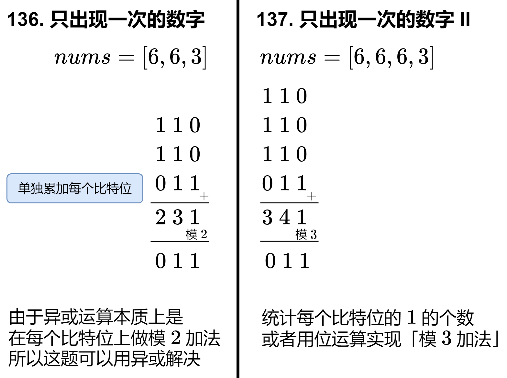

---
tags:
    - Array
    - Bit Manipulation
    - Top Interviews
---

# [137. Single Number II](https://leetcode.com/problems/single-number-ii/)

Given an integer array `nums` where every element appears **three times** except for one, which appears **exactly once**. *Find the single element and return it*.

You must implement a solution with a linear runtime complexity and use only constant extra space.

 

**Example 1:**

```
Input: nums = [2,2,3,2]
Output: 3
```

**Example 2:**

```
Input: nums = [0,1,0,1,0,1,99]
Output: 99
```

 

**Constraints:**

- `1 <= nums.length <= 3 * 104`
- `-231 <= nums[i] <= 231 - 1`
- Each element in `nums` appears exactly **three times** except for one element which appears **once**.


**Solution:**

**暴力思路**

设只出现一次的那个数为x. 用二进制思考:

* 如果x的某个比特是0, 由于其余数字都出现了3次, 所以nums的所有元素在这个比特位上的1的个数是3的倍数.
* 如果x的某个比特是1, 由于其余数字都出现了3次, 所以nums的所有元素在这个比特位上的1的个数除3余1.

这启发我们统计每个比特位上有多少个1. 下图比较了[136. Single Number](https://leetcode.com/problems/single-number/)与本题的异同:



先来看看如何实现「统计每个比特位的 1 的个数」。

代码中用到了一些位运算技巧，请看 [从集合论到位运算，常见位运算技巧分类总结！](https://leetcode.cn/circle/discuss/CaOJ45/)

```java
class Solution {
    public int singleNumber(int[] nums) {
        int result = 0;
        for (int i = 0; i < 32; i++){
            int cnt1 = 0;
            for (int x : nums){
                cnt1 = cnt1 + (x >> i & 1);
            }

            result = result | (cnt1 % 3 << i);
        }

        return result;
    }
}
// TC: O(n)
// SC: O(1)
```

```java
class Solution {
    public int singleNumber(int[] nums) {
        int result = 0;

        for (int i = 0; i < 32; i++){
            int onesCount = 0;
            for (int x : nums){
                onesCount = onesCount + ((x >> i) & 1);
            }

            result = result | (onesCount % 3) << i;
        }

        return result;
    }
}
// 暴力适合我
```


## 位运算的魔法：模 3 加法

对于异或(模2加法)来说, 把一个数不断地异或1, 相当于在0和1之间不断转换, 即:
$$
0 \rightarrow 1 \rightarrow 0 \rightarrow 1 \rightarrow \cdots
$$
类似地, 模3加法就是在0, 1, 2 之间不断转换, 即:
$$
0 \rightarrow 1 \rightarrow 2 \rightarrow 0 \rightarrow 1 \rightarrow 2 \rightarrow \cdots
$$
由于0, 1, 2需要两个比特才能表示, 设这两个比特分别为a和b, 即:

* $a=0, b =0$ 表示数字0;
* $a=0, b =1$ 表示数字1;
* $a=1, b =0$ 表示数字2;

那么转换规则就是:
$$
(0,0) \rightarrow (0,1) \rightarrow (1,0) \rightarrow (0,0) \rightarrow (0,1) \rightarrow (1,0) \rightarrow \cdots
$$
这其中有大量的$0$和$1$之间的转换, 我们已经知道, 这可以用异或运算实现, 写成代码就是:

```
a = a ^ 1
b = b ^ 1
```

除了两个例外情况:

* 当 a = 0 且 b = 0时, a必须保持不变, 仍然为0.
* 当 a = 1时, (此时b一定是0), b必须保持不变, 仍然为0.

换句话说, 我么可以在异或运算的基础上, 增加一些约束:

* 当$(a|b) == 0$ 时, 把0赋值给a, 否则($(a|b) == 1$)可以执行异或操作. 写成代码就是`a = (a \^ 1) \& (a |b)`.
* 当a == 1时, 把0赋值给b, 否则(~a == 1)可以执行异或操作.写成代码就是`b = (b ^ 1) & ~a`

其中`&`运算相当于为异或运算添加了一个约束: 当.....为1时, 才执行异或操作.

如果模3加法遇到了0, 那么a和b都应当维持不变. 好在把1改成0, 我们的代码仍然是正确的, 也就是: 

```
// 注意 a 和 b 是同时计算的
a = (a ^ x) & (a | b)
b = (b ^ x) & ~a
```

该代码在 *x*=0 和 *x*=1 的情况下都是成立的（注意 *a* 和 *b* 不可能都为 1）。

由于位运算具有「并行计算」的特点，上述运算规则可以推广到多个比特的情况。遍历 nums，利用上式计算出最终的 a 和 b。

最后，由于模 3 加法的结果要么是 0，要么是 1，没有 2，那么根据 b 的定义，这刚好就是 b，所以最后返回 b。

**优化：更简洁的代码**
也可以先算 b 再算 a，那么 a 的计算规则修改成：

* 当 a=0 且 b=1 时，a 必须保持不变，仍然为 0。注意这里的 b 是更新后的。


由于 b=1 的情况在 (0,0)→(0,1)→(1,0) 中只会出现一次，所以只要 b=1 我们可以断定 a=0，所以

* 当 b == 1 时，把 0 赋值给 a，否则（~b == 1）可以执行异或操作。


于是得到：

```
// 先算 b 再算 a
b = (b ^ x) & ~a
a = (a ^ x) & ~b
```

这样写出来的代码比上面的更简洁：

```java
class Solution {
    public int singleNumber(int[] nums) {
        int a = 0, b = 0;
        for (int x : nums) {
            b = (b ^ x) & ~a;
            a = (a ^ x) & ~b;
        }
        return b;
    }
}

```

#### 复杂度分析

- 时间复杂度：O(*n*)，其中 *n* 为 *nums* 的长度。
- 空间复杂度：O(1)。

## 进阶问题

改成除了一个元素出现**一次**，其余元素都出现**五次**呢？


```java
class Solution {
    public int singleNumber(int[] nums) {
        Map<Integer, Integer> map = new HashMap<Integer, Integer>();

        for (int i = 0; i < nums.length; i++){
            map.put(nums[i], map.getOrDefault(nums[i], 0) + 1);
            
        }

        for (Map.Entry<Integer, Integer> entry : map.entrySet()){
            if (entry.getKey() != 1 && entry.getValue() < 3){
                return entry.getKey();
            }
        }

        return 1;
    }
}

// TC: O(n)
// SC: O(n)
```

