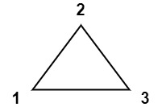
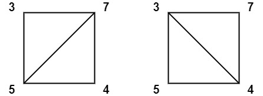
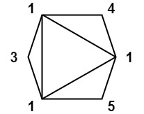
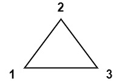
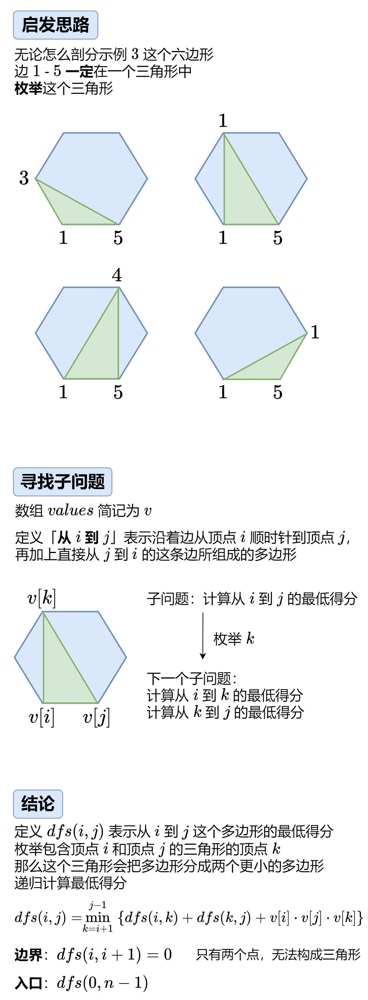

---
tags:
    - Array
    - Dynamic Programming
    - Top Interviews
---

# [1039. Minimum Score Triangulation of Polygon](https://leetcode.com/problems/minimum-score-triangulation-of-polygon/)

You have a convex `n`-sided polygon where each vertex has an integer value. You are given an integer array `values` where `values[i]` is the value of the `ith` vertex in **clockwise order**.

**Polygon** **triangulation** is a process where you divide a polygon into a set of triangles and the vertices of each triangle must also be vertices of the original polygon. Note that no other shapes other than triangles are allowed in the division. This process will result in `n - 2` triangles.

You will **triangulate** the polygon. For each triangle, the *weight* of that triangle is the product of the values at its vertices. The total score of the triangulation is the sum of these *weights* over all `n - 2` triangles.

Return the *minimum possible score* that you can achieve with some **triangulation** of the polygon.

 

**Example 1:**



**Input:** values = [1,2,3]

**Output:** 6

**Explanation:** The polygon is already triangulated, and the score of the only triangle is 6.

**Example 2:**



**Input:** values = [3,7,4,5]

**Output:** 144

**Explanation:** There are two triangulations, with possible scores: $3*7*5 + 4*5*7 = 245$, or $3*4*5 + 3*4*7 = 144$.
The minimum score is 144.

**Example 3:**



**Input:** values = [1,3,1,4,1,5]

**Output:** 13

**Explanation:** The minimum score triangulation is $1*1*3 + 1*1*4 + 1*1*5 + 1*1*1 = 13$.

 

**Constraints:**

- `n == values.length`
- `3 <= n <= 50`
- `1 <= values[i] <= 100`


Solution:





$$
dfs(i,j) = max_{k=i+1}^{j-1} \{dfs(i,k) + dfs(k, j) + v[i] \cdot v[j] \cdot v[k]\}
$$
递归边界: $dfs(i, i + 1) = 0$

递归入口: $dfs(0, n - 1)$


### DFS

```java
class Solution {
    public int minScoreTriangulation(int[] values) {
        int n = values.length;

        int result = dfs(0, n - 1, values);
        return result;
    }

    private int dfs(int i, int j, int[] values){
        if (i + 1 == j){
            return 0;
        }

        int result = Integer.MAX_VALUE;

        for (int k = i + 1; k < j; k++){
            result = Math.min(result, dfs(i, k, values) + dfs(k, j, values) + values[i] * values[j] * values[k]);
        }

        return result;

    }
}

// TC: O(n^n) branch^level
// SC: O(n)
```


### DFS+Memo

```java
class Solution {
    public int minScoreTriangulation(int[] values) {
        int n = values.length;
        int[][] memo = new int[n][n];
        for (int[] row : memo){
            Arrays.fill(row, -1);
        }
        int result = dfs(0, n - 1, values, memo);
        return result;
    }

    private int dfs(int i, int j, int[] values, int[][] memo){
        if (i + 1 == j){
            return 0;
        }

        if (memo[i][j] != -1){
            return memo[i][j];
        }

        int result = Integer.MAX_VALUE;

        for (int k = i + 1; k < j; k++){
            result = Math.min(result, dfs(i, k, values, memo) + dfs(k, j, values, memo) + values[i] * values[j] * values[k]);
        }

        memo[i][j] = result;

        return memo[i][j];

    }
}

// TC: O(n^3)
// SC: O(n^2)
```


### 1:1 Translate

$$
f[i][j] = max_{k=i+1}^{j-1} \{f[i][k] + f[k][j] + v[i] \cdot v[j] \cdot v[k]\}
$$

$$
\text{循环顺序} \begin{cases}
 & i < k, f[i] \text{从} f[k]转移过来, 所以i要倒序枚举 \\
 & j > k, f[i][j]从f[i][k]转移过来, 所以j要正序枚举
\end{cases}
$$

答案为$f[0][n-1]$

```java
class Solution {
    public int minScoreTriangulation(int[] values) {
        int n = values.length;
        int[][] memo = new int[n][n];
        // for (int[] row : memo){
        //     Arrays.fill(row, -1);
        // }
        // int result = dfs(0, n - 1, values, memo);

        for (int i = n - 3; i >= 0; i--){
            for (int j = i + 2; j < n; j++){
                int subResult = Integer.MAX_VALUE;
                for (int k = i + 1; k < j; k++){
                    subResult = Math.min(subResult, memo[i][k] + memo[k][j] + values[i] * values[j] * values[k]);
                }

                memo[i][j] = subResult;
            }
        }

        return memo[0][n - 1];
    }


}


// TC: O(n^3)
// SC: O(n^2)
```

