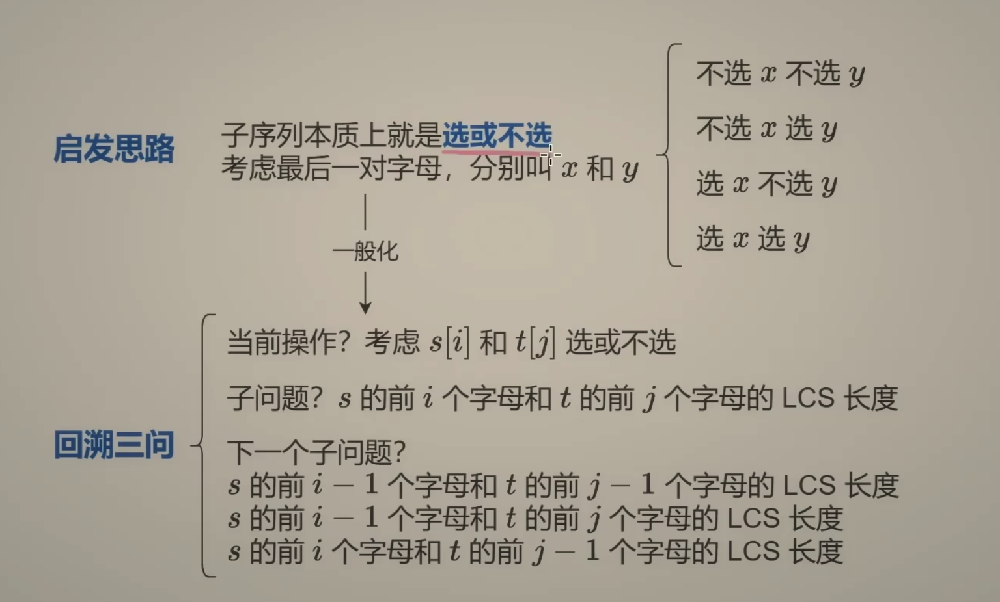
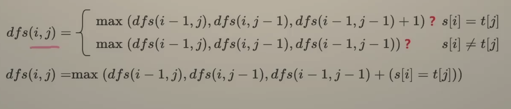
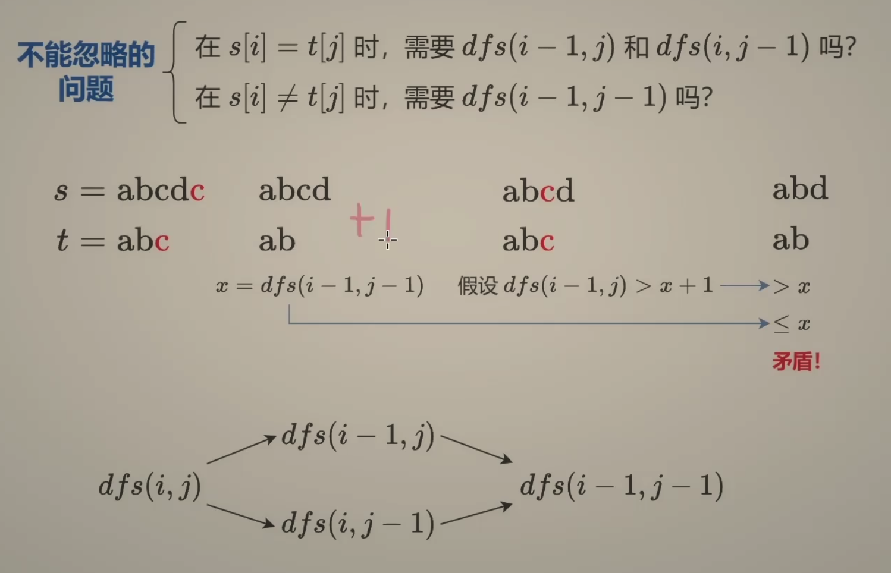
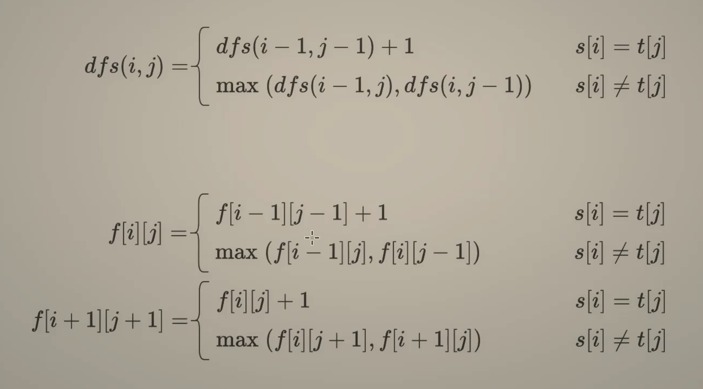
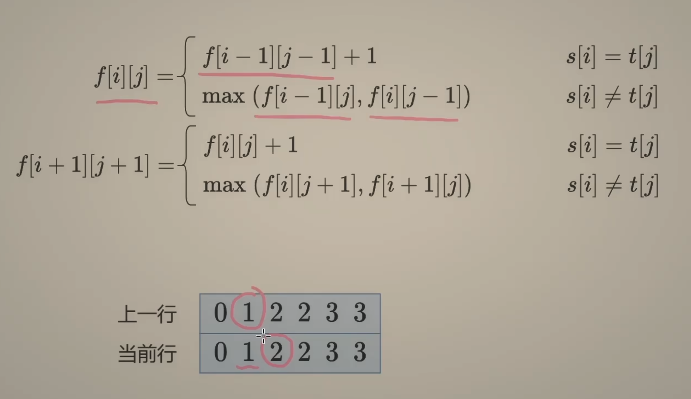

---
tags:
    - String	
    - Dynamic Programming
    - Top Interviews
---

# [1143. Longest Common Subsequence](https://leetcode.com/problems/longest-common-subsequence/)

Given two strings `text1` and `text2`, return *the length of their longest **common subsequence**.* If there is no **common subsequence**, return `0`.

A **subsequence** of a string is a new string generated from the original string with some characters (can be none) deleted without changing the relative order of the remaining characters.

- For example, `"ace"` is a subsequence of `"abcde"`.

A **common subsequence** of two strings is a subsequence that is common to both strings.

 

**Example 1:**

```
Input: text1 = "abcde", text2 = "ace" 
Output: 3  
Explanation: The longest common subsequence is "ace" and its length is 3.
```

**Example 2:**

```
Input: text1 = "abc", text2 = "abc"
Output: 3
Explanation: The longest common subsequence is "abc" and its length is 3.
```

**Example 3:**

```
Input: text1 = "abc", text2 = "def"
Output: 0
Explanation: There is no such common subsequence, so the result is 0.
```


**Solution:**

### 一、递归搜索 + 保存计算结果 = 记忆化搜索


启发思路: 子序列








```java
class Solution {
    public int longestCommonSubsequence(String text1, String text2) {
        char[] s = text1.toCharArray();
        char[] t = text2.toCharArray();

        int n = s.length;
        int m = t.length;
        int index1 = n - 1;
        int index2 = m - 1;
        return dfs(index1, index2, t, s);
    }

    private int dfs(int index1, int index2, char[] t, char[] s){
        if (index1 < 0 || index2 < 0){
            return 0;
        }

        if (s[index1] == t[index2]){
            return dfs(index1 - 1, index2 - 1, t, s) + 1;
        }

        return Math.max(dfs(index1 - 1, index2, t, s), dfs(index1, index2 - 1, t, s));
    }
}

// TC: O(n!)
// SC: O(n)
```


```java
class Solution {
    public int longestCommonSubsequence(String text1, String text2) {
        char[] s = text1.toCharArray();
        char[] t = text2.toCharArray();

        int n = s.length;
        int m = t.length;
        int index1 = n - 1;
        int index2 = m - 1;
        int[][] memo = new int[n][m];
        for (int[] row : memo){
            Arrays.fill(row, -1);
        }
        return dfs(index1, index2, t, s, memo);
    }

    private int dfs(int index1, int index2, char[] t, char[] s, int[][] memo){
        if (index1 < 0 || index2 < 0){
            return 0;
        }

        if (memo[index1][index2] != -1){
            return memo[index1][index2];
        }

        if (s[index1] == t[index2]){
            return memo[index1][index2] = dfs(index1 - 1, index2 - 1, t, s, memo) + 1;
        }

        return memo[index1][index2] = Math.max(dfs(index1 - 1, index2, t, s, memo), dfs(index1, index2 - 1, t, s, memo));
    }
}

// TC: O(n * m)
// SC: O(n * m)
```


### 二、1:1 翻译成递推



```java
class Solution {
    public int longestCommonSubsequence(String text1, String text2) {
        char[] s = text1.toCharArray();
        char[] t = text2.toCharArray();

        int n = s.length;
        int m = t.length;

        int index1 = n - 1;
        int index2 = m - 1;
        // int[][] memo = new int[n][m];
        // for (int[] row : memo){
        //     Arrays.fill(row, -1);
        // }

        // return dfs(index1, index2, t, s, memo);

        int[][] f = new int[n + 1][m + 1];
        for (int i = 0; i < n; i++){
            for (int j = 0; j < m; j++){

                if (s[i] == t[j]){
                    f[i + 1][j + 1] = f[i][j] + 1;
                }else{
                    f[i + 1][j + 1] = Math.max(f[i][j+ 1], f[i+ 1][j]);
                }
            }
        }
        return f[n][m];
    }

    private int dfs(int index1, int index2, char[] t, char[] s, int[][] memo){
        if (index1 < 0 || index2 < 0){
            return 0;
        }

        if (memo[index1][index2] != -1){
            return memo[index1][index2];
        }


        if (s[index1] == t[index2]){
            return memo[index1][index2] = dfs(index1 - 1, index2 -1, t, s, memo) + 1;
        }
        // dfs(i-1, j -1)+1

        return memo[index1][index2] = Math.max(dfs(index1 - 1, index2, t, s, memo), dfs(index1, index2 - 1, t, s, memo));
        // max(dfs(i-1, j), dfs(i, j-1))

        // f[i][j] ={
            // s[i] = t[j] f[i-1][j-1] + 1
            // s[i] != t[j] Math.max(f[i-1][j], f[i][j-1])
        // }

        // f[i + 1][j+ 1] ={
       // s[i] = t[j] f[i][j] + 1
        // s[i] != t[j] Math.max(f[i][j + 1], f[i+ 1][j])

    }
}

// TC: O(n*m)
// SC: O(n*m)
```


```java
class Solution {
    public int longestCommonSubsequence(String text1, String text2) {
        int[][] longest = new int[text1.length()+1][text2.length() +1];
        for (int i = 1; i <= text1.length(); i++){
            for (int j = 1; j <= text2.length(); j++){
                if (text1.charAt(i - 1) == text2.charAt(j-1)){
                    longest[i][j] = longest[i-1][j-1] + 1;
                } else {
                    longest[i][j] = Math.max(longest[i - 1][j], longest[i][j-1]);
                }
            }
        }

        return longest[text1.length()][text2.length()];
        
    }
}

// TC: O(n^2)
// SC: O(n^2)
/*	
					i
        - a b c
      - 0 0 0	0
      d 0 0	0	0				j  
      e 0 0 0 0
      f 0 0 0 0
      a 0 1 0 0
      f 0 1 1 1
      c 0 1 1 2
M[i-1][j] is from
1 + M[i - 1][j - 1] > M[i-1][j-1]
Math.max(M[i-2][j], M[i-1][j-1]) >= M[i-1][j-1]

res  = dp[n][m] -> 一直在继承, 从来没有东山再起
*/
```


M\[i][j] represents the length of the longest subsequences between a[0... i -1] (first i letters of a) and b[0 ... j -1] (first j letters of b)

M\[i][j -1]

M\[i - 1][j]

**Base case**

M\[0][0] = 0

M\[i][0] = 0

M\[0][j] = 0


**Induction rule**

**Case 1: M\[i][j] = 1 + M\[i -1][j -1]					if 		a[i - 1] == b[j-1]**

**Case 2: M\[i][j] = max(M\[i -1][j], M\[i][j -1]) 	else a[i-1] != b[j-1]**

TC: O(n\*m) * O(1) =O(n*m)

SC: O(n * m) => optimize O(n)               


### 三 空间优化：两个数组（滚动数组）

```java
class Solution {
    public int longestCommonSubsequence(String text1, String text2) {
        char[] s = text1.toCharArray();
        char[] t = text2.toCharArray();

        int n = s.length;
        int m = t.length;

        int index1 = n - 1;
        int index2 = m - 1;
        // int[][] memo = new int[n][m];
        // for (int[] row : memo){
        //     Arrays.fill(row, -1);
        // }

        // return dfs(index1, index2, t, s, memo);

        // int[][] f = new int[n + 1][m + 1];
        // for (int i = 0; i < n; i++){
        //     for (int j = 0; j < m; j++){

        //         if (s[i] == t[j]){
        //             f[i + 1][j + 1] = f[i][j] + 1;
        //         }else{
        //             f[i + 1][j + 1] = Math.max(f[i][j+ 1], f[i+ 1][j]);
        //         }
        //     }
        // }
        // return f[n][m];

        int[][] f = new int[2][m + 1];
        for (int i = 0; i < n; i++){
            for (int j = 0; j < m; j++){
                if (s[i] == t[j]){
                    f[(i + 1) % 2][j + 1] = f[i % 2][j] + 1;
                }else{
                    f[(i + 1) % 2][j + 1] = Math.max(f[i % 2][j + 1], f[(i + 1) % 2][j]);
                }
            }
        }

        return f[n % 2][m];
    }

}

// TC: O(mn)
// SC: O(m)
```


### 空间优化：一个数组

答疑
问：为什么 j 不能倒序循环？

答：本题 $f[i+1][j+1]$ 需要从 $f[i+1][j]$ 转移过来，这只能正序枚举 j。倒序枚举的话，$f[i+1][j]$ 还没有计算出来。



```java
class Solution {
    public int longestCommonSubsequence(String text1, String text2) {
        char[] s = text1.toCharArray();
        char[] t = text2.toCharArray();

        int n = s.length;
        int m = t.length;

        int index1 = n - 1;
        int index2 = m - 1;
        // int[][] f = new int[2][m + 1];
        // for (int i = 0; i < n; i++){
        //     for (int j = 0; j < m; j++){
        //         if (s[i] == t[j]){
        //             f[(i + 1) % 2][j + 1] = f[i % 2][j] + 1;
        //         }else{
        //             f[(i + 1) % 2][j + 1] = Math.max(f[i % 2][j + 1], f[(i + 1) % 2][j]);
        //         }
        //     }
        // }

        // return f[n % 2][m];

        int[] f = new int[m + 1];
        for (int i = 0; i < n; i++){
            int pre = f[0];
            for (int j = 0; j < m; j++){
                int tmp = f[j + 1];
                if (s[i] == t[j]){
                    f[j + 1] = pre + 1;
                }else{
                    f[j + 1] = Math.max(f[j + 1], f[j]);
                }
                pre = tmp;
            }
        }

        return f[m];

    }

}
// TC: O(nm)
// SC: O(m)
```

https://www.bilibili.com/video/BV1TM4y1o7ug/?vd_source=73e7d2c4251a7c9000b22d21b70f5635
