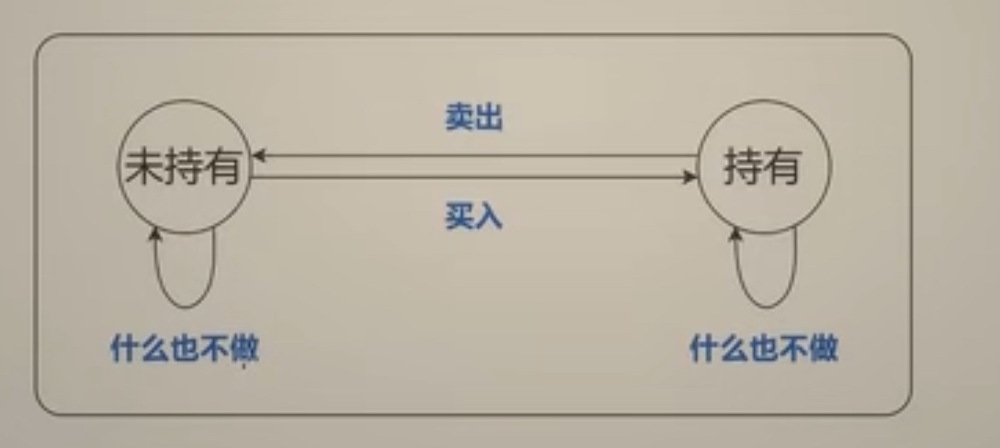
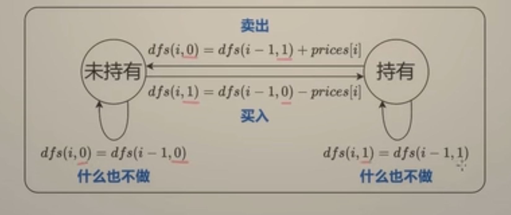

---
tags:
    - Array
    - Dynamic Programming
    - Greedy
    - Top Interviews
---


# [122. Best Time to Buy and Sell Stock II](https://leetcode.com/problems/best-time-to-buy-and-sell-stock-ii/) ‼️

You are given an integer array `prices` where `prices[i]` is the price of a given stock on the `ith` day.

On each day, you may decide to buy and/or sell the stock. You can only hold **at most one** share of the stock at any time. However, you can buy it then immediately sell it on the **same day**.

Find and return *the **maximum** profit you can achieve*.

 

**Example 1:**

```
Input: prices = [7,1,5,3,6,4]
Output: 7
Explanation: Buy on day 2 (price = 1) and sell on day 3 (price = 5), profit = 5-1 = 4.
Then buy on day 4 (price = 3) and sell on day 5 (price = 6), profit = 6-3 = 3.
Total profit is 4 + 3 = 7.
```

**Example 2:**

```
Input: prices = [1,2,3,4,5]
Output: 4
Explanation: Buy on day 1 (price = 1) and sell on day 5 (price = 5), profit = 5-1 = 4.
Total profit is 4.
```

**Example 3:**

```
Input: prices = [7,6,4,3,1]
Output: 0
Explanation: There is no way to make a positive profit, so we never buy the stock to achieve the maximum profit of 0.
```

 

**Constraints:**

- `1 <= prices.length <= 3 * 104`
- `0 <= prices[i] <= 104`


**Solution:**

**启发思路**: 最后一天发生了什么 (为了方便后面改成递推, 从后往前思考)

从第0天开始到第5天结束时的利润 = 从第0天开始到第4天结束时的利润 + 第5天的利润

> 如果第5天 你什么都不做, 利润为0; 如果买入就-4; 如果买了就+4 (是没有考虑前面买入的时候花了多少钱, 如果你是花6块钱买入的, 那么这个-6就要算在前面, 这0到4天的利润当中了)
>
> 继续想, 从第0天到第4天结束时的利润 等于从第0天到第3天结束时的利润加上第4天的利润

**关键词:** 天数、是否持有股票

子问题? 到第$i$ 天结束时, 持有/未持有股票的最大利润

当前操作? 见下图

下一个字问题? 到第$i- 1$ 天结束时, 持有/未持有股票的最大利润



> 未持有, 如果什么都不做, 状态不变.
>
> 如果买入股票, 那就从i-1天结束时, 未持有股票的状态变成第i天结束时持有股票的状态. 
>
> 如果卖出股票也是类似的, 从持有到未持有
>
> 持有, 如果什么都不做, 状态不变
>
> > 这种表示状态之间转换关系的图叫做状态机, 从这张图就可以直观地看出, 状态转移一共有这四种情况.

下一个子问题? 到第$i - 1$ 天结束时, 持有/未持有股票的最大利润

定义$dfs(i, 0)$ 表示到第$i$天结束时, 未持有股票的最大利润

定义$dfs(i, 1)$ 表示到第$i$天结束时, 持有股票的最大利润

由于第$i - 1$ 天的结束就是第$i$天的开始

$dfs(i - 1, \cdot)$ 也表示到第$i$天开始时的最大利润




$$
dfs(i,0) = max(dfs(i - 1, 0), dfs(i - 1,1) + prices[i])\\
dfs(-1,1) = max(dfs(i-1, 1), dfs(i-1, 0) - prices[i])
$$
递归边界: 
$$
dfs(-1,0) = 0  \text{ 第0天开始未持有股票, 利润为0} \\
dfs(-1,1) = -\infin  \text{ 第0天开始不可能持有股票 }
$$
递归入口:
$$
max(dfs(n-1, 0), dfs(n - 1, 1)) = dfs(n-1, 0)
$$

> 如果最后一天你还持有股票, 这个股票在后面就卖不出去了, 所以dfs(n-1, 1) 是不会比dfs(n-1,0)还要大的, 那么直接从dfs(n-1,0) 开始递归就行了

### DFS

```java
class Solution {
    public int maxProfit(int[] prices) {
        int n = prices.length;

        int result = dfs(n - 1, prices, 0);
        return result;
    }

    private int dfs(int i, int[] prices, int hold){
        if (i < 0){
            if (hold == 1){
                return Integer.MIN_VALUE;
            }else{
                return 0;
            }
        }

        if (hold == 1){
            return Math.max(dfs(i - 1, prices, 1), dfs(i - 1, prices, 0) - prices[i]);
          //  dfs(i - 1, prices, 0) - prices[i]       
          //                    买入, i-1的应该是hold = 0 才能卖入, 上一个值
        }

        return Math.max(dfs(i - 1, prices, 0), dfs(i -1, prices, 1) + prices[i]);
    }
}
// TC: O(2^n)
// SC: O(n)
```


### DFS + Memo

```java
class Solution {
    public int maxProfit(int[] prices) {
        int n = prices.length;

        int[][] memo = new int[n][2];
        for (int[] row : memo){
            Arrays.fill(row, -1);
        }

        int result = dfs(n - 1, prices, 0, memo);// wether hold stock

        return result;
    }

    private int dfs(int i , int[] prices, int hold, int[][] memo){
        // hold = 1 means has the stock 
        // hold = 0 means not has the stock

        if (i < 0){
            if (hold == 1){
                return Integer.MIN_VALUE;
            }else{
                return 0;
            }
        }

        if (memo[i][hold] != -1){
            return memo[i][hold];
        }

        if (hold == 1){ // i > i - 1 ->  not buy or buy 
            memo[i][hold] = Math.max(dfs(i - 1, prices, 1, memo), dfs(i - 1, prices, 0, memo) - prices[i]);
            return memo[i][hold];
        }

        // current i = 0; // not sell // sell 
        memo[i][hold] = Math.max(dfs(i - 1, prices, 0, memo), dfs(i - 1, prices, 1, memo) + prices[i]);
        return memo[i][hold];
    }


}

/*
      0 
    /  \ x
    7   
   /|| 
*/

// TC: O(n * 2) => O(n)
// SC: O(n)
```


###  1:1 翻译成递推

$$
f[i][0] = max(f[i - 1][0], f[i - 1][1] + prices[i])\\
f[i][1] = max(f[i - 1][1], f[i - 1][0] - prices[i])
$$

但这样没有状态表示$f[-1][0]$ 和$f[-1][1]$

那就在$f$的最前面插入一个状态

最终递推式

$f[0][0] = 0$

$f[0][1] = -\infin$

$f[i + 1][0] = max(f[i][0], f[i][1] + prices[i])$

$f[i + 1][1] = max(f[i][1], f[i][0] - prices[i])$

答案为$f[n][0]$

> why prices[i] not change 
>
> 只是将利润数组整体往后移一位以适应插入数组开头的边界条件
>
> 举例: 原来第0天的利润放在f[0], 现在向后移动一位放在f[1], 而f[0]存放的就是边界条件.
>
> dp数组扩容, prices数组没有. 这两个是不同的数组


```java
class Solution {
    public int maxProfit(int[] prices) {
        int n = prices.length;

        int[][] memo = new int[n + 1][2];
        // for (int[] row : memo){
        //     Arrays.fill(row, -1);
        // }
        // memo[i][1] = Math.max(dfs(i - 1, prices, 1, memo), dfs(i - 1, prices, 0, memo) - prices[i]);
        // memo[i][0] = Math.max(dfs(i - 1, prices, 0, memo), dfs(i - 1, prices, 1, memo) + prices[i]);

        // memo[i][1] = Math.max(memo[i - 1][1], memo[i - 1][0] - prices[i]);
        // memo[i][0] = Math.max(memo[i - 1][0], memo[i - 1][1] + prices[i]);


        // memo[i + 1][1] = Math.max(memo[i][1], memo[i][0] - prices[i]);
        // memo[i + 1][0] = Math.max(memo[i][0], memo[i][1] + prices[i]);
        memo[0][1] = Integer.MIN_VALUE;
        memo[0][0] = 0;

        for (int i = 0; i < n; i++){
            for (int j = 0; j < 2; j++){
                if (j == 1){
                    memo[i + 1][1] = Math.max(memo[i][1], memo[i][0] - prices[i]);
                }else{
                    memo[i + 1][0] = Math.max(memo[i][0], memo[i][1] + prices[i]);
                }
            }
        }

        int result = memo[n][0];

        // int result = dfs(n - 1, prices, 0, memo);// wether hold stock

        return result;


    }

    // private int dfs(int i , int[] prices, int hold, int[][] memo){
    //     // hold = 1 means has the stock 
    //     // hold = 0 means not has the stock

    //     if (i < 0){
    //         if (hold == 1){
    //             return Integer.MIN_VALUE;
    //         }else{
    //             return 0;
    //         }
    //     }

    //     if (memo[i][hold] != -1){
    //         return memo[i][hold];
    //     }

    //     if (hold == 1){ // i > i - 1 ->  not buy or buy 
    //         memo[i][hold] = Math.max(dfs(i - 1, prices, 1, memo), dfs(i - 1, prices, 0, memo) - prices[i]);
    //         return memo[i][hold];
    //     }

    //     // current i = 0; // not sell // sell 
    //     memo[i][hold] = Math.max(dfs(i - 1, prices, 0, memo), dfs(i - 1, prices, 1, memo) + prices[i]);
    //     return memo[i][hold];
    // }


}

/*
      0 
    /  \ x
    7   
   /|| 
*/

// TC: O(n * 2) => O(n)
// SC: O(n)
```


### 空间优化

```java
class Solution {
    public int maxProfit(int[] prices) {
        int f0 = 0;
        int f1 = Integer.MIN_VALUE;

        for (int i = 0; i < prices.length; i++){
            int newF0 = Math.max(f0, f1 + prices[i]);
            f1 = Math.max(f1, f0 - prices[i]);
            f0 = newF0;
        }
        return f0;
    }
}
// TC: O(n)
// SC: O(1)
```

