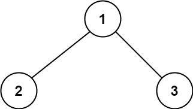
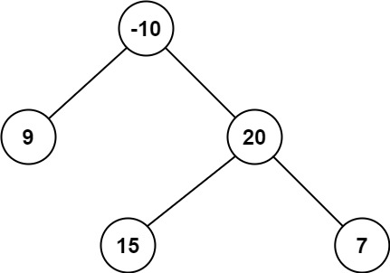
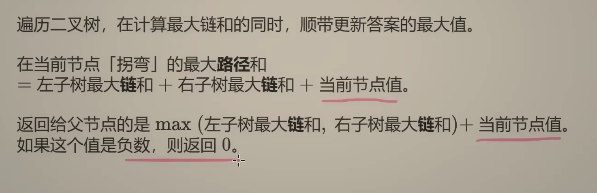

---
tags:
    - Dynamic Programming
    - Tree
    - Depth-First Search	
    - Binary Tree
    - Top Interviews
---

# [124. Binary Tree Maximum Path Sum](https://leetcode.com/problems/binary-tree-maximum-path-sum/)

A **path** in a binary tree is a sequence of nodes where each pair of adjacent nodes in the sequence has an edge connecting them. A node can only appear in the sequence **at most once**. Note that the path does not need to pass through the root.

The **path sum** of a path is the sum of the node's values in the path.

Given the `root` of a binary tree, return *the maximum **path sum** of any **non-empty** path*.

 

**Example 1:**



```
Input: root = [1,2,3]
Output: 6
Explanation: The optimal path is 2 -> 1 -> 3 with a path sum of 2 + 1 + 3 = 6.
```

**Example 2:**



```
Input: root = [-10,9,20,null,null,15,7]
Output: 42
Explanation: The optimal path is 15 -> 20 -> 7 with a path sum of 15 + 20 + 7 = 42.
```


**Solutions:**

本题有两个关键概念：

链：从下面的某个节点（不一定是叶子）到当前节点的路径。把这条链的节点值之和，作为 dfs 的返回值。如果节点值之和是负数，则返回 0（和 0 取最大值）。这个思想和 53. 最大子数组和 是一样的，如果左侧子数组的元素和是负数，就不和当前元素拼起来。
直径：等价于由两条（或者一条）链拼成的路径。我们枚举每个 node，假设直径在这里「拐弯」，也就是计算由左右两条从下面的某个节点（不一定是叶子）到 node 的链的节点值之和，去更新答案的最大值。
⚠注意：dfs 返回的是链的节点值之和，不是直径的节点值之和。

答疑
问：如果所有节点值都是负数，代码会算出什么结果？

答：在所有节点值都为负数的情况下，代码中的 ans = max(ans, l_val + r_val + node.val) 等价于 ans = max(ans, node.val)，我们求的是最大节点值（绝对值最小的负数）。这是符合题目要求的，因为在所有节点值都为负数的情况下，路径只有一个节点是最优的（毕竟节点越多，元素和越小）。类比 53. 最大子数组和，当数组元素都是负数的时候，答案就是 max(nums)。

```java
/**
 * Definition for a binary tree node.
 * public class TreeNode {
 *     int val;
 *     TreeNode left;
 *     TreeNode right;
 *     TreeNode() {}
 *     TreeNode(int val) { this.val = val; }
 *     TreeNode(int val, TreeNode left, TreeNode right) {
 *         this.val = val;
 *         this.left = left;
 *         this.right = right;
 *     }
 * }
 */
class Solution {
    int result = Integer.MIN_VALUE;
    public int maxPathSum(TreeNode root) {
        dfs(root);
        return result;
    }

    private int dfs(TreeNode root){
        if (root == null){
            return 0;
        }

        int left = Math.max(dfs(root.left), 0);
        int right = Math.max(dfs(root.right), 0);

        result = Math.max(left + right + root.val, result);
        return Math.max(Math.max(left, right) + root.val, 0);
    }
}

// TC: O(n)
// SC: O(n)
```


​	100

​	/    \

​     -1      -1

对比: from one leaf node to another leaf 小也得要. 98

any node to any node  能拐弯, 没必要到leaf 没限制 100

1. 读懂题 题目允不允许拐弯(人字形)
2. 必须拐弯吗

```java
// 允许拐弯
// 非必需

**
 * Definition for a binary tree node.
 * public class TreeNode {
 *     int val;
 *     TreeNode left;
 *     TreeNode right;
 *     TreeNode() {}
 *     TreeNode(int val) { this.val = val; }
 *     TreeNode(int val, TreeNode left, TreeNode right) {
 *         this.val = val;
 *         this.left = left;
 *         this.right = right;
 *     }
 * }
 */
class Solution {
    private int maxSum;
    public int maxPathSum(TreeNode root) {
        maxSum = Integer.MIN_VALUE;
        if (root == null){
            return maxSum;
        }

        helper(root);
        return maxSum;
    }

    private int helper(TreeNode root){
        // base case 
        if (root == null){
            return 0;
        }

        // recursive rule
        int left = Math.max(helper(root.left), 0);
        int right = Math.max(helper(root.right),0);
				
        // compare 
        int cur = left + right + root.val;
      	// update
        maxSum = Math.max(maxSum, cur);

        return Math.max(left + root.val, right + root.val);
    }
}

// TC: O(N)
// SC: O(N)
```

any to any


