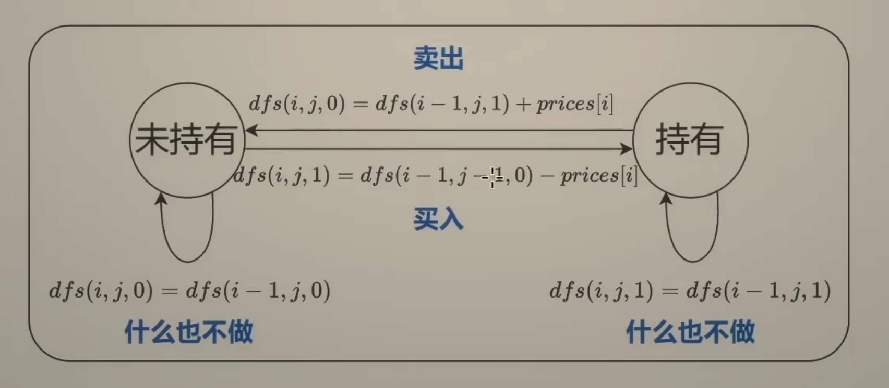

---
tags:
    - Array
    - Dynamic Programming
    - Top Interviews
---

# [188. Best Time to Buy and Sell Stock IV](https://leetcode.com/problems/best-time-to-buy-and-sell-stock-iv/)

You are given an integer array `prices` where `prices[i]` is the price of a given stock on the `ith` day, and an integer `k`.

Find the maximum profit you can achieve. You may complete at most `k` transactions: i.e. you may buy at most `k` times and sell at most `k` times.

**Note:** You may not engage in multiple transactions simultaneously (i.e., you must sell the stock before you buy again).

 

**Example 1:**

```
Input: k = 2, prices = [2,4,1]
Output: 2
Explanation: Buy on day 1 (price = 2) and sell on day 2 (price = 4), profit = 4-2 = 2.
```

**Example 2:**

```
Input: k = 2, prices = [3,2,6,5,0,3]
Output: 7
Explanation: Buy on day 2 (price = 2) and sell on day 3 (price = 6), profit = 6-2 = 4. Then buy on day 5 (price = 0) and sell on day 6 (price = 3), profit = 3-0 = 3.
```

 

**Constraints:**

- `1 <= k <= 100`
- `1 <= prices.length <= 1000`
- `0 <= prices[i] <= 1000`


**Solution:**

定义

定义$dfs(i, j, 0)$ 表示到第$i$天结束时完成至多$j$笔交易, 未持有股票的最大利润

定义$dfs(i,j,1)$表示到第$i$天结束时完成至多$j$笔交易, 持有股票的最大利润



$dfs(i,j,0) = max(dfs(i - 1, j, 0), dfs(i - 1, j, 1) + prices[i]$

$dfs(i,j,1) = max(dfs(i-1,j,1), dfs(i-1, j,0) - prices[i])$


递归边界:
$$
dfs(\cdot, -1,\cdot) = -\infin \text{ 任何情况下}j\text{都不能为负}\\
dfs(-1,j,0)=0 \text{ 第0天开始未持有股票, 利润为0}\\
dfs(-1,j,1)=-\infin \text{ 第0天开始不可能持有股票}
$$
递归入口: $max(dfs(n - 1, k, 0), dfs(n - 1, k ,1)) = dfs(n - 1, k, 0)$


### DFS

```java
class Solution {
    public int maxProfit(int k, int[] prices) {
        int n = prices.length;
        int result = dfs(n - 1, k, prices, 0);

        return result;
    }

    private int dfs(int i, int k, int[] prices, int hold){
        if (k < 0){ // k == 0 still valid, we can inherit
            return Integer.MIN_VALUE;
        }

        if (i < 0){
            if (hold == 1){
                return Integer.MIN_VALUE;
            }else{
                return 0;
            }
        }

        if (hold == 1){
            return Math.max(dfs(i - 1, k, prices, 1), dfs(i-1, k, prices, 0) - prices[i]);
        }

        return Math.max(dfs(i - 1, k, prices, 0), dfs(i - 1, k -1,prices, 1) + prices[i]);
    }
}

// TC: O(2^n)
// SC: O(n)
```


### DFS + Memo

```java
class Solution {
    public int maxProfit(int k, int[] prices) {
        int n = prices.length;
        int[][][] memo = new int[n][2][k + 1];
        for (int[][] mat : memo){
            for (int[] row : mat){
                Arrays.fill(row, -1);
            }
        }

        int result = dfs(n - 1, k, prices, 0, memo);

        return result;
    }

    private int dfs(int i, int k, int[] prices, int hold, int[][][] memo){
        if (k < 0){
            return Integer.MIN_VALUE;
        }

        if (i < 0){
            if (hold == 1){
                return Integer.MIN_VALUE;
            }else{
                return 0;
            }
        }

        if (memo[i][hold][k] != -1){
            return memo[i][hold][k];
        }

        if (hold == 1){
            memo[i][hold][k] = Math.max(dfs(i - 1, k, prices, 1, memo), dfs(i-1, k, prices, 0, memo) - prices[i]);
            return memo[i][hold][k];
        }

        memo[i][hold][k] = Math.max(dfs(i - 1, k, prices, 0, memo), dfs(i - 1, k -1,prices, 1, memo) + prices[i]);
        return memo[i][hold][k];
    }
}

// TC: O(n*k)
// SC: O(n*k)
```


### Translate 1:1 into recursion

$$
f[i][j][0] = max(f[i - 1][j][0], f[i - 1][j][1] + prices[i])\\
f[i][j][0] = max(f[i - 1][j][1], f[i-1][j-1][0] - prices[i])\\
$$

但这样没有状态表示$f[-1][\cdot][\cdot]$和$f[\cdot][-1][\cdot]$

那就在$f$和每个$f[i]$的最前面插入一个状态

最终递推式子
$$
f[\cdot][0][\cdot] = -\infin \\
f[0][j][0] = 0 \ \ j \geq 1 \\
f[0][j][1] = -\infin  \ \ j \geq 1 \\
f[i + 1][j][0] = max(f[i][j][0], f[i][j][1] + prices[i]) \\ 
f[i + 1][j][1] = max(f[i][j][1], f[i][j - 1][0] - prices[i])
$$
答案为: $f[n][k+1][0]$


```java
class Solution {
    public int maxProfit(int k, int[] prices) {
        int n = prices.length;
        int[][][] f = new int[n + 1][k + 2][2];
        for (int[][] mat : f) {
            for (int[] row : mat) {
                Arrays.fill(row, Integer.MIN_VALUE / 2); // 防止溢出
            }
        }
        for (int j = 1; j <= k + 1; j++) {
            f[0][j][0] = 0;
        }
        for (int i = 0; i < n; i++) {
            for (int j = 1; j <= k + 1; j++) {
                f[i + 1][j][0] = Math.max(f[i][j][0], f[i][j][1] + prices[i]);
                f[i + 1][j][1] = Math.max(f[i][j][1], f[i][j - 1][0] - prices[i]);
            }
        }
        return f[n][k + 1][0];
    }
}
// TC: O(n*k)
// SC: O(n*k)
```


### Space optimization

???

```java
class Solution {
    public int maxProfit(int k, int[] prices) {
        int[][] f = new int[k + 2][2];
        for (int j = 1; j <= k + 1; j++) {
            f[j][1] = Integer.MIN_VALUE / 2; // 防止溢出
        }
        f[0][0] = Integer.MIN_VALUE / 2;
        for (int p : prices) {
            for (int j = k + 1; j > 0; j--) {
                f[j][0] = Math.max(f[j][0], f[j][1] + p);
                f[j][1] = Math.max(f[j][1], f[j - 1][0] - p);
            }
        }
        return f[k + 1][0];
    }
}
// TC: O(n*k)
// SC: O(k)
```


### Follow up: 改成恰好/至少交易k次, 要怎么初始化?

恰好: $f[0][1][0] = 0$, 其余=$-\infin$

(注意前面塞了个状态, $f[0][1]$才是恰好完成0次的状态)


至少: $f[i][-1][\cdot]$ 等价于$f[i][0][\cdot]$

所以每个$f[i]$的最前面不需要插入状态

[至少0次]等价于[可以不限次交易]

所以$f[i][0][\cdot]$ 就是无限次交易下的最大利润, 转移方程也一样

$f[0][0][0] = 0$, 其余=$-\infin$

$f[i + 1][0][0] = max(f[i][0][0], f[i][0][1] + prices[i])$

$f[i+1][0][1] = max(f[i][0][1], f[i][0][0] - prices[i])$


 