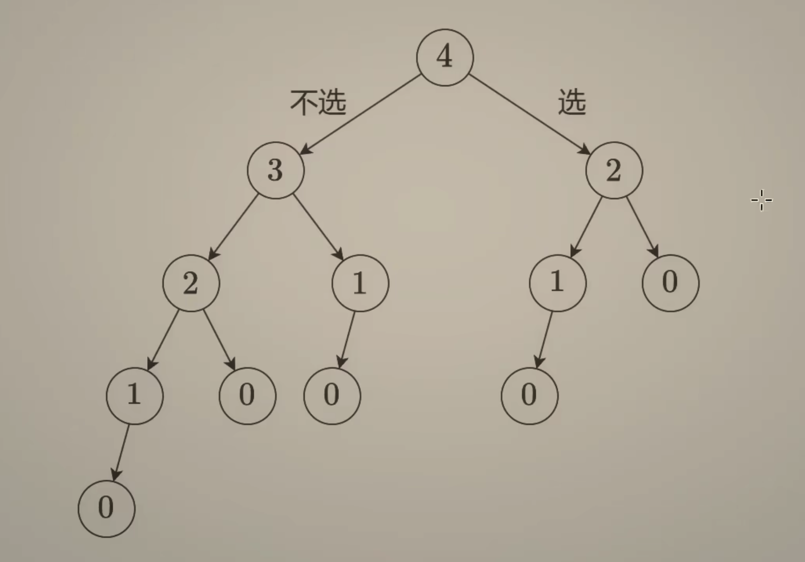
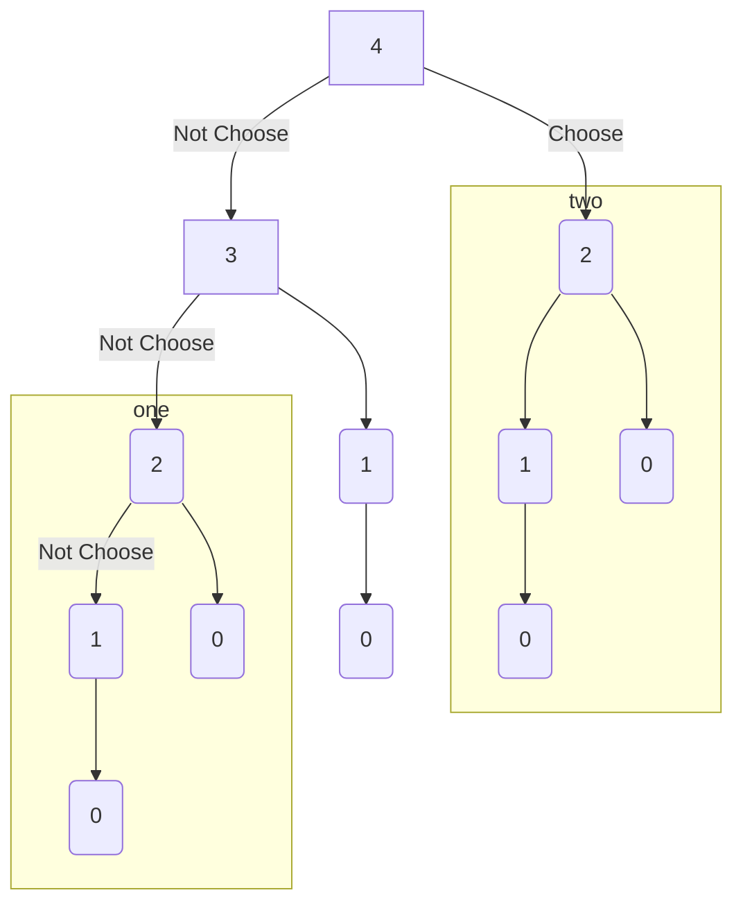
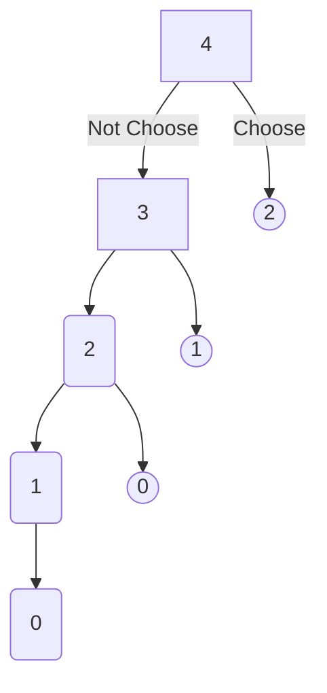
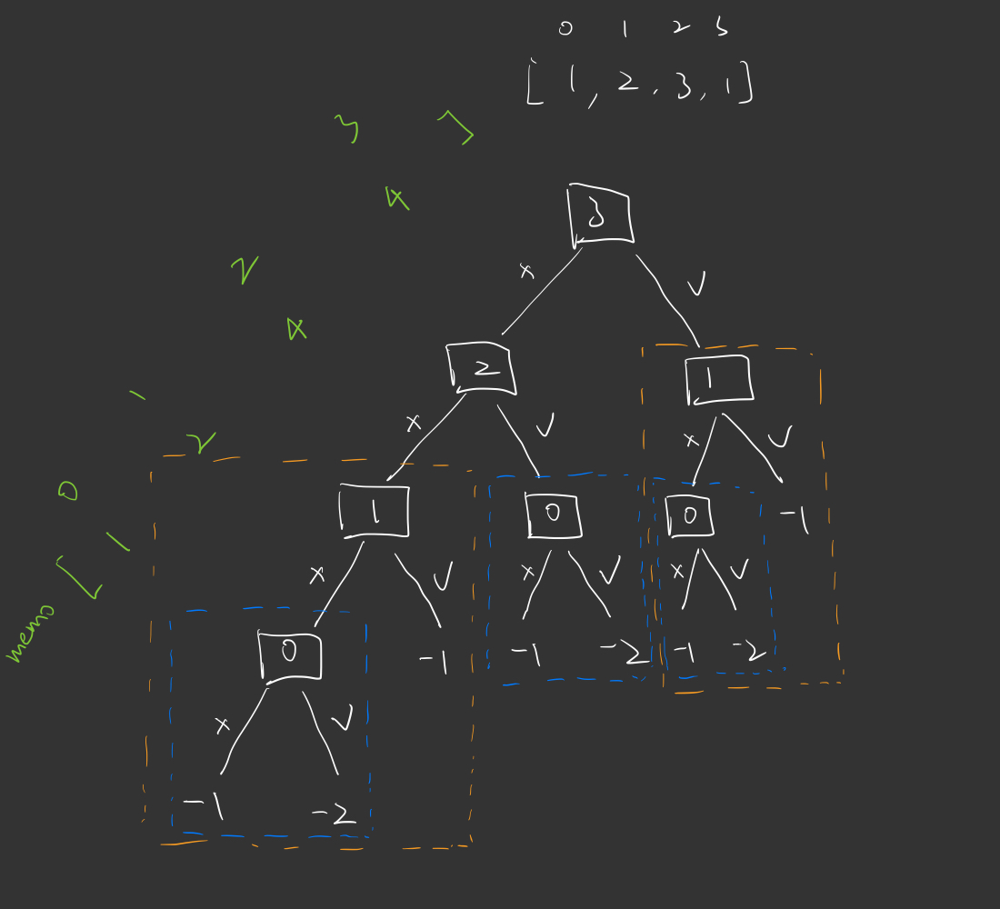

---
tags:
    - Array
    - Dynamic Programming
    - Top Interviews
---

# [198. House Robber](https://leetcode.com/problems/house-robber/)

You are a professional robber planning to rob houses along a street. Each house has a certain amount of money stashed, the only constraint stopping you from robbing each of them is that adjacent houses have security systems connected and **it will automatically contact the police if two adjacent houses were broken into on the same night**.

Given an integer array `nums` representing the amount of money of each house, return *the maximum amount of money you can rob tonight **without alerting the police***.

 

**Example 1:**

```
Input: nums = [1,2,3,1]
Output: 4
Explanation: Rob house 1 (money = 1) and then rob house 3 (money = 3).
Total amount you can rob = 1 + 3 = 4.
```

**Example 2:**

```
Input: nums = [2,7,9,3,1]
Output: 12
Explanation: Rob house 1 (money = 2), rob house 3 (money = 9) and rob house 5 (money = 1).
Total amount you can rob = 2 + 9 + 1 = 12.
```

**Solution:**




回溯三问: 

1. 当前操作? 

   枚举第$i$个房子选/不选

2. 子问题?

   从前$i$个房子中得到的最大金额和

3. 下一个子问题?

   分类讨论: 

   3.1 不选: 从前$i - 1$ 个房子中得到的最大金额和

   3.2 选: 从前$i - 2$ 个房子中得到的最大金额和

$$
dfs(i) = max(dfs(i - 1), dfs(i - 2) + nums[i])
$$

在定义DFS或者DP数组的含义时候, 它只能表示从一些元素中算出来的结果, 而不是从一个元素中算出来的结果. 另外一点是, 这里没有把得到额金额和作为递归的入参, 而是把它当作了返回值, 后面再写记忆化的时候, 你就明白为什么了

### 1. 递归

```java
class Solution {
    public int rob(int[] nums) {
        int n = nums.length;
        int index = n - 1;

        int result = dfs(index, nums); // 从最后一个房子开始思考
        return result;
    }
		// dfs(i) 表示从 nums[0] 到nums[i] 最多能偷多少
    private int dfs(int index, int[] nums){
        if (index < 0){ // 递归边界 (没有房子)
            return 0;
        }

        int result = Math.max(dfs(index - 1, nums), dfs(index - 2, nums) + nums[index]);
        return result;
    }
}

// TLX
// TC: O(2^n)
// SC: O(n)
```


### 2. 递归搜索 + 保存计算结果 = 记忆化搜索






把递归的计算结果**保存**下来, 那么下次递归到同样的入参时就直接返回先前保存的结果.

**递归搜索 + 保存计算结果 = 记忆化搜索**


```java
class Solution {
    public int rob(int[] nums) {
        int n = nums.length;
        int index = n - 1; // 从最后一个房子开始思考
        int[] memo = new int[n];
        Arrays.fill(memo, -1); // -1 表示没有计算过
        int result = dfs(index, nums, memo);
        return result;
        
    }

    private int dfs(int index, int[] nums, int[] memo){
        if (index < 0){
            return 0;
        }

        if (memo[index] != -1){
            return memo[index];
        }

        int result = Math.max(dfs(index - 1, nums, memo), dfs(index - 2, nums, memo) + nums[index]);
        memo[index] = result;
        return result;

    }
}

// TC: O(n) 状态个数*单个状态时间
// SC: O(n)
```



### 3. 1:1 翻译成递推

自顶向下算 = 记忆化搜索

自低向上算 = 递推

1:1 翻译成递推:

1. dfs -> f数组
2. 递归 -> 循环
3. 递归边界 


$$
dfs(i) = max(dfs(i - 1), dfs(i - 2) + nums[i])\\
f[i] = max(f[i-1], f[i-2] + nums[i])\\
f[i + 2] = max(f[i+1], f[i] + nums[i])
$$


```java
class Solution {
    public int rob(int[] nums) {
        int n = nums.length;
        int index = n - 1;
        int[] dp = new int[n + 2];
        // Arrays.fill(dp, -1);
        for (int i = 0; i < n; i++){
            dp[i + 2] = Math.max(dp[i + 1], dp[i] + nums[i]);
        }
        // int result = backtrack(index, n, nums, dp);
        // return result;
        return dp[n + 1];
    }

    // private int backtrack(int index, int n, int[] nums, int[] dp){
    //     if (index < 0){
    //         return 0;
    //     }
    //     if (dp[index] != -1){
    //         return dp[index];
    //     }

    //     int result = Math.max(backtrack(index - 1, n, nums, dp), backtrack(index - 2, n, nums, dp) + nums[index]);
    //     dp[index] = result;
    //     return result;
    // }
}

// TC: O(n)
// SC: O(n)
```


```java
class Solution {
    public int rob(int[] nums) {
        if (nums == null || nums.length == 0){
            return 0;
        }

        if (nums.length == 1){
            return nums[0];
        }

        int[] dp = new int[nums.length];
        dp[0] = nums[0];
        if (nums[0] < nums[1]){
            dp[1] = nums[1];
        }else{
            dp[1] = nums[0];
        }

        for (int i = 2; i < nums.length; i++){
            if (dp[i-1] > dp[i-2] + nums[i]){
                dp[i] = dp[i-1];
            }else{
                dp[i] = dp[i-2] + nums[i];
            }
        }

        return dp[nums.length -1];
    }
}

// TC: O(n)
// SC: O(n)
```

```java
int rob(int* nums, int numsSize){
    if (numsSize == 0){
        return 0;
    }

    if (numsSize == 1){
        return nums[0];
    }
    
    int dp[numsSize];
    dp[0] = nums[0];
    if (nums[1] > nums[0]){
        dp[1] = nums[1];
    }else{
        dp[1] = nums[0];
    }

    for (int i = 2; i < numsSize; i++){
        if (dp[i-1] > dp[i-2] + nums[i]){
            dp[i] = dp[i-1];
        }else{
            dp[i] = dp[i-2] + nums[i];
        }
    }

    int result = dp[numsSize-1];
    return result;

}
```


### 4. 空间优化

$$
dfs(i) = max(dfs(i - 1), dfs(i - 2) + nums[i])\\
f[i] = max(f[i-1], f[i-2] + nums[i])\\
f[i + 2] = max(f[i+1], f[i] + nums[i])
$$

当前 = max(上一个, 上上一个 + nums[i])

$f_0$ 表示上上一个, $f_1$ 表示上一个

$newF = max(f_1, f_0 + nums[i])$

$f_0 = f_1$

$f_1 = newF$

```java
class Solution {
    public int rob(int[] nums) {
        int n = nums.length;
        // int index = n - 1;
        // int[] dp = new int[n + 2];
        int f0 = 0;
        int f1 = 0;
        // Arrays.fill(dp, -1);
        for (int i = 0; i < n; i++){
            // dp[i + 2] = Math.max(dp[i + 1], dp[i] + nums[i]);
            int new_f = Math.max(f1, f0 + nums[i]);
            f0 = f1;
            f1 = new_f;
        }
        // int result = backtrack(index, n, nums, dp);
        // return result;
        return f1;
    }

    // private int backtrack(int index, int n, int[] nums, int[] dp){
    //     if (index < 0){
    //         return 0;
    //     }
    //     if (dp[index] != -1){
    //         return dp[index];
    //     }

    //     int result = Math.max(backtrack(index - 1, n, nums, dp), backtrack(index - 2, n, nums, dp) + nums[index]);
    //     dp[index] = result;
    //     return result;
    // }
}

// TC: O(n)
// SC: O(1)
```


