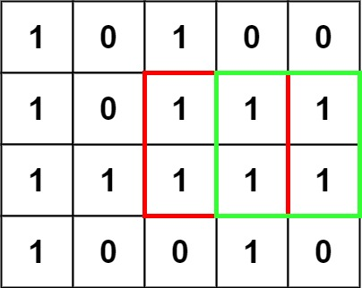
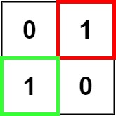

---
tags:
    - Array
    - Dynamic Programming
    - Matrix
    - Top Interviews
---

# [221. Maximal Square](https://leetcode.com/problems/maximal-square/)

Given an `m x n` binary `matrix` filled with `0`'s and `1`'s, *find the largest square containing only* `1`'s *and return its area*.

**Example 1:**



```
Input: matrix = [["1","0","1","0","0"],["1","0","1","1","1"],["1","1","1","1","1"],["1","0","0","1","0"]]
Output: 4
```

**Example 2:**



```
Input: matrix = [["0","1"],["1","0"]]
Output: 1
```

**Example 3:**

```
Input: matrix = [["0"]]
Output: 0
```


**Solution:**

### DFS

```java
class Solution {
    public int maximalSquare(char[][] matrix) {
       int n = matrix.length;
       int m = matrix[0].length;
       int result = 0;
       for (int i = 0; i < n ; i++){
        for (int j = 0; j < m; j++){
            result = Math.max(dfs(i, j, matrix), result);
        }
       }

       return result * result;
    }

    private int dfs(int i, int j, char[][] matrix){
        if(i < 0 || j < 0){
            return 0;
        }

        if (matrix[i][j] == '1'){
            return Math.min(dfs(i -1, j, matrix), Math.min(dfs(i, j - 1, matrix), dfs(i-1, j-1, matrix))) + 1;
        }

        return 0;
    }
}

// TC: O(n^3)
// SC: O(n*m)
```


### DFS + MEMO

```java
class Solution {
    public int maximalSquare(char[][] matrix) {
       int n = matrix.length;
       int m = matrix[0].length;
       int result = 0;
       int[][] memo = new int[n][m];
       for (int[] row : memo){
        Arrays.fill(row, -1);
       }
       for (int i = 0; i < n ; i++){
        for (int j = 0; j < m; j++){
            result = Math.max(dfs(i, j, matrix, memo), result);
        }
       }

       return result * result;
    }

    private int dfs(int i, int j, char[][] matrix, int[][] memo){
        if(i < 0 || j < 0){
            return 0;
        }

        if (memo[i][j] != -1){
            return memo[i][j];
        }

        if (matrix[i][j] == '1'){
            return memo[i][j] = Math.min(dfs(i -1, j, matrix, memo), Math.min(dfs(i, j - 1, matrix, memo), dfs(i-1, j-1, matrix, memo))) + 1;
        }

        return memo[i][j] = 0;
    }
}

// TC: O(n*m)
// SC: O(n*m)
```


## 1:1 翻译成递推

```java
class Solution {
    public int maximalSquare(char[][] matrix) {
       int n = matrix.length;
       int m = matrix[0].length;
       int result = 0;
    //    int[][] memo = new int[n][m];
    //    for (int[] row : memo){
    //     Arrays.fill(row, -1);
    //    }

       int[][] f = new int[n + 1][m + 1];
       for (int i = 0; i < n ; i++){
        for (int j = 0; j < m; j++){
            result = Math.max(dfs(i, j, matrix, memo), result);
                    // f(i + 1, j + 1), Math.min(f(i, j), f(i + 1, j), f(i, j));
            // if (matrix[i][j] == '1'){
            //     f[i+ 1][j+1] = Math.min(f[i][j+1], Math.min(f[i+ 1][j], f[i][j])) + 1;
            //     result = Math.max(result, f[i + 1][j + 1]);
            // }

        }
       }

       return result * result;
    }

    private int dfs(int i, int j, char[][] matrix, int[][] memo){
        if (i < 0 || j < 0){
            return 0;
        }

        if (memo[i][j] != -1){
            return memo[i][j];
        }

        if (matrix[i][j] == '1'){
            return memo[i][j] = Math.min(dfs(i -1, j, matrix, memo), Math.min(dfs(i, j - 1, matrix, memo), dfs(i-1, j-1, matrix, memo))) + 1;
        }

        // memo[i][j] = Math.min (dfs(i-1,j), (dfs(i, j-1), dfs(i-1, j-1)));
        // f(i, j) = math.min(f(i-1, j), f(i, j - 1), f(i - 1, j-1))
        // f(i + 1, j + 1), Math.min(f(i, j), f(i + 1, j), f(i, j));

        return memo[i][j] = 0;
    }
}

// TC: O(n*m)
// SC: O(n*m)
```


## 空间优化


## 空间优化：一个数组

```java
class Solution {
    public int maximalSquare(char[][] matrix) {
        int row = matrix.length;
        int col = matrix[0].length;

        int[][] m = new int[row][col];

        int result = 0;

        for (int i = 0; i < row; i++){
            if (matrix[i][0] == '1'){
                m[i][0] = 1;
                result = 1;
            }
        }

        for (int j = 0; j < col; j++){
            if (matrix[0][j] == '1'){
                m[0][j] = 1;
                result = 1;
            }
        }

        for (int i = 1; i < row; i++){
            for (int j = 1; j < col; j++){
                if (matrix[i][j] == '1'){ 
                    // if (matrix[i-1][j] == '1' && matrix[i-1][j-1] == '1' && matrix[i][j-1] == '1'){
                    m[i][j] = Math.min(m[i-1][j] , Math.min(m[i-1][j-1], m[i][j-1])) + 1;
                    // }else {}
                }

                result = Math.max(result, m[i][j]);
            }
        }

        return result * result;
    }
}

// TC: O(n^2)
// SC: O(n^2)


/*
   m

   1 0   1  0. 0
   1 0   1  1   1
   1  1   1  2  2
   1  


*/
```

