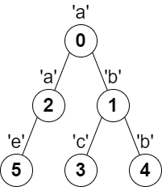
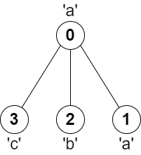
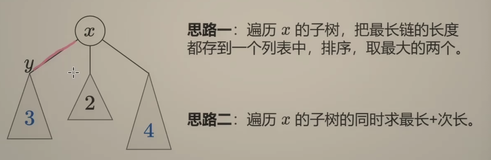

---
tags:
    - Array
    - String
    - Tree
    - Depth-First Search
    - Graph
    - Topological Sort
    - Top Interviews
---

# [2246. Longest Path With Different Adjacent Characters](https://leetcode.com/problems/longest-path-with-different-adjacent-characters/)

You are given a **tree** (i.e. a connected, undirected graph that has no cycles) **rooted** at node `0` consisting of `n` nodes numbered from `0` to `n - 1`. The tree is represented by a **0-indexed** array `parent` of size `n`, where `parent[i]` is the parent of node `i`. Since node `0` is the root, `parent[0] == -1`.

You are also given a string `s` of length `n`, where `s[i]` is the character assigned to node `i`.

Return *the length of the **longest path** in the tree such that no pair of **adjacent** nodes on the path have the same character assigned to them.*

 

**Example 1:**



```
Input: parent = [-1,0,0,1,1,2], s = "abacbe"
Output: 3
Explanation: The longest path where each two adjacent nodes have different characters in the tree is the path: 0 -> 1 -> 3. The length of this path is 3, so 3 is returned.
It can be proven that there is no longer path that satisfies the conditions. 
```

**Example 2:**



```
Input: parent = [-1,0,0,0], s = "aabc"
Output: 3
Explanation: The longest path where each two adjacent nodes have different characters is the path: 2 -> 0 -> 3. The length of this path is 3, so 3 is returned.
```

 

**Constraints:**

- `n == parent.length == s.length`
- `1 <= n <= 105`
- `0 <= parent[i] <= n - 1` for all `i >= 1`
- `parent[0] == -1`
- `parent` represents a valid tree.
- `s` consists of only lowercase English letters.


Solution:

思路一: 遍历x的子树, 把最长链的长度都存到一个列表中, 排序, 取最大的两个.

思路二: 遍历x的子树的同时求最长+次长



如何一次遍历找到最长+次长?

* 如果次长在前面, 最长在后面, 那么遍历到最长的时候就能算出最长+次长
* 如果最长在前面, 次长在后面, 那么遍历到次长的时候就能算出最长+次长

```java
class Solution {
    int result = 0;
    public int longestPath(int[] parent, String s) {
        int n = parent.length;

        Map<Integer, List<Integer>> graph = new HashMap<>();
        for (int i = 1; i < n; i++){ // 0是根结点 这条边不存在
            graph.putIfAbsent(parent[i], new ArrayList<>());
            graph.get(parent[i]).add(i);
        }

        dfs(0, graph, s);

        return result + 1;
    }

    private int dfs(int x, Map<Integer, List<Integer>> graph, String s){
        if (!graph.containsKey(x)){
            return 0;
        }
        List<Integer> cur = graph.get(x);
        int maxLen = 0;
        for (int i = 0; i < cur.size(); i++){
            int y = cur.get(i);
            int len = dfs(y, graph, s) + 1;
            if (s.charAt(x) != s.charAt(y)){
                result = Math.max(result, maxLen + len);
                maxLen = Math.max(maxLen, len);
            }
        }

        return maxLen;
    }
}

// TC: O(n)
// SC: O(n)
```


```java
class Solution {
    int result = 0;
    public int longestPath(int[] parent, String s) {
        int n = s.length();
        Map<Integer, List<Integer>> graph = new HashMap<>();
        for (int i = 1; i < n; i++){
            graph.putIfAbsent(parent[i], new ArrayList<>());
            graph.get(parent[i]).add(i);

        }

        dfs(0, graph, s);
        return result + 1;
    }

    private int dfs(int i, Map<Integer, List<Integer>> graph, String s){
        if (!graph.containsKey(i)){
            return 0;
        }

        List<Integer> nei = graph.get(i);
        int maxLen = 0;
        for (int j = 0; j < nei.size(); j++){
            int next = nei.get(j);
            int len = dfs(next, graph, s) + 1;
            if (s.charAt(i) != s.charAt(next)){
                result = Math.max(result, maxLen + len);
                maxLen = Math.max(len, maxLen);
            }
        }

        return maxLen;
    }
}

// TC: O(n)
// SC: O(n)

/*
          0 1 2 3 4 5
        [-1,0,0,1,1,2]      s = "abacbe"
            level


*/
```

