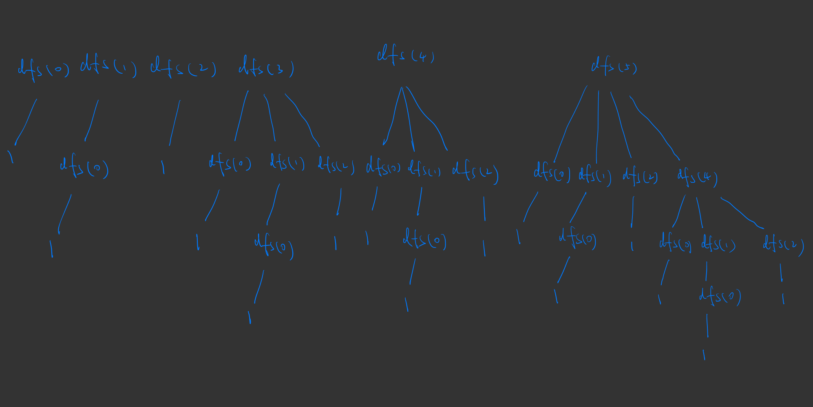

---
tags:
    - Array
    - Binary Search
    - Dynamic Programming
    - Top Interviews
---

# [300. Longest Increasing Subsequence](https://leetcode.com/problems/longest-increasing-subsequence/)

Given an integer array `nums`, return *the length of the longest **strictly increasing subsequence***. 

**Example 1:**

```
Input: nums = [10,9,2,5,3,7,101,18]
Output: 4
Explanation: The longest increasing subsequence is [2,3,7,101], therefore the length is 4.
```

**Example 2:**

```
Input: nums = [0,1,0,3,2,3]
Output: 4
```

**Example 3:**

```
Input: nums = [7,7,7,7,7,7,7]
Output: 1
```

 

**Solution:**

递增子序列 IS, Increasing Subsequence

最长递增子序列 LIS, Longest Increasing Subsequence

$O(n^2)$ dfs -> memo -> 递推

$O(nlogn)$ 二分 + 贪心


### 1 DFS

思路1: 选或不选 为了比大小, 需要知道上一个选的数字

> 选或者不选是要和之前最后一个数比, 并且要记录每次选了什么

思路2: 枚举选哪个 比较当前选的数字和下一个要选的数字

> 先比完, 再递归, 不用记录更多参数, 直接去数组里找


**启发思路:** 枚举$nums[i]$ 作为LIS的末尾元素. 那么需要枚举$nums[j]$作为LIS倒数第二个元素, 其中$j < i $ 且$nums[j] < nums[i]$

**回溯三问**:

1. 子问题? 以$nums[i]$ 结尾的LIS长度

2. 当前操作? 枚举$nums[j]$

3. 下一个子问题? 以$nums[j]$ 结尾的LIS长度
   $$
   dfs(i) = max\{dfs(j)\} + 1, j < i \text{且} nums[j] < nums[i] \\
   f[i] = max\{f[j]\} +1 , j < i \text{且} nums[i] < nums[i]
   $$
   




```java
class Solution {
    public int lengthOfLIS(int[] nums) {
        int n = nums.length;

        int index = n - 1;

        int result = 0;

        for (int i = 0; i < n; i++){ // n
            result = Math.max(result, dfs(i, nums));
        }

        return result;

    }

    private int dfs(int index, int[] nums){
        int result = 0;
        for (int i = 0; i < index; i++){ // 
            if (nums[i] < nums[index]){
                result = Math.max(result, dfs(i, nums));
            }
        }

        return result + 1;
    }
}
// TC: O(n * 2^n)
// SC: O(n)

// TLM

// 在当前问题中，递归树是 二分决策树，每层只分裂为两种可能（选或不选）
```

```
dfs(4)
├── dfs(3)
│   ├── dfs(2)
│   │   ├── dfs(1)
│   │   │   └── dfs(0)
│   │   └── dfs(0)
│   └── dfs(1)
│       └── dfs(0)
├── dfs(2)
│   ├── dfs(1)
│   │   └── dfs(0)
│   └── dfs(0)
├── dfs(1)
│   └── dfs(0)
└── dfs(0)
```


### 2 DFS + Memo

```java
class Solution {
    public int lengthOfLIS(int[] nums) {
        int n = nums.length;

        int index = n - 1;

        int result = 0;
        int[] memo = new int[n];

        for (int i = 0; i < n; i++){
            result = Math.max(result, dfs(i, nums, memo));
        }

        return result;

    }

    private int dfs(int index, int[] nums, int[] memo){
        int result = 0;
        if (memo[index] != 0){
            return memo[index];
        }
        for (int i = 0; i < index; i++){
            if (nums[i] < nums[index]){
                result = Math.max(result, dfs(i, nums, memo));
            }
        }
        memo[index] = result + 1;
        return result + 1;
    }
}

// TC: O(n^2)
// SC: O(n)
```

时间复杂度: $O(n^2)$, 其中$n$为nums的长度, 由于每个状态只会计算一次, 动态规划的时间复杂度 = 状态个数 x 单个状态的计算时间. 本题中状态个数等于O(n), 单个状态的计算时间为O(n), 所以动态规划的时间复杂度为O(n^2)

### 3 1:1 Translate

$dfs(i) = max\{dfs(j)\} + 1, j < i \text{且} nums[j] < nums[i]$

$f[i] = max\{f[j]\} +1 , j < i \text{且} nums[i] < nums[i]$


```java
class Solution {
    public int lengthOfLIS(int[] nums) {
       int n = nums.length;

       int result = 0;
    //    int[] memo = new int[n];
    //    Arrays.fill(memo, -1);
    //    for (int i = 0; i < n; i++){
    //     result = Math.max(result, dfs(i, nums, memo));
    //    } 

    //    return result;

        int[] dp = new int[n];

        for (int i = 0; i < n; i++){
            int curResult = 0;
            for (int j = 0; j < i; j++){
                if (nums[j] < nums[i]){
                    curResult = Math.max(curResult, dp[j]);
                }
            }

            dp[i] = curResult + 1;

            result = Math.max(result, dp[i]);
        }

        return result;
    }

    // private int dfs(int i, int[] nums, int[] memo){
    //     int result = 0;

    //     if (memo[i] != -1){
    //         return memo[i];
    //     }

    //     for (int j = 0; j < i; j++){
    //         if (nums[j] < nums[i]){
    //             result = Math.max(result, dfs(j, nums, memo));
    //         }
    //     }


    //     return memo[i] = result + 1;
    // }
}
```


```java
class Solution {
    public int lengthOfLIS(int[] nums) {
        int n = nums.length;

        int result = 0;
        int[] dp = new int[n];

        for (int i = 0; i < n; i++){
            for (int j = 0; j < i; j++){
                if (nums[j] < nums[i]){
                    dp[i] = Math.max(dp[j], dp[i]);
                }
            }

            dp[i] = dp[i] + 1;
            result = Math.max(result, dp[i]);

        }

        return result;

    }
}

// TC: O(n^2)
// SC: O(n)
```


```java
class Solution {
    public int lengthOfLIS(int[] nums) {
        if (nums == null || nums.length == 0){
            return 0;
        }

        int[] dp = new int[nums.length];
        int result = 1;

        for (int i = 0; i < dp.length; i++){
            dp[i] = 1;
        }
        
        for (int i = 1; i < nums.length; i++){
            for (int j = 0; j < i; j++){
                if (nums[j] < nums[i]){
                    dp[i] = Math.max(dp[j] + 1, dp[i]);
                }
            }

            result = Math.max(dp[i], result);
        }

        return result;

        
    }
}

/*
// TC: O(n^2)
// SC: O(n)
dp[i] represents the length of the longest strictly increasing subsequence end at i

        [10,9,2,5,3,7,101,18]
                    i
                  j
dp[i]    1  1 1 2 2 3 1   1

result = 

// base case 
i = 0; dp[i] = 1

// induction rule 
dp[i + 1] = dp[i]?  -> dp[i ] = dp[i -1] ?...

if (nums[j] < nums[i]){
    dp[i] = Math(dp[j] + 1, dp[i]);
}else{
    continue;
}
result


*/
```


## Greedy + Binary Search

注：方法三本质是对上述 DP 做法的优化，也算 DP 做法。

假设 f[3] 和 f[4] 的值都等于 2，且 nums[3]=99999，nums[4]=9。

我们现在要计算 f[5]。想一想，谁更容易满足上面代码中的 if (nums[j] < nums[i])？这里 i=5，j=3 或者 4。

nums[4] 更小，更容易满足 if (nums[j] < nums[i])。更大的 nums[3] 虽然也可能满足条件，但由于 f[3]=f[4]，在更新 f[5] 时，二者的效果是一样的，所以 nums[3] 是个无用数据。换句话说，对于相同的 f 值，我们只需保留更小的 nums[i]。

注：这个「去掉无用数据」的想法和单调栈是一样的。见 单调栈【基础算法精讲 26】。

因此，定义 g[i] 表示 f[j]=i+1 时，nums[j] 的最小值。也就是长为 i+1 的上升子序列的末尾元素的最小值。这里 +1 是因为 f[j] 至少是 1，g[0] 对应的不是 f[j]=0，而是 f[j]=1。

Extra Space:

```java
class Solution {
    public int lengthOfLIS(int[] nums) {
        List<Integer> g = new ArrayList<>();
        for (int x : nums) {
            int j = lowerBound(g, x);
            if (j == g.size()) {
                g.add(x); // >=x 的 g[j] 不存在
            } else {
                g.set(j, x);
            }
        }
        return g.size();
    }

    // 开区间写法
    private int lowerBound(List<Integer> g, int target) {
        int left = -1, right = g.size(); // 开区间 (left, right)
        while (left + 1 < right) { // 区间不为空
            // 循环不变量：
            // nums[left] < target
            // nums[right] >= target
            int mid = left + (right - left) / 2;
            if (g.get(mid) < target) {
                left = mid; // 范围缩小到 (mid, right)
            } else {
                right = mid; // 范围缩小到 (left, mid)
            }
        }
        return right; // 或者 left+1
    }
}
// 时间复杂度：O(nlogn)，其中 n 为 nums 的长度。
// 空间复杂度：O(1)。
```


原地修改:

```java
class Solution {
    public int lengthOfLIS(int[] nums) {
        int ng = 0; // g 的长度
        for (int x : nums) {
            int j = lowerBound(nums, ng, x);
            nums[j] = x;
            if (j == ng) { // >=x 的 g[j] 不存在
                ng++;
            }
        }
        return ng;
    }

    // 开区间写法
    private int lowerBound(int[] nums, int right, int target) {
        int left = -1; // 开区间 (left, right)
        while (left + 1 < right) { // 区间不为空
            // 循环不变量：
            // nums[left] < target
            // nums[right] >= target
            int mid = left + (right - left) / 2;
            if (nums[mid] < target) {
                left = mid; // 范围缩小到 (mid, right)
            } else {
                right = mid; // 范围缩小到 (left, mid)
            }
        }
        return right; // 或者 left+1
    }
}
// 时间复杂度：O(nlogn)，其中 n 为 nums 的长度。
// 空间复杂度：O(1)。
```


https://leetcode.cn/problems/longest-increasing-subsequence/solutions/2147040/jiao-ni-yi-bu-bu-si-kao-dpfu-o1-kong-jia-4zma/


https://www.bilibili.com/video/BV1ub411Q7sB/?vd_source=73e7d2c4251a7c9000b22d21b70f5635
