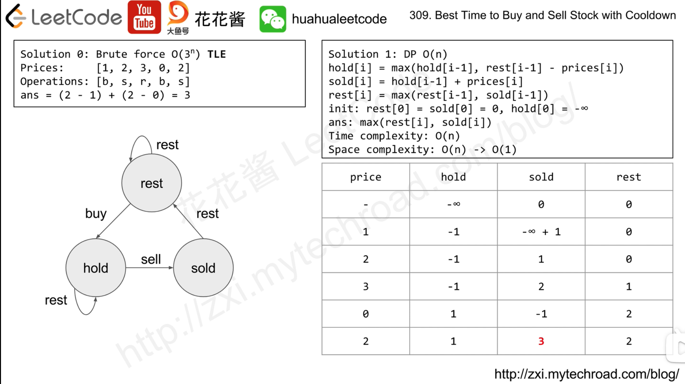

---
tags:
    - Array
    - Dynamic Programming
    - Top Interviews
---

# [309. Best Time to Buy and Sell Stock with Cooldown](https://leetcode.com/problems/best-time-to-buy-and-sell-stock-with-cooldown/)

You are given an array `prices` where `prices[i]` is the price of a given stock on the `ith` day.

Find the maximum profit you can achieve. You may complete as many transactions as you like (i.e., buy one and sell one share of the stock multiple times) with the following restrictions:

- After you sell your stock, you cannot buy stock on the next day (i.e., cooldown one day).

**Note:** You may not engage in multiple transactions simultaneously (i.e., you must sell the stock before you buy again).

 

**Example 1:**

```
Input: prices = [1,2,3,0,2]
Output: 3
Explanation: transactions = [buy, sell, cooldown, buy, sell]
```

**Example 2:**

```
Input: prices = [1]
Output: 0
```

 

**Constraints:**

- `1 <= prices.length <= 5000`
- `0 <= prices[i] <= 1000`


**Solution:**

Based on **122. Best Time to Buy and Sell Stock II**, only one change is needed: when computing the **holding stock** state, replace `dfs(i−1, 0)` with `dfs(i−2, 0)`.

The reasoning is the same as in **198. House Robber**: if you buy a stock on day *i*, then you cannot sell on day *i−1*. Therefore, the transition can only come from the **no-stock** state on day *i−2*.

Note that `dfs(i−2, 0)` does **not** mean that the stock was necessarily sold on day *i−2*; it simply represents the optimal state where no stock is held.

This change introduces an additional boundary condition: `dfs(−2, 0) = 0`. In the space-optimized version, `pre0` refers to this state.

Also note that `dfs(−2, 1)` is unreachable, so when translating this into an iterative DP formulation, there is no need to initialize this state (i.e., we do **not** need to set `f[0][1] = −∞`).

### DFS

```java
class Solution {
    public int maxProfit(int[] prices) {
        int n = prices.length;
        int result = dfs(n - 1, prices, 0);

        return result;
    }

    private int dfs(int i, int[] prices, int hold){
        if (i < 0){
            if (hold == 1){
                return Integer.MIN_VALUE;
            }else{
                return 0;
            }
        }

        if (hold == 1){
            return Math.max(dfs(i - 1, prices, 1), dfs(i - 2, prices, 0) - prices[i]);
        }

        return Math.max(dfs(i - 1, prices, 0), dfs(i - 1, prices, 1) + prices[i]);
    }
}
// TC: O(2^n)
// SC: O(n)
```


### DFS + Memo

```java
class Solution {
    public int maxProfit(int[] prices) {
        int n = prices.length;
        int[][] memo = new int[n][2];
        for (int[] row : memo){
            Arrays.fill(row, -1);
        }
        int result = dfs(n - 1, prices, 0, memo);

        return result;
    }

    private int dfs(int i, int[] prices, int hold, int[][] memo){
        if (i < 0){
            if (hold == 1){
                return Integer.MIN_VALUE;
            }else{
                return 0;
            }
        }

        if (memo[i][hold] != -1){
            return memo[i][hold];
        }

        if (hold == 1){
            memo[i][hold] = Math.max(dfs(i - 1, prices, 1, memo), dfs(i - 2, prices, 0, memo) - prices[i]);
            return memo[i][hold];
        }

        memo[i][hold] = Math.max(dfs(i - 1, prices, 0, memo), dfs(i - 1, prices, 1, memo) + prices[i]);
        return memo[i][hold];
    }
}

// TC: O(n)
// SC: O(n)
```


### Translate 1:1 into recursion

```java
class Solution {
    public int maxProfit(int[] prices) {
        int n = prices.length;
        int[][] f = new int[n + 2][2];
        f[1][1] = Integer.MIN_VALUE;
        for (int i = 0; i < n; i++) {
            f[i + 2][0] = Math.max(f[i + 1][0], f[i + 1][1] + prices[i]);
            f[i + 2][1] = Math.max(f[i + 1][1], f[i][0] - prices[i]);
        }
        return f[n + 1][0];
    }
}

```


### Space optimization

```java
class Solution {
    public int maxProfit(int[] prices) {
        int pre0 = 0;
        int f0 = 0;
        int f1 = Integer.MIN_VALUE;
        for (int p : prices) {
            int newF0 = Math.max(f0, f1 + p); // f[i+2][0]
            f1 = Math.max(f1, pre0 - p); // f[i+2][1]
            pre0 = f0;
            f0 = newF0;
        }
        return f0;
    }
}

```


```java
class Solution {
    public int maxProfit(int[] prices) {
        if (prices.length < 2) {
            return 0;
        }


        int n = prices.length;
        int[] hold = new int[n]; 
        // represents the maximum profit on day i, if we are holding a stock.
        int[] sell = new int[n];
        // represents the maximum profit on day i if we sell a stock
        int[] cooldown = new int[n];
        // represents the maximum profit on day i, if we are in a coolddown period

        hold[0] = -prices[0]; // we bought a stock on day 0
        sell[0] = 0; // we cannot sell on day 0
        cooldown[0] = 0; // we are in cooldown on day 0, no action has been taken

        for (int i = 1; i < n; i++) {
            hold[i] = Math.max(hold[i-1], cooldown[i-1] - prices[i]);
            sell[i] = hold[i-1] + prices[i];
            cooldown[i] = Math.max(cooldown[i-1], sell[i-1]);
        }

        return Math.max(sell[n-1], cooldown[n-1]);
        // the maximum profit will be the maximum value of sell[n-1] and cooldown[n-1]
        // since we cannot hold a stock on the end to consider it as profit.
    }
}

// TC: O(n)
// SC: O(n)
```



https://www.bilibili.com/video/BV1ho4y1W7QK/?spm_id_from=333.1387.collection.video_card.click&vd_source=73e7d2c4251a7c9000b22d21b70f5635
