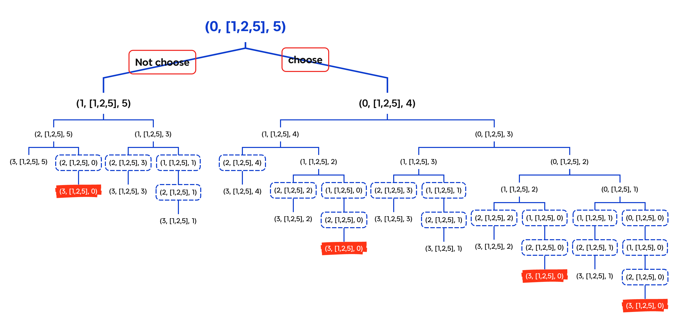
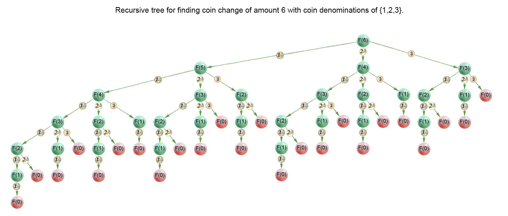

---
tags:
    - Array
    - Dynamic Programming
    - Breadth-First Search
    - Top Interviews
---

# [322. Coin Change](https://leetcode.com/problems/coin-change/) ❤️‍🔥

You are given an integer array `coins` representing coins of different denominations and an integer `amount` representing a total amount of money.

Return *the fewest number of coins that you need to make up that amount*. If that amount of money cannot be made up by any combination of the coins, return `-1`.

You may assume that you have an infinite number of each kind of coin.

 

**Example 1:**

```
Input: coins = [1,2,5], amount = 11
Output: 3
Explanation: 11 = 5 + 5 + 1
```

**Example 2:**

```
Input: coins = [2], amount = 3
Output: -1
```

**Example 3:**

```
Input: coins = [1], amount = 0
Output: 0
```

 

**Constraints:**

- `1 <= coins.length <= 12`
- `1 <= coins[i] <= 231 - 1`
- `0 <= amount <= 104`

**Solution**:



### DFS

```java
class Solution {
    public int result = Integer.MAX_VALUE;
    public int coinChange(int[] coins, int amount) {
        Arrays.sort(coins);
        int index = coins.length - 1;
        int count = 0;
        dfs(index, coins, amount, count);
        if (result == Integer.MAX_VALUE){
            return -1;
        }
        return result;

    }

    private void dfs(int index, int[] coins, int amount, int count){
        if (amount == 0){
            result = Math.min(count, result);
        }
        
        if (index < 0){
            return;
        }

        if (amount == 0){
            result = Math.min(count, result);
        }
        int cur = coins[index];
        int mostPick = amount / coins[index];
        for (int i = mostPick; i >= 0; i--){
            dfs(index - 1, coins, amount - i * cur, count + i);
        }

        return;
    }
}

// TC: O(n^n)
// SC: O(n)

// TLE
```


**完全背包**: 有$n$种物品, 第$i$种物品的体积为$w[i]$, 价值为$v[i]$每种物品无限次重复选, 求体积和不超过capactiy时的最大价值和.

回溯三问:

1. 当前操作? 枚举第i种物品选一个或不选

   不选, 剩余容量不变; 选一个, 剩余容量减少$w[i]$

2. 子问题? 在剩余容量为$c$时, 从前$i$种物品中得到的最大价值和

3. 下一个子问题? 分类讨论:

   不选: 在剩余容量为$c$时, 从前$i-1$种物品中得到的最大价值和

   选一个: 在剩余容量为$c-w[i]$时, 从前i种物品中得到的最大价值和

$$
dfs(i,c) = max(dfs(i- 1,c), dfs(i, c- w[i])+ v[i])
$$


常见变形:

1. 至多装capacity, 求方案数/最大价值和
2. 恰好装capacity, 求方案数/最大/最小价值和
3. 至少装capacity, 求方案数/最小价值和

$$
dfs(i, c) = min(dfs(i-1, c), dfs(i, c-w[i])+ v[i])
$$


本题这是完全背包的一种变形
$$
dfs(i,c) = min(dfs(i-1,c), dfs(i,c -w[i]) + v[i])
$$


### DFS

```java
class Solution {
    public int coinChange(int[] coins, int amount) {
        int n = coins.length;

        int result = dfs(n - 1, coins, amount);
        if (result < Integer.MAX_VALUE/2){
            return result;
        }else{
            return -1;
        }
    }

    private int dfs(int i, int[] coins, int amount){
        if (i < 0){
            if (amount == 0){
                return 0;
            }else{
                return Integer.MAX_VALUE/2; // 除 2 防止下面 + 1 溢出
            }
        }
				// 不选
        if (coins[i] > amount){
           return dfs(i - 1, coins, amount);
        }
				// 不选 vs 继续选
        return Math.min(dfs(i-1, coins, amount), dfs(i, coins, amount - coins[i]) + 1); 
    }
}

// TC: O(2^n)
// SC: O(n)
// TLE
```


```java
class Solution {
    int result;
    public int coinChange(int[] coins, int amount) {
        result = Integer.MAX_VALUE;

        int index = 0;
        int subResult = 0;
        dfs(index, coins, amount, subResult);

        if (result == Integer.MAX_VALUE){
            return -1;
        }else{
            return result;
        }
        
    }

        // [1, 2, 5]       11
        //        
    private void dfs(int index, int[] coins, int amount, int subResult){
        if (index == coins.length){
            if (amount == 0){
                result = Math.min(subResult, result);
            }

            return;
        }

        int curCoin = coins[index];
        int branch = amount/curCoin;// include

        for (int i = 0; i <= branch; i++){ 
            dfs(index + 1, coins, amount - curCoin * i, subResult + i);
        }

        return;
    }
}

// TC: O(2^n)
// SC: O(n)
```


### DFS + Memo

```java
class Solution {
    public int coinChange(int[] coins, int amount) {
        int n = coins.length;
        int[][] memo = new int[n][amount + 1]; 
        for (int[] row : memo){
            Arrays.fill(row, -1); // -1 表示没有计算过
        }
        int result = dfs(n - 1, coins, amount, memo);
        if (result < Integer.MAX_VALUE/2){
            return result;
        }else{
            return -1;
        }
    }

    private int dfs(int i, int[] coins, int amount, int[][] memo){
        if (i < 0){
            if (amount == 0){
                return 0;
            }else{
                return Integer.MAX_VALUE/2; // 除 2 防止下面 + 1 溢出
            }
        }

        if (memo[i][amount] != -1){
            return memo[i][amount];
        }
				
        // 不选
        if (coins[i] > amount){
           memo[i][amount] = dfs(i - 1, coins, amount, memo);
           return memo[i][amount];
        }
        
        // 不选 vs 继续选
        memo[i][amount] = Math.min(dfs(i-1, coins, amount, memo), dfs(i, coins, amount - coins[i], memo) + 1);
        return memo[i][amount]; 
    }
}

// TC: O(n*a)
// SC: O(n*a)
```


### 1:1 翻译成递推

$$
dfs(i,c) = min(dfs(i-1,c), dfs(i,c -w[i]) + v[i])
$$

$$
dp[i][c] = min(dp[i-1][c], dp[i][c - w[i]] + v[i])\\
dp[i + 1][c] = min(dp[i][c], dp[i+1][c-w[i+1]] + v[i +1])
$$


```java
class Solution {
    public int coinChange(int[] coins, int amount) {
        int n = coins.length;
        int[][] memo = new int[n + 1][amount + 1]; 
        // for (int[] row : memo){
        //     Arrays.fill(row, -1);
        // }
        Arrays.fill(memo[0], Integer.MAX_VALUE/2);
        memo[0][0] = 0;
        for (int i = 0; i < n; i++){
            for (int c = 0; c <= amount; c++){
                if (coins[i] > c){
                    memo[i + 1][c] = memo[i][c];
                }else{
                    memo[i + 1][c] = Math.min(memo[i][c], memo[i + 1][c - coins[i]] + 1);
                }
            }
        }
        // int result = dfs(n - 1, coins, amount, memo);
        int result = memo[n][amount];
        if (result < Integer.MAX_VALUE/2){
            return result;
        }else{
            return -1;
        }
    }
}

// TC: O(n*a)
// SC: O(a)
```

```java
class Solution {
    public int coinChange(int[] coins, int amount) {
        int n = coins.length;


        // int[][] memo = new int[n][amount + 1];
        // for (int[] row : memo){
        //     Arrays.fill(row, -1); // -1 表示没有计算过
        // }

        // int result = dfs(n - 1, amount, coins, memo);

        int[][] f = new int[n + 1][amount + 1];
        Arrays.fill(f[0], Integer.MAX_VALUE / 2); // 除2防止下面 + 1溢出
        f[0][0] = 0;
        for(int i = 0; i < n; i++){
            for (int c = 0; c < amount + 1; c++){
                if (c < coins[i]){
                    f[i + 1][c] = f[i][c];
                }else{
                    f[i + 1][c] = Math.min(f[i][c], f[i + 1][c - coins[i]]+ 1);
                }
            }
        }

        int result = f[n][amount];

        if (result < Integer.MAX_VALUE/2){
            return result;
        }else{
            return -1;
        }
    }

    private int dfs(int i, int amount, int[] coins, int[][] memo){
        if (i < 0){
            if (amount == 0){
                return 0;
            }else{
                return Integer.MAX_VALUE/2; // 除 2 防止下面 + 1 溢出
            }
        }

        if (memo[i][amount] != -1){
            return memo[i][amount];
        }

        // 不选
        if (amount < coins[i]){
            return memo[i][amount] = dfs(i - 1, amount, coins, memo);
        }
        // 不选 vs 继续选
        return memo[i][amount] = Math.min(dfs(i - 1, amount, coins, memo), dfs(i, amount - coins[i], coins, memo) + 1);


    }
}
```


-----

### 空间优化：两个数组（滚动数组）

```java
class Solution {
    public int coinChange(int[] coins, int amount) {
        int n = coins.length;
        int[][] memo = new int[2][amount + 1]; 
        // for (int[] row : memo){
        //     Arrays.fill(row, -1);
        // }
        Arrays.fill(memo[0], Integer.MAX_VALUE/2);
        memo[0][0] = 0;
        for (int i = 0; i < n; i++){
            for (int c = 0; c <= amount; c++){
                if (coins[i] > c){
                    memo[(i + 1) % 2][c] = memo[i%2][c];
                }else{
                    memo[(i + 1) % 2][c] = Math.min(memo[i % 2][c], memo[(i + 1) % 2][c - coins[i]] + 1);
                }
            }
        }
        // int result = dfs(n - 1, coins, amount, memo);
        int result = memo[n % 2][amount];
        if (result < Integer.MAX_VALUE/2){
            return result;
        }else{
            return -1;
        }
    }
}

// TC: O(n*a) 其中 n 为 coins 的长度。
// SC: O(a)
```


### 空间优化：一个数组

好比在一面墙上画画，原来这面墙画的是 f[i]，现在要画一副新的画，把原来的画覆盖掉，新的画叫做 f[i+1]。

在循环的过程中：

对于 c<x 的状态，转移方程是 f[i+1][c]=f[i][c]，这说明原来画的内容保持不变，空间优化后是 f[c]=f[c]，这个赋值是多余的。所以可以从 c=x 开始循环。
对于 c≥x 的状态，转移方程是 f[i+1][c]=min(f[i][c],f[i+1][c−x]+1)，其中 f[i][c] 就地取材，f[i+1][c−x] 是新画的内容，从这面墙的下标 c−x 处取到，所以空间优化后就是 f[c]=min(f[c],f[c−x]+1)。


```java
class Solution {
    public int coinChange(int[] coins, int amount) {
        int n = coins.length;
        // int[][] memo = new int[2][amount + 1]; 
        // for (int[] row : memo){
        //     Arrays.fill(row, -1);
        // }
        int[] memo = new int[amount + 1];
        Arrays.fill(memo, Integer.MAX_VALUE/2);
        memo[0] = 0;
        for (int i = 0; i < n; i++){
            for (int c = coins[i]; c <= amount; c++){
                memo[c] = Math.min(memo[c], memo[c - coins[i]] + 1);
            }
        }
        // int result = dfs(n - 1, coins, amount, memo);
        int result = memo[amount];
        if (result < Integer.MAX_VALUE/2){
            return result;
        }else{
            return -1;
        }
    }
}

// TC: O(n*a) 
// SC: O(a)
```


> **Approach 1 (Brute force) [Time Limit Exceeded]**
>
> ```java
> class Solution {
>     public int coinChange(int[] coins, int amount) {
>         int index = 0;
>         return helper(0, coins, amount);
>     }
> 
>     private int helper(int index, int[] coins, int amount){
>         if (amount == 0){
>             return 0;
>         }
>         
>         if (index == coins.length){
>             return -1;
>         }
> 
>         int branches = amount/coins[index];
>         int minCost = Integer.MAX_VALUE;
>         for (int i = 0; i <= branches; i++){
>             if (amount >= i * coins[index]){
>                 int res = helper(index + 1, coins, amount - i * coins[index]);
>                 if (res != -1){
>                     minCost = Math.min(minCost, res + i);
>                 }
>             }
>         }
> 
>         if (minCost == Integer.MAX_VALUE){
>             return -1;
>         }else{
>             return minCost;
>         }
>           
>     }
> }
> 
> 
> 
> //        [1, 2, 5]
> /*          /   \
> level 0:  1    
>          0/ |||.. \          11 /1 = 11
> level 1: 
> */
> 
> // level: index of coins
>  
> // branch: means the how many coins I will pick up
> 
> 
> // TC: O(branch^level) = O(S^n)
> // SC: O(level) = O(n)
> ```
>
> 
>
> 
>
> ```java
> class Solution{
> 	int result = -1; Integer.MAX_VALUE;
> 	int[] memo;
> 	public int coinChange(int[] coins, int amount){
> 		// base case
> 		if (coins == null){
> 	return -1;
> }
> 
> if (coins.length == 1){
> 	if (amount % coins[0] == 0){
> 	return amount / coins[0];
> }else{
> 	return -1;
> }
> }
> 		memo = new int[coins.length];
> 		Arrays.sort(coins);
> 		int index = 0; coins.length -1;
> 		bfs(index, coins, amount);
> 
> 		return result;
> 
> 
> 	}
> 
> 	private void bfs(int index, int[] coins, int amount){
> 		
> 		if (amount == 0){
> 	int sum = 0;
> 	for (int i = 0; i < memo.length; i++){
> 	sum = sum[i] sum+ memo[i];
> }
> 
> result = Math.min(sum, result);
> return;
> }
> 
> if (index == coins.length -1){
> 			if (amount == 0){
> 		int sum = 0;
> 		for (int i = 0; i < memo.length; i++){
> 		sum = sum[i] sum + memo[i];
> }
> 
> result = Math.min(sum, result);
> return;
> }else{
> 	return;
> }
> }
> 
> int curCoin = coins[index];
> int curCount = amount / curCoin;
> 
> for (int i = curCount; i >= 0; i--){
> 	memo[index] = i; 
> 	bfs(index - 1, coins, amount - i * curCoin);
> 	memo[index] = 0;
> }
> 
> 
> 
> }
> 
> }
> 
> ```
>
> 
>
> 
>
> 
>
> 
>
> 
>
> 
>
> ```java
> public class Solution {
>   public int coinChange(int[] coins, int amount) {
>     int max = amount + 1;
>     int[] dp = new int[amount + 1];
>     Arrays.fill(dp, max);
>     dp[0] = 0;
>     for (int i = 1; i <= amount; i++) {
>       for (int j = 0; j < coins.length; j++) {
>         if (coins[j] <= i) {
>           dp[i] = Math.min(dp[i], dp[i - coins[j]] + 1);
>         }
>       }
>     }
>     return dp[amount] > amount ? -1 : dp[amount];
>   }
> }
> /*
> 
>               1       2        5
> 
>                     11
>                   /  |  \  
> 0level  5         0   1  2 
>                 / \  / \ / \
> 1level  2     2    
> 
> 
> 
> 
> level coins value
> branch  number of coins
> 
> 
> */
> ```
>
> **Approach 2 (Dynamic programming - Top down) [Accepted]**
>
> ```java
> class Solution {
>     private Integer[] memo;
>     public int coinChange(int[] coins, int amount) {
>         memo = new Integer[amount+1];
>         return helper(coins, amount);
>     }
> 
>     private int helper(int[] coins, int amount){
>         if (amount < 0){
>             return -1;
>         }
> 
>         if (amount == 0){
>             return 0;
>         }
> 
>         if (memo[amount] != null){
>             return memo[amount];
>         }
> 
>         int minCount = Integer.MAX_VALUE;
> 
>         // branch
>         for (int coin : coins){
>             int count = helper(coins, amount - coin);
>             if (count == -1){
>                 continue;
>             }
> 
>             minCount = Math.min(minCount, count + 1);
>         }
> 
>         if (minCount == Integer.MAX_VALUE){
>             memo[amount] = -1;
>         }else{
>             memo[amount] =  minCount;
>         }
> 
>         return memo[amount];
> 
>     }
> }
> // TC: O(branch^level) = O(n^S)
> // SC: O(S)
> 
> 
> /*
> 
> level means: amount
> branch means: index[coins]
> 
> memo [amount+1]
>              1, 2, 5
>               11 
>             /   |  \
> level       
> 
> 
> */
> ```
>
> 
>
> **Approach 3 (Dynamic programming - Bottom up) [Accepted]**
>
> For the iterative solution, we think in bottom-up manner. Before calculating $F(i)$, we have to compute all minimum counts for amounts up to $i$. On each iteration ii*i* of the algorithm $F(i)$ is computed as $min_{j=0 \ldots n-1}{F(i -c_j)} + 1$
>
> ```java
> class Solution {
>     public int coinChange(int[] coins, int amount) {
>         int[] dp = new int[amount + 1];
>         // dp[i] stroes the fewest the number of coins to make up amount i
>         Arrays.fill(dp, amount + 1);
> 
>         dp[0] = 0;
> 
>         for (int i = 1; i <= amount; i++){
>             for (int coin : coins){
>                 if (i - coin < 0){
>                     continue;
>                 }
>                 dp[i] = Math.min(dp[i], dp[i - coin] + 1);
>             }
>         }
> 
>         if (dp[amount] == (amount + 1)){
>             return -1;
>         }else{
>             return dp[amount];
>         }
> 
>     }
> }
> // 1,2 5
> 
>         // index: 0 1 2 
>         //        1 2 5
>         // 
> 
>         // index: 0   1   2   3   4   5   6   7   8   9   10  11  
>         // dp:    0   12  12  12  12  12  12  12  12  12  12  12 
>         // 
> 
> 
> // TC: O(S*N)
> // SC: O(S)
> 
> // i:    0 1 2 3 4 5 6 7 8 9 10 11 
> // dp[i] 0 1 1 2 2 1 2 2 3 3 2  3 
> 
> ```
>
> 
>
> 
>
> ```java
> class Solution {
>     private Integer[] memo;
>     public int coinChange(int[] coins, int amount) {
>         memo = new Integer[amount + 1];
>         int index = 0;
>         // return helper(index, coins, amount);
>         return helper(coins, amount);
>         
>     }
> 
>     private int helper(int[] coins, int amount){
>         if (amount < 0){
>             return -1;
>         }
>         
>         if (amount == 0){
>             return 0;
>         }
> 
>         // if (index == coins.length){
>         //     return -1;
>         // }
> 
>     
> 
>         if (memo[amount] != null){
>             return memo[amount];
>         }
> 
>         // int branches = amount/coins[index];
> 
>         int minCost = Integer.MAX_VALUE;
> 
> 
>         // for (int i = 0; i <= branches; i++){
>         //     if (amount >= i * coins[index]){
>         //         int res = helper(index + 1, coins, amount - i * coins[index]);
>         //         if (res != -1){
>         //             minCost = Math.min(minCost, res + i);
>         //         }
>         //     }
>         // }
> 
>         for (int coin : coins){
>             int res = helper(coins, amount - coin);
>             if (res == -1){
>                 continue;
>             }
> 
>             minCost = Math.min(minCost, res + 1);
>         }
> 
>         // if (minCost == Integer.MAX_VALUE){
>         //     return -1;
>         // }else{
>         //     return minCost;
>         // }
> 
>         if (minCost == Integer.MAX_VALUE){
>             memo[amount] = -1;
>         }else{
>             memo[amount] = minCost;
>         }
> 
>         return memo[amount];
>     }
> }
> ```
>


