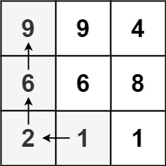
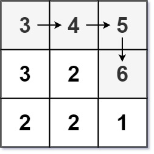

# [329. Longest Increasing Path in a Matrix](https://leetcode.com/problems/longest-increasing-path-in-a-matrix/)

Given an `m x n` integers `matrix`, return *the length of the longest increasing path in* `matrix`.

From each cell, you can either move in four directions: left, right, up, or down. You **may not** move **diagonally** or move **outside the boundary** (i.e., wrap-around is not allowed).

 

**Example 1:**



```
Input: matrix = [[9,9,4],[6,6,8],[2,1,1]]
Output: 4
Explanation: The longest increasing path is [1, 2, 6, 9].
```

**Example 2:**



```
Input: matrix = [[3,4,5],[3,2,6],[2,2,1]]
Output: 4
Explanation: The longest increasing path is [3, 4, 5, 6]. Moving diagonally is not allowed.
```

**Example 3:**

```
Input: matrix = [[1]]
Output: 1
```

 

**Constraints:**

- `m == matrix.length`
- `n == matrix[i].length`
- `1 <= m, n <= 200`
- `0 <= matrix[i][j] <= 231 - 1`


**Solution:**

```java
class Solution {
    int result = Integer.MIN_VALUE;
    public int longestIncreasingPath(int[][] matrix) {
        int[][] memo = new int[matrix.length][matrix[0].length];

        for (int i = 0; i < matrix.length; i++){
            for (int j = 0; j < matrix[0].length; j++){
                int count = dfs(matrix, i, j, Integer.MIN_VALUE, memo); 
                result = Math.max(result, count);
            }
        }

        return result;

    }

    private static int dfs(int[][] matrix, int x, int y, int prev, int[][] memo){
        if (x < 0 || x == matrix.length || y < 0 || y == matrix[0].length || matrix[x][y] <= prev){
            return 0;
        }
        
        if (memo[x][y] != 0){
            return memo[x][y];
        }

        
        int up = dfs(matrix, x + 1, y, matrix[x][y], memo);
        int down = dfs(matrix, x - 1, y, matrix[x][y], memo);
        int left = dfs(matrix, x, y + 1, matrix[x][y], memo);
        int right = dfs(matrix, x, y - 1, matrix[x][y], memo);
        
        memo[x][y] = Math.max(Math.max(up, down), Math.max(left, right)) + 1;

        return memo[x][y];
        
    }
}

// TC: O(n^2)
// SC: O(n^2)
```


```java
class Solution {
    private int[][] directions = {{1, 0}, {0,1}, {-1, 0},{0, -1}};
    private int m, n;
    public int longestIncreasingPath(int[][] matrix) {
        if (matrix == null || matrix.length == 0){
            return 0;
        }
        m = matrix.length;
        n = matrix[0].length;
        int[][] memo = new int[m][n];
        int result = 0;

        for (int i = 0; i < m; i++){
            for (int j = 0; j < n; j++){
                result = Math.max(result, dfs(matrix, memo, i, j));
            }
        }

        return result;
    }

    private int dfs(int[][] matrix, int[][] memo, int x, int y){
        if (memo[x][y] != 0){
            return memo[x][y];
        }

        int result = 1;
        for (int[] dirction : directions){
            int newX = x + dirction[0];
            int newY = y + dirction[1];

            if (newX >= 0 && newX < m && newY >= 0 && newY < n && matrix[newX][newY] > matrix[x][y]){
                result = Math.max(result, dfs(matrix, memo, newX, newY) + 1);
            }

        }


        memo[x][y] = result;
        return result;

    }

}
//TC: O(n*m)
//SC: O(n*m)
```


