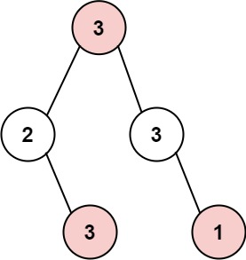
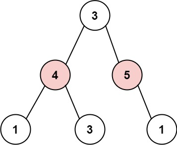
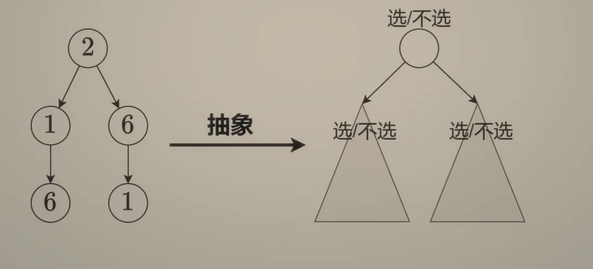

---
tags:
    - Dynamic Programming
    - Tree
    - Depth-First Search
    - Binary Tree
    - Top Interviews
---

# [337. House Robber III](https://leetcode.com/problems/house-robber-iii/)

The thief has found himself a new place for his thievery again. There is only one entrance to this area, called `root`.

Besides the `root`, each house has one and only one parent house. After a tour, the smart thief realized that all houses in this place form a binary tree. It will automatically contact the police if **two directly-linked houses were broken into on the same night**.

Given the `root` of the binary tree, return *the maximum amount of money the thief can rob **without alerting the police***.

 

**Example 1:**



```
Input: root = [3,2,3,null,3,null,1]
Output: 7
Explanation: Maximum amount of money the thief can rob = 3 + 3 + 1 = 7.
```

**Example 2:**



```
Input: root = [3,4,5,1,3,null,1]
Output: 9
Explanation: Maximum amount of money the thief can rob = 4 + 5 = 9.
```

 

**Constraints:**

- The number of nodes in the tree is in the range `[1, 104]`.
- `0 <= Node.val <= 104`


Solution:



选或不选: 

选当前节点: 左右儿子都不能选

不选当前节点: 左右儿子可选可不选


提炼状态: 

选当前节点时, 以当前节点为根的子树最大点权和

不选当前节点时, 以当前节点为根的子树最大点权和


转移方程:

选 = 左不选 + 右不选 + 当前节点值

不选 = max(左选, 左不选) + max(右选, 右不选)

最终答案=max(根选, 根不选)


没有上司的舞会

扩展: 一般树:

选 = ($\sum$ 不选子节点) + 当前节点值

不选=$\sum$ max(选子节点, 不选子节点)


总结:

树上最大独立集

二叉树 337

一般树 没有上司的舞会


最大独立集需要从图中选择尽量多的点, 使得这些点互不相邻. 

变形: 最大化点权之和.


树和子树的关系, 类似原问题和子问题跌关系, 所以树天然地具有递归的特点.

如何由子问题算出原问题, 是思考树形DP的出发点

常见套路: 

1. 选或不选
2. 枚举选哪个

```java
/**
 * Definition for a binary tree node.
 * public class TreeNode {
 *     int val;
 *     TreeNode left;
 *     TreeNode right;
 *     TreeNode() {}
 *     TreeNode(int val) { this.val = val; }
 *     TreeNode(int val, TreeNode left, TreeNode right) {
 *         this.val = val;
 *         this.left = left;
 *         this.right = right;
 *     }
 * }
 */
class Solution {
    public int rob(TreeNode root) {
        int[] result = dfs(root);
        return Math.max(result[0], result[1]);
        // not pick // pick
    }

    private int[] dfs(TreeNode root){
        if (root == null){
            return new int[]{0,0};
        }

        int[] left = dfs(root.left);
        int[] right = dfs(root.right);

        int rob = left[1] + right[1] + root.val;
        int notRob = Math.max(left[0], left[1]) + Math.max(right[0], right[1]);

        return new int[]{rob, notRob};
    }
}

// TC: O(n)
// SC: O(n)
```

