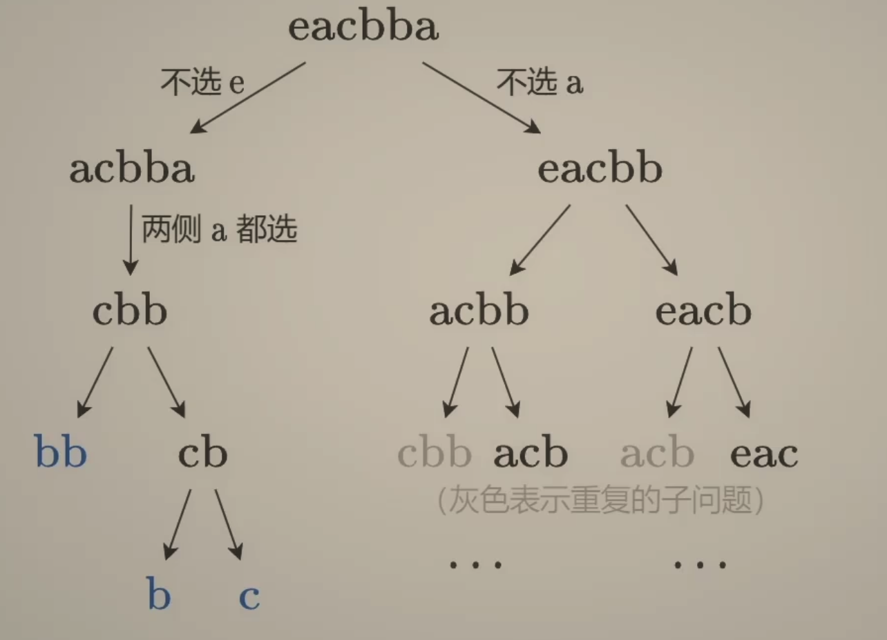

---
tags:
    - String
    - Dynamic Programming
    - Top Interviews
---

# [516. Longest Palindromic Subsequence](https://leetcode.com/problems/longest-palindromic-subsequence/)

Given a string `s`, find *the longest palindromic **subsequence**'s length in* `s`.

A **subsequence** is a sequence that can be derived from another sequence by deleting some or no elements without changing the order of the remaining elements.

 

**Example 1:**

```
Input: s = "bbbab"
Output: 4
Explanation: One possible longest palindromic subsequence is "bbbb".
```

**Example 2:**

```
Input: s = "cbbd"
Output: 2
Explanation: One possible longest palindromic subsequence is "bb".
```

 

**Constraints:**

- `1 <= s.length <= 1000`
- `s` consists only of lowercase English letters.


Solution:

s = eacbba

思路1: [转换] 求s和反转后s的LCS(最长公共子序列)

s = eacbba

$s_{rev}$ = abbcae


思路2: [选或不选] 从两侧内缩小问题规模



(类似LCS)

定义$dfs(i, j)$ 表示从$s[i]$ 到$s[j]$ 的最长回文子序列的长度
$$
dfs(i, j) = \begin{cases}
 & dfs(i + 1, j - 1) + 2   , \ \ \ \ \   s[i] = s[j] \\
 & max(dfs(i+1, j), dfs(i, j - 1)), \ \ \ \ \ s[i] \neq s[j]
\end{cases}
$$
递归边界:
$$
dfs(i,i) = 1\\
dfs(i+1, i) = 0
$$
比如遇到bb时, 会从$dfs(i, i + 1)$递归到$dfs(i + 1, i)$

递归入口: $dfs(0, n -1)$


### DFS

```java
class Solution {
    public int longestPalindromeSubseq(String s) {
        int n = s.length();

        int result = dfs(0, n-1, s);
        return result;
    }

    private int dfs(int i, int j, String s){
        if (i > j){
            return 0;
        }

        if (i == j){
            return 1;
        }

        if (s.charAt(i) == s.charAt(j)){
            return dfs(i + 1, j - 1, s) + 2;
        }

        return Math.max(dfs(i + 1, j, s), dfs(i, j-1, s));
    }
}

// TC: O(2^n)
// SC: O(n)
```


### DFS + Memo

```java
class Solution {
    public int longestPalindromeSubseq(String s) {
        int n = s.length();
        int[][] memo = new int[n][n];
        for(int[] row : memo){
            Arrays.fill(row, -1);
        }
        int result = dfs(0, n-1, s, memo);
        return result;
    }

    private int dfs(int i, int j, String s, int[][] memo){
        if (i > j){
            return 0;
        }

        if (i == j){
            return 1;
        }

        if (memo[i][j] != -1){
            return memo[i][j];
        }

        if (s.charAt(i) == s.charAt(j)){
            memo[i][j] = dfs(i + 1, j - 1, s, memo) + 2;
            return memo[i][j];
        }

        memo[i][j] = Math.max(dfs(i + 1, j, s, memo), dfs(i, j-1, s, memo));
        return memo[i][j];
    }
}

// TC: O(n^2)
// SC: O(n^2)
```


### 1:1 Translate to iteration

$$
f(i, j) = \begin{cases}
 & 0  , \ \ \ \ \   i >j  \\
 & 1, \ \ \ \ \ i = j \\
 & f[i + 1][j - 1] + 2, s[i] = s[j]\\
 &max(f[i+1][j], f[i][j - 1]), s[i]\neq s[j]

\end{cases}
$$

$$
\text{Iteration order} \begin{cases}
 & f[i] \text{transitions from} f[i+1], \text{so} i \text{should be iterated in reverse} \\
 & f[i][j] \text{transitions from} f[i][j-1], so j \text{should be iterated in forward order}
\end{cases}
$$

答案为$f[0][n-1]$

```java
class Solution {
    public int longestPalindromeSubseq(String s) {
        int n = s.length();
        int[][] memo = new int[n][n];
        // for (int[] row : memo){
        //     Arrays.fill(row, -1);
        // }
        // int result = dfs(0, n - 1, s, memo);


        for (int i = n-1; i >= 0; i--){
            memo[i][i] = 1;
            for (int j = i+1 ; j <n; j++){
                if (s.charAt(i) == s.charAt(j)){
                    memo[i][j] = memo[i + 1][j - 1] + 2;
                    continue;
                }

                memo[i][j] = Math.max(memo[i+1][j], memo[i][j-1]);
            }
        }

        int result = memo[0][n-1];
        return result;
    }
}
// TC: O(n^2)
// SC: O(n^2)
```

Convert recursion to iteration.

Convert dfs into f array

### Space optimization

```java
class Solution {
    public int longestPalindromeSubseq(String S) {
        char[] s = S.toCharArray();
        int n = s.length;
        int[] f = new int[n];
        for (int i = n - 1; i >= 0; i--) {
            f[i] = 1;
            int pre = 0; // 初始值为 f[i+1][i]
            for (int j = i + 1; j < n; j++) {
                int tmp = f[j];
                f[j] = s[i] == s[j] ? pre + 2 : Math.max(f[j], f[j - 1]);
                pre = tmp;
            }
        }
        return f[n - 1];
    }
}
// TC: O(n^2)
// SC: O(n)
```

