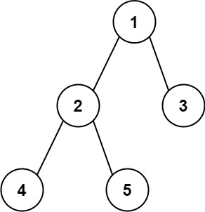
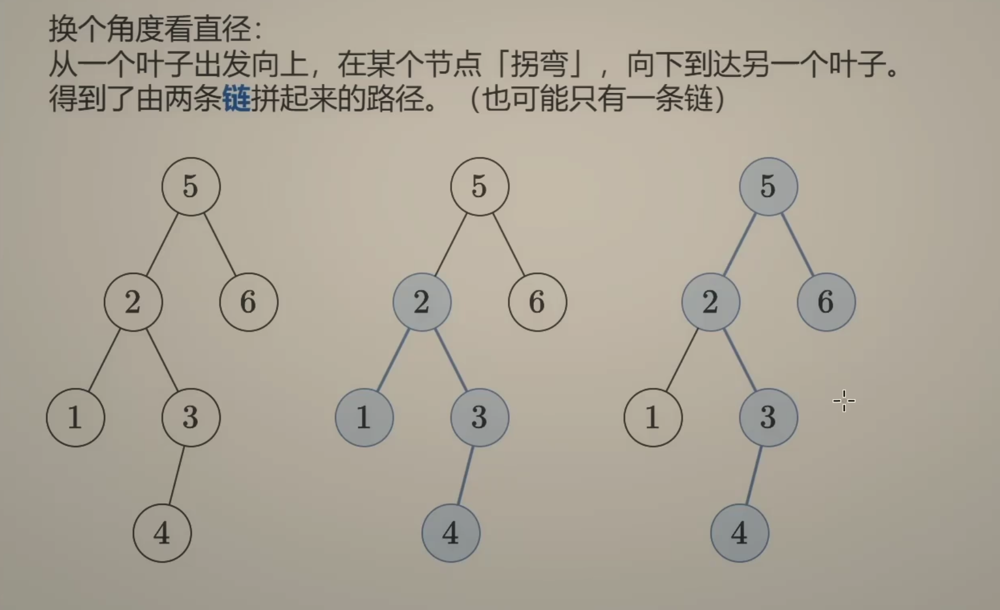
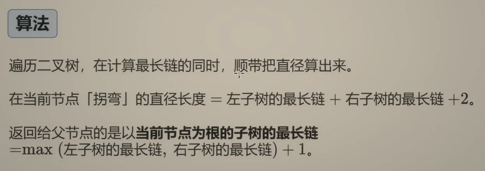

---
tags:
    - Tree
    - Depth-First Search
    - Binary Tree
    - Top Interviews
---

# [543. Diameter of Binary Tree](https://leetcode.com/problems/diameter-of-binary-tree/)

Given the `root` of a binary tree, return *the length of the **diameter** of the tree*.

The **diameter** of a binary tree is the **length** of the longest path between any two nodes in a tree. This path may or may not pass through the `root`.

The **length** of a path between two nodes is represented by the number of edges between them.

 

**Example 1:**



```
Input: root = [1,2,3,4,5]
Output: 3
Explanation: 3 is the length of the path [4,2,1,3] or [5,2,1,3].
```

**Example 2:**

```
Input: root = [1,2]
Output: 1
```

 

**Constraints:**

- The number of nodes in the tree is in the range `[1, 104]`.
- `-100 <= Node.val <= 100`


Solution:

```java
/**
 * Definition for a binary tree node.
 * public class TreeNode {
 *     int val;
 *     TreeNode left;
 *     TreeNode right;
 *     TreeNode() {}
 *     TreeNode(int val) { this.val = val; }
 *     TreeNode(int val, TreeNode left, TreeNode right) {
 *         this.val = val;
 *         this.left = left;
 *         this.right = right;
 *     }
 * }
 */
class Solution {
    int result = 0;
    public int diameterOfBinaryTree(TreeNode root) {
        dfs(root);
        return result;
    }

    private int dfs(TreeNode root){
        if (root == null){
            return 0;
        }

        int left = dfs(root.left);
        int right = dfs(root.right);

        result = Math.max(result, left + right);

        return Math.max(left, right) + 1;

    }
}

// TC: O(n)
// SC: O(n)
```






```java
/**
 * Definition for a binary tree node.
 * public class TreeNode {
 *     int val;
 *     TreeNode left;
 *     TreeNode right;
 *     TreeNode() {}
 *     TreeNode(int val) { this.val = val; }
 *     TreeNode(int val, TreeNode left, TreeNode right) {
 *         this.val = val;
 *         this.left = left;
 *         this.right = right;
 *     }
 * }
 */
class Solution {
    int result = 0;
    public int diameterOfBinaryTree(TreeNode root) {
        height(root);
        return result;

        // root = [1,2,3,4,5]

        /*
                [3] 1
                   / \
             [2]  2   3
                 / \
            [1] 4   5        

        lheight = 3
        rheight = 2

        root:
        path1: root.left + root.right = 2 + 1 = 3

        not root:
        
        */
    }

    private int height(TreeNode root){
        if (root == null){
            return 0;
        }

        int left = height(root.left);
        int right = height(root.right);

        result = Math.max(left + right, result);

        return Math.max(left, right) + 1;
    }
}
```


```java
/**
 * Definition for a binary tree node.
 * public class TreeNode {
 *     int val;
 *     TreeNode left;
 *     TreeNode right;
 *     TreeNode() {}
 *     TreeNode(int val) { this.val = val; }
 *     TreeNode(int val, TreeNode left, TreeNode right) {
 *         this.val = val;
 *         this.left = left;
 *         this.right = right;
 *     }
 * }
 */
class Solution {
    int result = 0;
    public int diameterOfBinaryTree(TreeNode root) {
        height(root);
        return result;

        // root = [1,2,3,4,5]

        /*
                [3] 1
                   / \
               [2]  2   3
                 / \
               [1] 4   5        

        lheight = 3
        rheight = 2

        root:
        path1: root.left + root.right = 2 + 1 =3

        not root:
        
        */


        
    }

    private int height(TreeNode root){
        if (root == null){
            return 0;
        }

        int left = height(root.left);
        int right = height(root.right);

        result = Math.max(left + right, result);

        return Math.max(left, right) + 1;
    }
}
```


```java
/**
 * Definition for a binary tree node.
 * public class TreeNode {
 *     int val;
 *     TreeNode left;
 *     TreeNode right;
 *     TreeNode() {}
 *     TreeNode(int val) { this.val = val; }
 *     TreeNode(int val, TreeNode left, TreeNode right) {
 *         this.val = val;
 *         this.left = left;
 *         this.right = right;
 *     }
 * }
 */
class Solution {
    int result = 0;
    public int diameterOfBinaryTree(TreeNode root) {
        if (root == null){
            return 0;
        }

        helper(root);

        return result;

    }

    private int helper(TreeNode root){
        if (root == null){
            return 0;
        }

        int left = helper(root.left);
        int right = helper(root.right);

        int cur = left + right; // not add 1 here because the diameter depends on the edge

        result = Math.max(cur, result);

        return Math.max(left, right) + 1;
    }
}

// TC: O(n)
// SC: O(n)
```


```java
class Solution {
    private int diameter;
    public int diameterOfBinaryTree(TreeNode root) {
        diameter = 0;
        longestPath(root);
        return diameter;
    }
    private int longestPath(TreeNode node){
        if(node == null) return 0;
        // recursively find the longest path in
        // both left child and right child
        int leftPath = longestPath(node.left);
        int rightPath = longestPath(node.right);

        // update the diameter if left_path plus right_path is larger
        diameter = Math.max(diameter, leftPath + rightPath);

        // return the longest one between left_path and right_path;
        // remember to add 1 for the path connecting the node and its parent
        return Math.max(leftPath, rightPath) + 1;
    }
}
```

