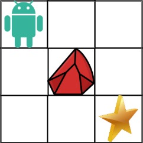

---
tags:
    - Array
    - Dynamic Programming
    - Matrix
    - Top Interview
---

# [63. Unique Paths II](https://leetcode.com/problems/unique-paths-ii/)

You are given an `m x n` integer array `grid`. There is a robot initially located at the **top-left corner** (i.e., `grid[0][0]`). The robot tries to move to the **bottom-right corner** (i.e., `grid[m - 1][n - 1]`). The robot can only move either down or right at any point in time.

An obstacle and space are marked as `1` or `0` respectively in `grid`. A path that the robot takes cannot include **any** square that is an obstacle.

Return *the number of possible unique paths that the robot can take to reach the bottom-right corner*.

The testcases are generated so that the answer will be less than or equal to `2 * 109`.

 

**Example 1:**



```
Input: obstacleGrid = [[0,0,0],[0,1,0],[0,0,0]]
Output: 2
Explanation: There is one obstacle in the middle of the 3x3 grid above.
There are two ways to reach the bottom-right corner:
1. Right -> Right -> Down -> Down
2. Down -> Down -> Right -> Right
```

**Example 2:**


```
Input: obstacleGrid = [[0,1],[0,0]]
Output: 1
```

 

**Constraints:**

- `m == obstacleGrid.length`
- `n == obstacleGrid[i].length`
- `1 <= m, n <= 100`
- `obstacleGrid[i][j]` is `0` or `1`.

 

**Solution:**

```java
class Solution {
    public int uniquePathsWithObstacles(int[][] obstacleGrid) {
        int n = obstacleGrid.length;
        int m = obstacleGrid[0].length;
        return dfs(n - 1, m - 1, obstacleGrid);
    }

    private int dfs(int i, int j, int[][] nums){
        if (i < 0 || j < 0 || nums[i][j] == 1){
            return 0;
        }

        if (i == 0 && j == 0){
            return 1;
        }

        return dfs(i-1, j, nums) + dfs(i, j-1, nums);
    }
}
```


```java
class Solution {
    public int uniquePathsWithObstacles(int[][] obstacleGrid) {
        int n = obstacleGrid.length;
        int m = obstacleGrid[0].length;
        int[][] memo = new int[n][m];
        for (int[] row : memo){
            Arrays.fill(row, -1);
        }
        return dfs(n - 1, m - 1, obstacleGrid, memo);
    }

    private int dfs(int i, int j, int[][] nums, int[][] memo){
        if (i < 0 || j < 0 || nums[i][j] == 1){
            return 0;
        }

        if (i == 0 && j == 0){
            return 1;
        }

        if (memo[i][j] != -1){
            return memo[i][j];
        }

        return memo[i][j] = dfs(i-1, j, nums, memo) + dfs(i, j-1, nums, memo);
    }
}
```


```java
class Solution {
    public int uniquePathsWithObstacles(int[][] obstacleGrid) {
        int n = obstacleGrid.length;
        int m = obstacleGrid[0].length;
        int[][] memo = new int[n + 1][m + 1];
        // for (int[] row : memo){
        //     Arrays.fill(row, -1);
        // }

        for(int i = 0; i < n; i++){
            memo[i][0] = 0;
        }

        for (int j = 0; j < m; j++){
            memo[0][j] = 0;
        }

        for (int i = 0; i < n; i++){
            for (int j = 0; j < m; j++){
                if (obstacleGrid[i][j] == 1){
                    memo[i][j] = 0;
                }else if (i == 0 && j == 0){
                    memo[i + 1][j +1] = 1;
                }else{
                    memo[i + 1][j + 1] = memo[i][j + 1] + memo[i + 1][j]; 
                }
            }
        }

        return memo[n][m];

        // return dfs(n - 1, m - 1, obstacleGrid, memo);
    }
}
```

