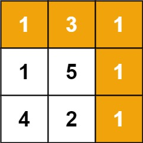
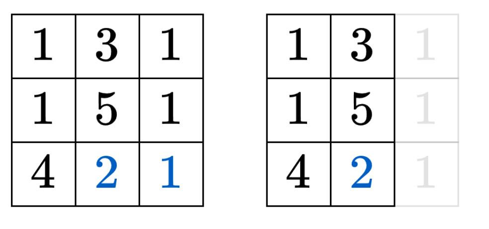
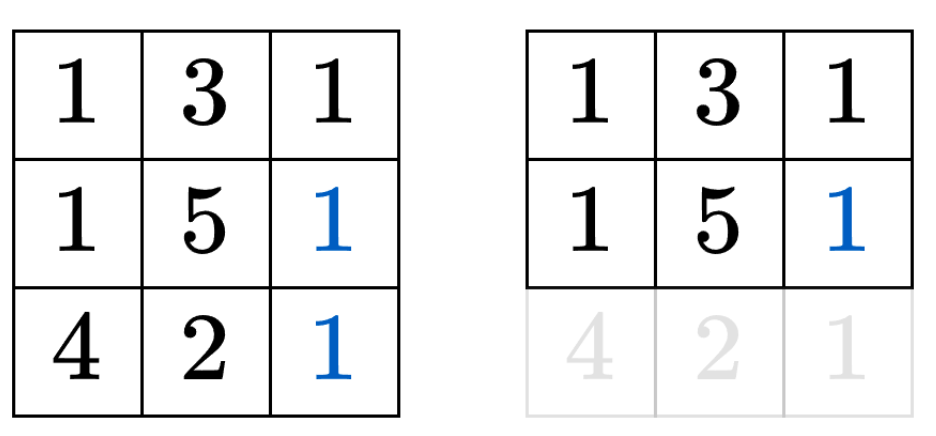

---
tags:
    - Array
    - Dynamic Programming
    - Matrix
    - Top Interview
---


# [64. Minimum Path Sum](https://leetcode.com/problems/minimum-path-sum/)

Given a `m x n` `grid` filled with non-negative numbers, find a path from top left to bottom right, which minimizes the sum of all numbers along its path.

**Note:** You can only move either down or right at any point in time.

 

**Example 1:**



```
Input: grid = [[1,3,1],[1,5,1],[4,2,1]]
Output: 7
Explanation: Because the path 1 → 3 → 1 → 1 → 1 minimizes the sum.
```

**Example 2:**

```
Input: grid = [[1,2,3],[4,5,6]]
Output: 12
```

 

**Constraints:**

- `m == grid.length`
- `n == grid[i].length`
- `1 <= m, n <= 200`
- `0 <= grid[i][j] <= 200`


**Solution:**

一 寻找子问题

怎么把一个大问题变成小问题?

示例中的最后一步发生了什么? 

如果是2 -> 1就需要知道从起点起到2的最大价值和, 问题缩小成一个3行2列的子问题



如果是1->1 就需要知道从起点到1的最大价值和, 问题缩小成一个2行3列的子问题



**见微知著，想清楚最后一步发生了什么，就想清楚每一步发生了什么。**

受上图启发, 定义$dfs(i,j)$表示从左上角到第i行第j列这个格子(记作(i,j))的最小价值和.

分类讨论怎么到达(i,j):

* 如果是从左边过来, 那么必须先到达(i, j-1), 我们需要知道从左上角到(i, j-1)的最小价值和, 再加上$grid[i][j]$, 得到$dfs(i, j-1) + grid[i][j]$. 
* 如果是从上边过来, 那么必须先到达(i-1, j), 我们需要知道从左上角到(i-1, j)的最小价值和, 再加上$grid[i][j]$, 得到$dfs(i - 1, j) + grid[i][j]$.

二者去最小值, 得到**状态转移方程**
$$
dfs(i, j) = min(dfs(i-1,j), dfs(i, j-1)) + grid[i][j]
$$
**递归边界**:

* $dfs(-1, j) = dfs(i, -1) = \infty$. 用$\infty$表示不合法(出界)的状态, 从而保证min不会取到不合法的状态.
* $dfs(0,0) = grid[0][0]$

递归入口: $dfs(m - 1, n -1)$, 这就是原问题, 也是答案.

> 问：看上去，这计算的是从右下角到左上角的最小价值和？
>
> 答：注意加法运算发生在递归返回后，即递归的「归」的时候我们才开始计算最小价值和，所以计算顺序是从左上角到右下角。
>
> 问：为什么要倒着思考？
>
> 答：方便后面 1:1 地翻译成递推。 
>

```java
class Solution {
    public int minPathSum(int[][] grid) {
        return dfs(grid.length - 1, grid[0].length - 1, grid);
    }

    private int dfs(int i, int j, int[][] grid){
        if (i < 0 || j < 0){
            return Integer.MAX_VALUE;
        }

        if (i == 0 && j == 0){
            return grid[i][j];
        }

        return Math.min(dfs(i, j - 1, grid), dfs(i - 1, j, grid)) + grid[i][j];
    }
}

```

TC: $O(2^{m+n})$, 其中m和n分别为grid的行数和列数. 搜索树可以近似为一棵二叉树, 树高为$O(m + n)$.

SC: $O(m+n)$, 递归需要$O(m+n)$的栈空间.


二 用记忆化搜索优化

举个例子, 对于$dfs(2,2)$来说, 先左在上 和 先上再左, 都会调用dfs(1,1). 

考虑到整个递归过程中有大量重复递归调用(递归入参相同). 由于递归函数没有副作用, 同样的入参无论计算多少次, 算出来的结果都是一样的, 因此可以用记忆化搜索来优化:

* 如果一个状态(递归入参)是第一次遇到, 那么可以在返回前, 把状态及其结果记到一个memo数组中
* 如果一个状态不是第一次遇到(memo中保存的结果不等于memo的初始值), 那么可以直接返回memo中保存的结果.

注意: memo数组的初始值一定不能等于要记忆化的值! 例如初始值设置为0, 并且要记忆化的dfs(i, j) 也等于0, 那就没法判断0到底表示第一次遇到这个状态,还是表示之前遇到过了, 从而导致记忆化失效. 一般把初始值设置为$-1$.

```java
class Solution {
    public int minPathSum(int[][] grid) {
        int m = grid.length;
        int n = grid[0].length;
        int[][] memo = new int[m][n];
        for (int[] row : memo){
            Arrays.fill(row, -1);
        }
        return dfs(grid.length - 1, grid[0].length - 1, grid, memo);
    }

    private int dfs(int i, int j, int[][] grid, int[][] memo){
        if (i < 0 || j < 0){
            return Integer.MAX_VALUE;
        }

        if (i == 0 && j == 0){
            return grid[i][j];
        }

        if (memo[i][j] != -1){
            return memo[i][j];
        }

        memo[i][j] = Math.min(dfs(i, j - 1, grid, memo), dfs(i - 1, j, grid, memo)) + grid[i][j];
        return memo[i][j];
    }
}

// TC: O(mn), 其中 m 和 n 分别为 grid 的行数和列数。由于每个状态只会计算一次，动态规划的时间复杂度 = 状态个数 × 单个状态的计算时间。本题状态个数等于 O(mn)，单个状态的计算时间为 O(1)，所以总的时间复杂度为 O(mn)。
// SC: O(mn) 保存多少状态，就需要多少空间
```

## 三、1:1 翻译成递推

我们可以去掉递归中的递, 只保留归的部分, 即自底向上计算.

具体来说, $f[i+1][j+1]$的定义和$dfs(i, j)$的定义是一样的, 都表示从左上角到第$i$行第$j$列这个格子(记作$(i,j)$)的最小价值和. 这里+1是为了把$dfs(-1,j)$和dfs(i, -1)这些状态也翻译过来, 这样我们可以把$f[0][j]$和$f[i][0]$作为初始值.

相应的递推式(状态转移方程)也和dfs一样:
$$
f[i+1][j + 1] = min(f[i+1][j],f[i][j+ 1]) + grid[i][j]
$$

> 问: 为什么$grid[i][j]$的下标不用变?
>
> 答: 既然是在f的最左边和最上边插入一排状态, 那么就只需要修改和f有关的下标, 其余任何逻辑都无需修改. 或者说, 如果$grid[i][j]$也改成$grid[i+1][j+1]$, 那么当$i = m -1$或者$j = n -1$时$grid[i +1][j +1]$会下标越界, 这显然是错误的.

初始值:

* $f[0][j]=f[i][0] = \infty$, 翻译自递归边界$dfs(-1, j) = dfs(i, -1) =\infty$.
* $f[1][1] = grid[0][0]$, 翻译自递归边界$dfs(0,0) = grid[0][0]$.

答案为$f[m][n]$, 翻译自递归入口$dfs(m-1, n-1)$.

```java
class Solution {
    public int minPathSum(int[][] grid) {
        int n = grid.length;
        int m = grid[0].length;
        int[][] memo = new int[n + 1][m + 1];

        for (int j = 0; j < m + 1; j++){
            memo[0][j] = Integer.MAX_VALUE; 
        }

        for (int i = 0; i < n + 1; i++){
            memo[i][0] = Integer.MAX_VALUE;
        }
        // Arrays.fill(memo[0], Integer.MAX_VALUE);
        // - - - -
        // - 0 0 0
        // - 0 0 0
        // - 0 0 0
        for (int i = 0; i < n; i++){
            for (int j = 0; j < m; j++){
                if (i == 0 && j == 0){
                    memo[i+1][j+1] = grid[i][j];
                }
                else{
                    memo[i+ 1][j + 1] = Math.min(memo[i+1][j], memo[i][j +1]) + grid[i][j];
                }
            }
        }

        return memo[n][m];
    }
}
```

TC: $O(mn)$, 其中$m$和$n$分别为$grid$的行数和列数. 

SC: $O(mn)$.


----

## 四、空间优化


```java
class Solution {
    public int minPathSum(int[][] grid) {
        int n = grid[0].length;
        int[] f = new int[n + 1];
        Arrays.fill(f, Integer.MAX_VALUE);
        f[1] = 0;
        for (int[] row : grid) {
            for (int j = 0; j < n; j++) {
                f[j + 1] = Math.min(f[j], f[j + 1]) + row[j];
            }
        }
        return f[n];
    }
}

```


## 五、空间优化（原地修改）

```java
class Solution {
    public int minPathSum(int[][] grid) {
        int m = grid.length;
        int n = grid[0].length;
        int[] f = grid[0]; // 这里没有拷贝，f 和 grid[0] 都持有同一段内存
        for (int j = 1; j < n; j++) {
            f[j] += f[j - 1];
        }
        for (int i = 1; i < m; i++) {
            f[0] += grid[i][0];
            for (int j = 1; j < n; j++) {
                f[j] = Math.min(f[j - 1], f[j]) + grid[i][j];
            }
        }
        return f[n - 1];
    }
}

```


```java
class Solution {
    public int minPathSum(int[][] grid) {
        int rows = grid.length;
        int cols = grid[0].length;

        // Create a 2D array to store the minimum path sums.
        int[][] dp = new int[rows][cols];

        // Initialize the starting point with the first cell's value.
        dp[0][0] = grid[0][0];

        // Fill in the first row (can only come from the left).
        for (int col = 1; col < cols; col++) {
            dp[0][col] = dp[0][col - 1] + grid[0][col];
        }

        // Fill in the first column (can only come from above).
        for (int row = 1; row < rows; row++) {
            dp[row][0] = dp[row - 1][0] + grid[row][0];
        }

        // Fill in the rest of the dp array.
        for (int row = 1; row < rows; row++) {
            for (int col = 1; col < cols; col++) {
                dp[row][col] = Math.min(dp[row - 1][col], dp[row][col - 1]) + grid[row][col];
            }
        }

        // Return the value at the bottom-right corner, which is the minimum path sum.
        return dp[rows - 1][cols - 1];
    }
}

```

