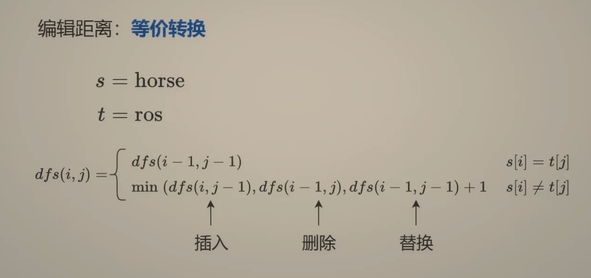

---
tags:
    - String
    - Dynamic Programming
    - Top Interviews
---

# [72. Edit Distance](https://leetcode.com/problems/edit-distance/)

Given two strings `word1` and `word2`, return *the minimum number of operations required to convert `word1` to `word2`*.

You have the following three operations permitted on a word:

- Insert a character
- Delete a character
- Replace a character

 

**Example 1:**

```
Input: word1 = "horse", word2 = "ros"
Output: 3
Explanation: 
horse -> rorse (replace 'h' with 'r')
rorse -> rose (remove 'r')
rose -> ros (remove 'e')
```

**Example 2:**

```
Input: word1 = "intention", word2 = "execution"
Output: 5
Explanation: 
intention -> inention (remove 't')
inention -> enention (replace 'i' with 'e')
enention -> exention (replace 'n' with 'x')
exention -> exection (replace 'n' with 'c')
exection -> execution (insert 'u')
```


**Solution:**


答疑
问：为什么只需考虑从右往左（或者从左往右）操作？我就不能从中间开始操作吗？

答：假设两个字符为 s[i] 和 t[j]，先操作 i 再操作 j，还是先操作 j 再操作 i，结果都是一样的。推广，任意一种操作顺序，都可以重新排列成从右往左（从左往右）操作。



```java
class Solution {
    public int minDistance(String word1, String word2) {
       char[] w1 = word1.toCharArray();
       char[] w2 = word2.toCharArray();

       int n = word1.length();
       int m = word2.length();

       return dfs(n - 1, m - 1, w1, w2);

       
    }

    private int dfs(int i, int j, char[] w1, char[] w2){
        if (i < 0){
            return j + 1;
        }

        if (j < 0){
            return i + 1;
        }

        if (w1[i] == w2[j]){
            return dfs(i - 1, j - 1, w1, w2);
        }

        return Math.min(dfs(i-1, j-1, w1, w2), Math.min(dfs(i - 1, j, w1, w2), dfs(i, j-1, w1, w2))) + 1;
    }
}
```


```java
class Solution {
    public int minDistance(String word1, String word2) {
       char[] w1 = word1.toCharArray();
       char[] w2 = word2.toCharArray();

       int n = word1.length();
       int m = word2.length();

       int[][] memo = new int[n][m];
       for (int[] row : memo){
        Arrays.fill(row, -1);
       }

       return dfs(n - 1, m - 1, w1, w2, memo);

       
    }

    private int dfs(int i, int j, char[] w1, char[] w2, int[][] memo){
        if (i < 0){
            return j + 1;
        }

        if (j < 0){
            return i + 1;
        }

        if (memo[i][j] != -1){
            return memo[i][j];
        }

        if (w1[i] == w2[j]){
            return memo[i][j] = dfs(i - 1, j - 1, w1, w2, memo);
        }

        return memo[i][j] = Math.min(dfs(i-1, j-1, w1, w2, memo), Math.min(dfs(i - 1, j, w1, w2, memo), dfs(i, j-1, w1, w2, memo))) + 1;
    }
}
// TC: O(nm)
// SC: O(nm)
```


## 二、1:1 翻译成递推

```java
class Solution {
    public int minDistance(String word1, String word2) {
       char[] w1 = word1.toCharArray();
       char[] w2 = word2.toCharArray();

       int n = word1.length();
       int m = word2.length();

    //    int[][] memo = new int[n][m];
    //    for (int[] row : memo){
    //     Arrays.fill(row, -1);
    //    }

    //    return dfs(n - 1, m - 1, w1, w2, memo);

        int[][] f = new int[n + 1][m +1];
        for (int j = 0; j < m; j++){
            f[0][j + 1] = j + 1;
        }

        for (int i = 0; i < n; i++){
            f[i + 1][0] = i + 1;
            for (int j = 0; j < m; j++){
                if (w1[i] == w2[j]){
                    f[i + 1][j + 1] = f[i][j];
                }else{
                    f[i + 1][j + 1] = Math.min(f[i][j], Math.min(f[i][j+ 1], f[i+ 1][j])) +1;
                }
            }
        }

        return f[n][m];

       
    }

    private int dfs(int i, int j, char[] w1, char[] w2, int[][] memo){
        if (i < 0){
            return j + 1;
        }

        if (j < 0){
            return i + 1;
        }

        if (memo[i][j] != -1){
            return memo[i][j];
        }

        if (w1[i] == w2[j]){
            return memo[i][j] = dfs(i - 1, j - 1, w1, w2, memo);
        }

        return memo[i][j] = Math.min(dfs(i-1, j-1, w1, w2, memo), Math.min(dfs(i - 1, j, w1, w2, memo), dfs(i, j-1, w1, w2, memo))) + 1;
    }
}

// TC: O(nm)
// SC: O(nm)
```


## 三、空间优化：两个数组（滚动数组）

```java
class Solution {
    public int minDistance(String word1, String word2) {
       char[] w1 = word1.toCharArray();
       char[] w2 = word2.toCharArray();

       int n = word1.length();
       int m = word2.length();

    //    int[][] memo = new int[n][m];
    //    for (int[] row : memo){
    //     Arrays.fill(row, -1);
    //    }

    //    return dfs(n - 1, m - 1, w1, w2, memo);

        int[][] f = new int[2][m +1];
        for (int j = 0; j < m; j++){
            f[0][j + 1] = j + 1;
        }

        for (int i = 0; i < n; i++){
            f[(i + 1) % 2 ][0] = i + 1;
            for (int j = 0; j < m; j++){
                if (w1[i] == w2[j]){
                    f[(i + 1) % 2][j + 1] = f[i % 2][j];
                }else{
                    f[(i + 1) % 2][j + 1] = Math.min(f[i % 2][j], Math.min(f[i % 2][j+ 1], f[(i + 1) % 2][j])) +1;
                }
            }
        }

        return f[n % 2][m];

       
    }

}

// TC: O(nm)
// SC: O(m)
```


## 四、空间优化：一个数组

```java
class Solution {
    public int minDistance(String word1, String word2) {
       char[] w1 = word1.toCharArray();
       char[] w2 = word2.toCharArray();

       int n = word1.length();
       int m = word2.length();

        int[] f = new int[m +1];
        for (int j = 0; j < m; j++){
            f[j + 1] = j + 1;
        }

        for (int i = 0; i < n; i++){
            int pre = f[0];
            f[0] = i + 1;
            for (int j = 0; j < m; j++){
                int tmp = f[j + 1];
                if (w1[i] == w2[j]){
                    f[j + 1] = pre;
                }else{
                    f[j + 1] = Math.min(f[j], Math.min(f[j+ 1], pre)) +1;
                }
                pre = tmp;
            }
        }

        return f[m];

       
    }

}

// TC: O(nm)
// SC: O(m)
```


```java
class Solution {
    public int minDistance(String word1, String word2) {
        int[][] dp = new int[word1.length() + 1][word2.length() + 1];

        for (int i = 0; i < word1.length() + 1; i++){
            dp[i][0] = i;
        }

        for (int j = 0; j < word2.length() + 1; j++){
            dp[0][j] = j;
        }

        for (int i = 1; i < word1.length() + 1; i++){
            for (int j = 1; j < word2.length() + 1; j++){
                if (word1.charAt(i - 1) == word2.charAt(j - 1)){
                    dp[i][j] = dp[i- 1][j-1]; 
                }else{
                    dp[i][j] = Math.min(dp[i - 1][j - 1], Math.min(dp[i-1][j], dp[i][j - 1])) + 1;
                }
            }
        }

        return dp[word1.length()][word2.length()];
    }
}


// TC: O(n^2)
// SC: O(n^2)
```


```java
class Solution {
    public int minDistance(String word1, String word2) {
        //base case 
        int[][] m = new int[word1.length() + 1][word2.length() + 1];
        for(int i = 0; i < word1.length() + 1; i++){
            m[i][0] = i;
        }

        for (int j = 0; j < word2.length() + 1; j++){
            m[0][j] = j;
        }

        // induction rule
        for (int i = 1; i < word1.length() + 1; i++){
            for (int j = 1; j < word2.length() + 1; j++){
                if (word1.charAt(i - 1) == word2.charAt(j - 1)){
                    m[i][j] = m[i-1][j-1];
                }else{
                    m[i][j] = Math.min(m[i-1][j-1], Math.min(m[i-1][j], m[i][j-1])) + 1;
                }
            }
        }

        return m[word1.length()][word2.length()];
    }
}


/*

// TC: O(n^2)
// SC: O(n^2)

base case
             j     0 1 2 3
            word2| - r o s             ""
  i word1    
    ----   
  0   -             0 1 2 3
  1   h             1 1 2 3 
  2   o             2 2 1 2
  3   r             3 2 2 2
  4   s             4 3 3 2
  5   e             5 4 4 3

  m[i][j]: present the minmum number pf operations required to covert word1 begin to i and change to the word2 begin to j

induction rule:
if (word1(i) == word2(j)){
    m[i][j] = m[i-1][j-1]
}else{
    m[i][j] = Math.min(m[i-1][j-1], m[i-1][j], m[i][j-1])+1
}


return m[word1.length][word2.length]

*/
```

https://leetcode.cn/problems/edit-distance/solutions/2133222/jiao-ni-yi-bu-bu-si-kao-dong-tai-gui-hua-uo5q/
