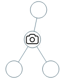
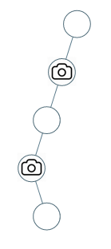
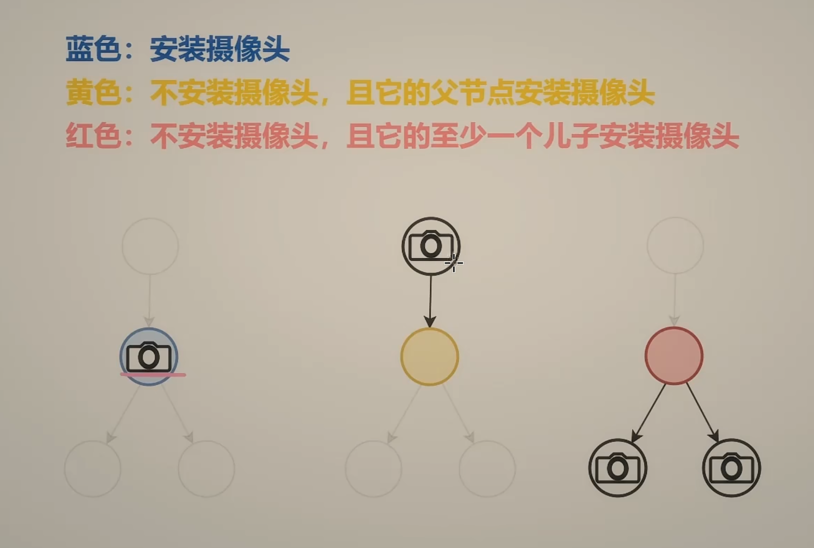
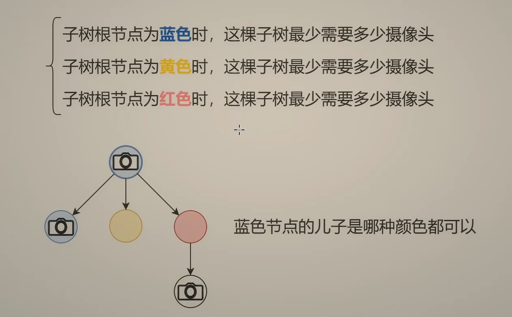
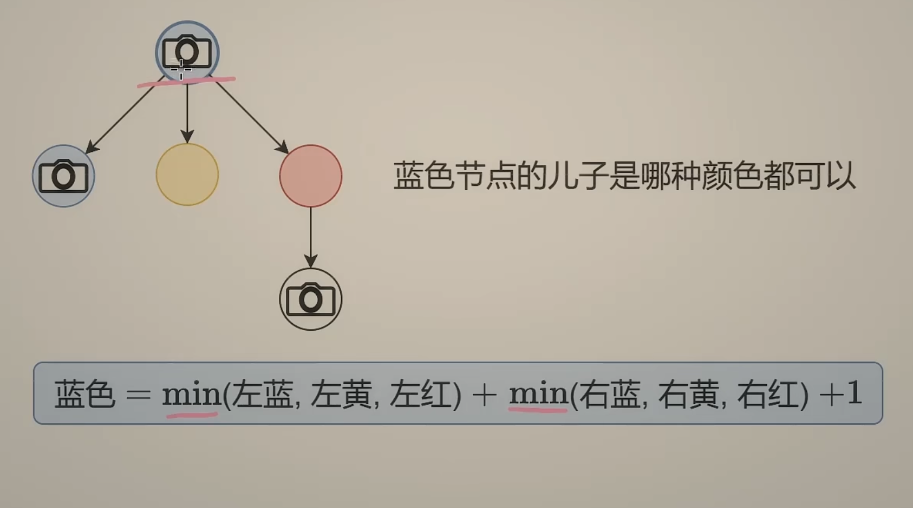
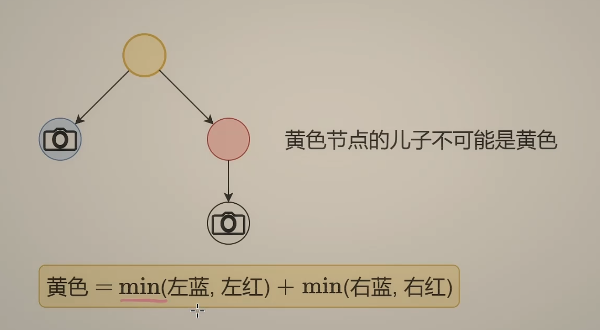
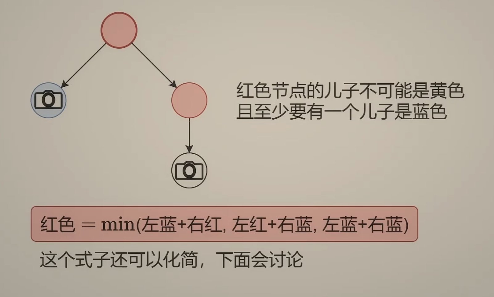

---
tags:
    - Dynamic Programming
    - Tree
    - Depth-First Search
    - Binary Tree
    - Top Interviews
---

# [968. Binary Tree Cameras](https://leetcode.com/problems/binary-tree-cameras/)

You are given the `root` of a binary tree. We install cameras on the tree nodes where each camera at a node can monitor its parent, itself, and its immediate children.

Return *the minimum number of cameras needed to monitor all nodes of the tree*.

 

**Example 1:**



```
Input: root = [0,0,null,0,0]
Output: 1
Explanation: One camera is enough to monitor all nodes if placed as shown.
```

**Example 2:**



```
Input: root = [0,0,null,0,null,0,null,null,0]
Output: 2
Explanation: At least two cameras are needed to monitor all nodes of the tree. The above image shows one of the valid configurations of camera placement.
```

 

**Constraints:**

- The number of nodes in the tree is in the range `[1, 1000]`.
- `Node.val == 0`


**Solution:**

有几种方式可以监控一个节点?

选或不选

1. 选, 在这个节点装摄像头 (蓝色)
2. 不选, 在它的父节点装摄像头 (黄色)
3. 不选, 在它的左/右儿子装摄像头 (红色)


```java
/**
 * Definition for a binary tree node.
 * public class TreeNode {
 *     int val;
 *     TreeNode left;
 *     TreeNode right;
 *     TreeNode() {}
 *     TreeNode(int val) { this.val = val; }
 *     TreeNode(int val, TreeNode left, TreeNode right) {
 *         this.val = val;
 *         this.left = left;
 *         this.right = right;
 *     }
 * }
 */
class Solution {
    public int minCameraCover(TreeNode root) {
        int[] result = dfs(root);
        return Math.min(result[0], result[2]);
    }

    private int[] dfs(TreeNode root){
        if (root == null){
            return new int[]{Integer.MAX_VALUE / 2, 0, 0};
        }

        int[] left = dfs(root.left);
        int[] right = dfs(root.right);

        int choose = Math.min(left[1], Math.min(left[2], left[0])) + Math.min(right[1], Math.min(right[2], right[0])) + 1;

        int byFa = Math.min(left[0], left[2]) + Math.min(right[0], right[2]);

        int byChildren = Math.min(Math.min(left[0] + right[2], right[0] + left[2]), left[0] + right[0]);

        return new int[]{choose, byFa, byChildren};

    }
}   

// TC: O(n)
// SC: O(n)
```












二叉树的根节点没有父节点, 不可能是黄色, 所以

最终答案 = min(根节点为蓝色, 根节点为红色)

递归边界: 

空节点不能装摄像头: 蓝色为$\infin$ , 表示不合法

空节点不需要被监控: 黄色和红色都为0


