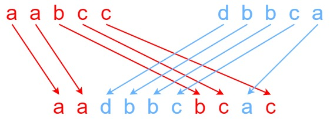

---
tags:
    - String
    - Dynamic Programming
    - Top Interviews
    - Microsoft
---

# [97. Interleaving String](https://leetcode.com/problems/interleaving-string/)

Given strings `s1`, `s2`, and `s3`, find whether `s3` is formed by an **interleaving** of `s1` and `s2`.

An **interleaving** of two strings `s` and `t` is a configuration where `s` and `t` are divided into `n` and `m` 

substrings respectively, such that:


- `s = s1 + s2 + ... + sn`
- `t = t1 + t2 + ... + tm`
- `|n - m| <= 1`
- The **interleaving** is `s1 + t1 + s2 + t2 + s3 + t3 + ...` or `t1 + s1 + t2 + s2 + t3 + s3 + ...`

**Note:** `a + b` is the concatenation of strings `a` and `b`.

 

**Example 1:**



```
Input: s1 = "aabcc", s2 = "dbbca", s3 = "aadbbcbcac"
Output: true
Explanation: One way to obtain s3 is:
Split s1 into s1 = "aa" + "bc" + "c", and s2 into s2 = "dbbc" + "a".
Interleaving the two splits, we get "aa" + "dbbc" + "bc" + "a" + "c" = "aadbbcbcac".
Since s3 can be obtained by interleaving s1 and s2, we return true.
```

**Example 2:**

```
Input: s1 = "aabcc", s2 = "dbbca", s3 = "aadbbbaccc"
Output: false
Explanation: Notice how it is impossible to interleave s2 with any other string to obtain s3.
```

**Example 3:**

```
Input: s1 = "", s2 = "", s3 = ""
Output: true
```

 

**Constraints:**

- `0 <= s1.length, s2.length <= 100`
- `0 <= s3.length <= 200`
- `s1`, `s2`, and `s3` consist of lowercase English letters.

 

**Follow up:** Could you solve it using only `O(s2.length)` additional memory space?


**Solution:**


### Recursion

```java
class Solution {
    public boolean isInterleave(String s1, String s2, String s3) {
       int n = s1.length();
       int m = s2.length();
       // If the total length doesn't match, it cannot be interleaving
       if (n + m != s3.length()){
        return false;
       } 

       return dfs(n - 1, m -1, s1.toCharArray(), s2.toCharArray(), s3.toCharArray());
    }

    private boolean dfs(int i, int j, char[] s1, char[] s2, char[] s3){
      // If both s1 and s2 are fully used, it's a valid interleaving
        if (i < 0 && j < 0){
            return true;
        }

        boolean res = false;
       // Try using s1's last character
        if (i >= 0 && s1[i] == s3[i + j + 1]){
            if (dfs(i - 1, j, s1, s2, s3)){
                return true;// If successful, return immediately
            }
        }
				// Try using s2's last character
        if (j >= 0 && s2[j] == s3[i + j + 1]){
            if (dfs(i, j - 1, s1, s2, s3)){
                return true;
            }
        }

        return false;

    }
}

// TC: O(2^(M+N))
// SC: O(M+N)
```

At each step, you may branch into **two recursive calls**:

- one using `s1`
- one using `s2`

### Recursion + Memo

```java
class Solution {
    public boolean isInterleave(String s1, String s2, String s3) {
       int n = s1.length();
       int m = s2.length();
       if (n + m != s3.length()){
        return false;
       } 
       // 字符串 注意 空
       int[][] memo = new int[n + 1][m + 1];
       for (int[] row : memo){
        Arrays.fill(row, -1);
       }

       return dfs(n - 1, m -1, s1.toCharArray(), s2.toCharArray(), s3.toCharArray(), memo);
    }

    private boolean dfs(int i, int j, char[] s1, char[] s2, char[] s3, int[][] memo){
        if (i < 0 && j < 0){
            return true;
        }

        if (memo[i + 1][j + 1] != -1){
            if (memo[i + 1][j + 1] == 1){
                return true;
            }else{
                return false;
            }
        }

        boolean res = false;

        if (i >= 0 && s1[i] == s3[i + j + 1]){
            if (dfs(i - 1, j, s1, s2, s3, memo)){
                res = true;
                memo[i + 1][j + 1] = 1;
            }
        }

        if (!res && j >= 0 && s2[j] == s3[i + j + 1]){
            if (dfs(i, j - 1, s1, s2, s3, memo)){
                res = true;
                memo[i + 1][j + 1] = 1;
            }
        }

        if (memo[i + 1][j + 1] == -1){
            memo[i+1][j + 1] = 0;
        }
        return res;

    }
}
// TC: O(m * n)
// SC: O(m * n)
```


```java
class Solution {
    public boolean isInterleave(String s1, String s2, String s3) {
        if (s1.length() + s2.length() != s3.length()){
            return false;
        }

        Boolean[][] memo = new Boolean[s1.length() + 1][s2.length() + 1];

        return helper(s1, s2, 0, 0, s3, memo);
    }


    private boolean helper(String s1, String s2, int i1, int i2, String s3, Boolean[][] memo){
        if (i1 == s1.length() && i2 == s2.length()){
            return true;
        }

        if (memo[i1][i2] != null){
            return memo[i1][i2];
        }

        Boolean valid = false;

        if (i1 < s1.length() && s1.charAt(i1) == s3.charAt(i1 + i2)){
            valid = helper(s1, s2, i1 + 1, i2, s3, memo);
        }

        if (!valid && i2 < s2.length() && s2.charAt(i2) == s3.charAt(i1+i2)){
            valid = helper(s1, s2, i1, i2+ 1, s3, memo);
        }

        memo[i1][i2] = valid;
        return valid;
    }
}

// TC: O(n*m)
// SC: O(n*m)
```


