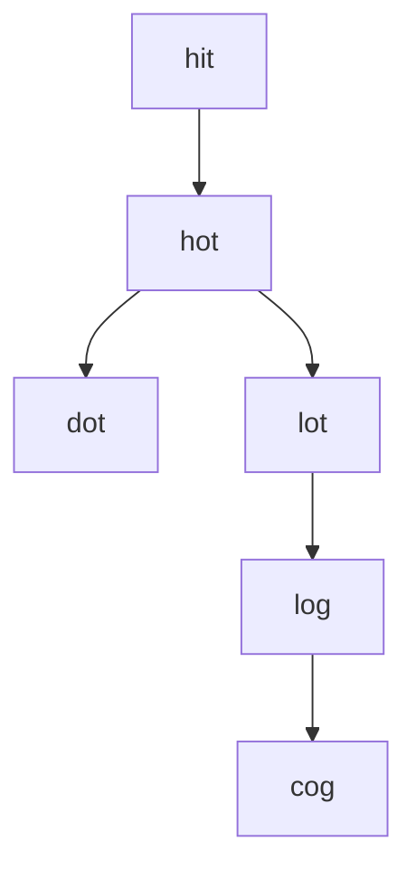

---
tags:
    - Hash Table
    - String
    - Breadth-First Search
    - Top Interviews
---

# [127. Word Ladder](https://leetcode.com/problems/word-ladder/)

A **transformation sequence** from word `beginWord` to word `endWord` using a dictionary `wordList` is a sequence of words `beginWord -> s1 -> s2 -> ... -> sk` such that:

- Every adjacent pair of words differs by a single letter.
- Every `si` for `1 <= i <= k` is in `wordList`. Note that `beginWord` does not need to be in `wordList`.
- `sk == endWord`

Given two words, `beginWord` and `endWord`, and a dictionary `wordList`, return *the **number of words** in the **shortest transformation sequence** from* `beginWord` *to* `endWord`*, or* `0` *if no such sequence exists.*

 

**Example 1:**

```
Input: beginWord = "hit", endWord = "cog", wordList = ["hot","dot","dog","lot","log","cog"]
Output: 5
Explanation: One shortest transformation sequence is "hit" -> "hot" -> "dot" -> "dog" -> cog", which is 5 words long.
```

**Example 2:**

```
Input: beginWord = "hit", endWord = "cog", wordList = ["hot","dot","dog","lot","log"]
Output: 0
Explanation: The endWord "cog" is not in wordList, therefore there is no valid transformation sequence.
```


**Solution:**




```java
class Solution {
	 public static int ladderLength2(String beginWord, String endWord, List<String> wordList) {
        int result = 0;

        Deque<String> queue = new ArrayDeque<>();

        Set<String> set = new HashSet<>();

        for (int i = 0; i < wordList.size(); i++){
            set.add(wordList.get(i));
        }

        queue.offerLast(beginWord);
        result++;

        set.remove(beginWord);

        while(!queue.isEmpty()){
            int size = queue.size();
            for (int i = 0; i < size; i++){
                String curWord = queue.pollFirst();
                if (curWord.equals(endWord)){
                    return result;
                }

                for (int j = 0; j < curWord.length(); j++){
                    for (char ch = 'a'; ch <= 'z'; ch++){
                        char[] curWordArray = curWord.toCharArray();
                        curWordArray[j] = ch;
                        String replaceWord = new String(curWordArray);

                        if (set.contains(replaceWord)){
                            set.remove(replaceWord);
                            queue.offerLast(replaceWord);
                        }

                    }
                }

            }


            result++;
        }

        return 0;
    }
}

// TC: O(n * m * 26)
// SC: O(n)
```


```java
class Solution {
    static class Pair{
        String word;
        int step;

        Pair(String word, int step){
            this.word = word;
            this.step = step;
        }
    }
  
    public int ladderLength(String beginWord, String endWord, List<String> wordList) {
        Queue<Pair> queue = new LinkedList<Pair>();
        queue.add(new Pair(beginWord, 1));

        Set<String> set = new HashSet<String>();
        int len = wordList.size();
        for (int i = 0; i < len; i++){
            set.add(wordList.get(i));
        }

        set.remove(beginWord);
        while(!queue.isEmpty()){
            Pair cur = queue.poll(); // <hit, 1>
            String curWord = cur.word; // hit
            int curStep = cur.step; // 1

            if (curWord.equals(endWord)){
                return curStep;
            }

            for (int i = 0; i < curWord.length(); i++){ // 3
                for (char ch = 'a'; ch <= 'z'; ch++){// 
                    char[] rCharArray = curWord.toCharArray(); // h i t
                    rCharArray[i] = ch; // h i t => a i t
                    String replaceWord = new String(rCharArray); // ait
                    if (set.contains(replaceWord)){ 
                        queue.add(new Pair(replaceWord, curStep + 1));
                        set.remove(replaceWord);
                    }
                }
            }

        }

        return 0;
        
    }
}

// TC:  O(N * L * 26) N: wordlist.length L word.length 
// SC:  O(N)
```


```java
class Solution {
    public int ladderLength(String beginWord, String endWord, List<String> wordList) {
        Set<String> wordListSet = new HashSet<>();
        for (String s : wordList){
            wordListSet.add(s);
        }

        int result = 0;
        if (!wordListSet.contains(endWord)){
            return result;
        }
        Deque<String> queue = new ArrayDeque<>();
        queue.offerLast(beginWord);
        result++;
        Set<String> visited = new HashSet<>();
        visited.add(beginWord);


        while(!queue.isEmpty()){
            int size = queue.size();
            for (int i = 0; i < size; i++){
                String cur = queue.pollFirst();
                if (cur.equals(endWord)){
                    return result;
                }

                for (int j = 0; j < cur.length(); j++){
                    for (char ch = 'a'; ch <= 'z'; ch++){
                        char[] curChar = cur.toCharArray();
                        curChar[j] = ch;
                        String newCurChar = new String(curChar);

                        if (wordListSet.contains(newCurChar) && !visited.contains(newCurChar)){
                            visited.add(newCurChar);
                            queue.offerLast(newCurChar);
                        }
                    }
                }
            }
            result++;
        }

        return 0;

        
    }
}
```

